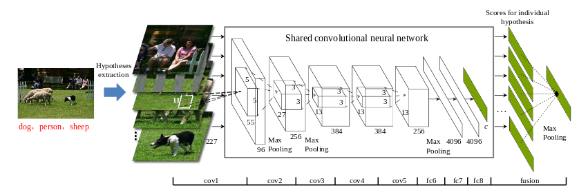
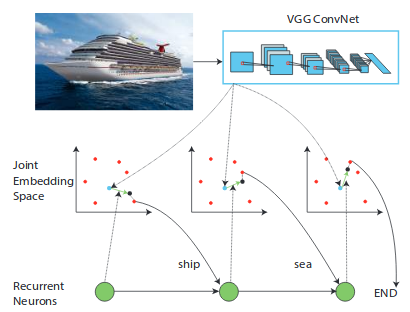
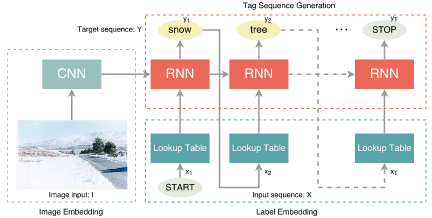
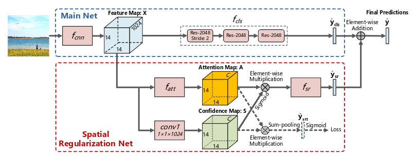
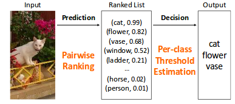
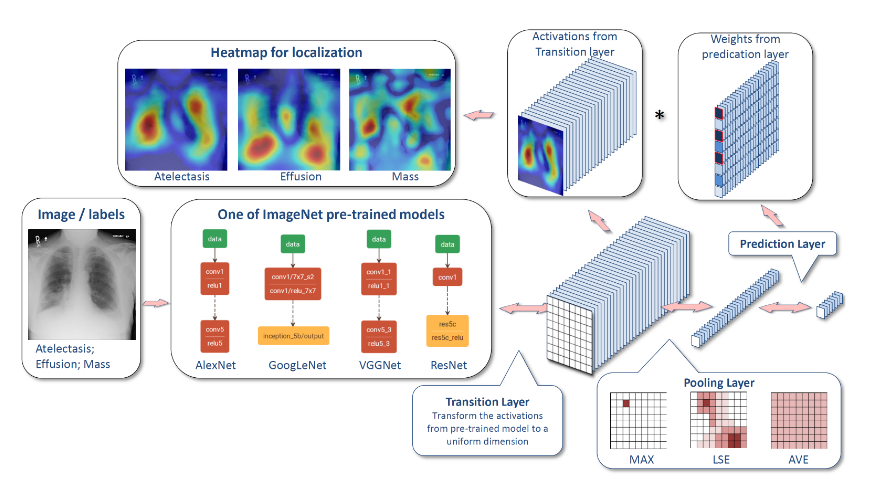
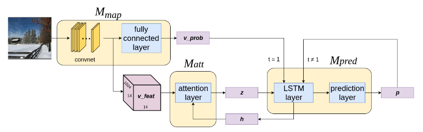
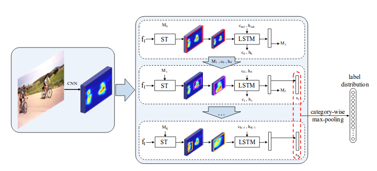
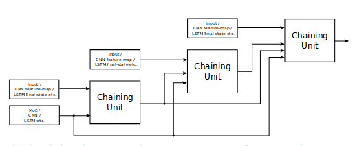
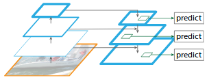

# Convolutional Neural Networks for Multi-Label Image Classification
\label{chp:dnn_mlc}

```{r, include=FALSE}
knitr::opts_chunk$set(echo = TRUE, message = FALSE, warning = FALSE)

library(tidyverse)
```

## Introduction

This post is about using deep neural networks (DNNs) to perform multi-label image classification (MLIC). MLIC is a generalisation of the single-label image classification task. It allows for an input image to be annotated with more than one label (*i.e.* classes are not mutually exclusive) which is often required in real-world applications. DNNs have showed its superiority over other methods when it comes to single-label image classification and other Computer Vision tasks. Here we investigate how it can be used to solve the lesser researched problem of MLIC.

To motivate the importance of MLIC, we will give examples of some of its useful applications. Thereafter we will discuss the main challenges of MLIC. The majority of this post covers existing deep learning approaches to MLIC in chronological order of publishing and how they attempt to overcome the above mentioned challenges. Note that we restrict our study space to methods that can be described as end-to-end or unified learning approaches. We will conclude with suggestions for future research.

## Applications

MLIC is a more general and practical problem compared to single-label classification since most real-world images contain multiple objects of different categories. Some interesting (for me at least) datasets for MLIC are listed below:

+ [**Planet: Understanding the Amazon from Space**](https://www.kaggle.com/c/planet-understanding-the-amazon-from-space/data): The dataset consist of $\pm$ 100,000 satellite images of the Amazon rainforest labeled with various land cover/land use classes along with atmospheric conditions. Each satellite image is associated with at least one label (see Figure \@ref(fig:apps) (a)) and therefore fits into the MLIC framework. The data was released as part of a Kaggle competition. The competition hosts wanted a model that can accurately monitor the Amazon from satellite images in order to help them prevent deforestation.

+ [**ChestX-ray8**](https://nihcc.app.box.com/v/ChestXray-NIHCC/folder/36938765345): The $\pm$ 110,000 images in this dataset are chest X-rays labeled with various thoracic pathologies where each image can have multiple labels (see Figure \@ref(fig:apps) (b)). The data was released by the NIH (National Institute of Health) to promote the development of computer aided diagnosis and detection.

+ [**WIDER-Attribute**](http://riemenschneider.hayko.at/vision/dataset/task.php?did=337): This is a human attribute prediction benchmark dataset. From the dataset we can get $\pm$ 60,000 images of individuals labeled with their corresponding attributes (see Figure \@ref(fig:apps) (c) for an example).


```{r apps, fig.cap="Examples of input-output pairs in a MLIC problem.", echo=FALSE}
#library(egg)
library(grid)
library(gridExtra)
library(imager)

head_a <- textGrob("(a)")
head_b <- textGrob("(b)")
head_c <- textGrob("(c)")

planet <- load.image('figures/train_24.jpg') %>% rasterGrob()
planet_lab <- "partly_cloudy\nprimary\nconventional_mine" %>% textGrob()

chest <- load.image('figures/00000013_025.png') %>% rasterGrob()
chest_lab <- "Cardiomegaly\nInfiltration\nMass\nNodule" %>% textGrob()

wider <- load.image('figures/marchin.jpg') %>% rasterGrob()
wider_lab <- "male\nsunglass\nhat\nlong_sleeve" %>% textGrob()

input_img <- textGrob("Input Image", rot = 90)
label_ax <- textGrob("Labels", rot = 90)

lay <- rbind(c(NA, 1, 2, 3),
             c(4, 5, 6, 7),
             c(8, 9, 10, 11))

grid.arrange(head_a, head_b, head_c, 
             input_img, planet, chest, wider,
             label_ax, planet_lab, chest_lab, wider_lab,
             #nrow = 3, ncol = 3,
             layout_matrix = lay,
             heights = c(0.1,0.6,0.3), widths = c(0.1, 0.3, 0.3, 0.3))
```

## Main Challenges

Here, we show how MLIC is different to single-label classification[^compare] and how these differences make the MLIC task more challenging. We will first look at the differences in terms of the input images, then how the multi-label output presents some new challenges, followed by the added complexity of evaluating MLIC models.

[^compare]: I chose to compare MLIC to single-label classification since it is one of the more commonly known and basic tasks in computer vision. MLIC also has close relationships with (weakly-supervise) object detection and image captioning.

### How are the input images different to conventional image classification?

Objects in a typical multi-label image come in various sizes and positions, wheras in a typical single-label image, the object is usually in the center and covering a large part of the image. See for example in Figure \@ref(fig:apps) (c) where the image region related to 'sunglass' is very small compared to the region related to 'male'. The objects in a multi-label image are often also only partially visible, for example in Figure \@ref(fig:apps) (a) where the 'partly_cloudy' region covers a big part of the 'primary (forest)' region. Notice the presence of spatial relations between label regions in a multi-label image. Again in Figure \@ref(fig:apps) (c) we can observe that the image regions related to 'sunglass' and 'hat' will usually be close to each other, in contrast to 'hat' and say 'shoes', which will rarely occur in the same proximity.

This diverse and complex contents of multi-label images make it difficult to learn effective feature representations and classifiers. This raises a question on the optimality of transfer learning from single-label image datasets to do MLIC, since the nature of the two types of images differ greatly. Using a network pre-trained on a object detection dataset might be a better starting point.

One approach to make better use of single-label feature representations is to transform the MLIC problem into mutliple multiclass classification problems over various regions of the images, *i.e.* identify patches in an image which is likely to be related to only one label and perform a single-label image classification on each of those patches. This is a common approach in object detection. An example of such an approach in MILC can be found in @Wei2014 (see Figure \@ref(fig:HCP)). However, we will not consider this method, since the so-called 'hypotheses extraction' step can be tedious and requires a separate algorithm. It therefore does not meet our requirements of an end-to-end network solution.

```{r HCP, fig.cap="An illustration of the infrastructure proposed in @Wei2014.", echo=FALSE}

```

### How does the mutli-labeledness influence learning?

The output space of a MLIC problem can get really big. The number of possible label combinations increases exponentialy with the increase in the number of unique labels in the dataset. This is said to be the key challenge in learning from multi-labeled data - handling such large label spaces. Not only does it require a large amount of computational power (which is not necessarily such a big problem anymore, thanks to DL + GPUs) but it also introduces other problems that needs to be considered in the modeling process, such as extreme class imbalance and label sparsity.

In our examples, the number of labels is relatively small. However, in the YouTube multi-label video classification [challenge](https://www.kaggle.com/c/youtube8m) there are 4716 unique labels. On average, each video in the training set is assoicated with only 3.7 labels and only 14 of the labels occur in more than 1% of the training videos.

```{r ytdist, eval=FALSE, include=FALSE}
library(tidyverse)
yt_labels <- read_csv('data/yt_labels.csv', col_names = FALSE)
yt_labels <- lapply(yt_labels$X2, strsplit, " ")

mean(sapply(yt_labels[1:10], function(a) length(unlist(a))))

temp <- prop.table(table(unlist(yt_labels))) %>% as.data.frame()

sum(temp$Freq > 0.01)
```

To more effectively learn in such large output spaces, algorithms can try to exploit the label dependency structures in the data. As an illustration of such structures, see Figure \@ref(fig:corr) for the normalised label co-occurrence matrices of the human attribute prediction dataset. See how 'male' almost never occur with 'longHair' and 'skirt', and most of the time when 'formal' is relevant to an image, so to is 'longSleeve'. These are the types of "correlation" in the labels we would want a model to exploit. In a perfect world, we would expect a model to identify a skirt regardless of whether or not a male is already identified. However, the data is never a 'perfect world' and knowing whether or not the person in an image is a male might help the model to determine if he/she is wearing a skirt, especially if there are only a few examples of skirts in the training data and/or the skirt is only partially visible.

```{r corr, fig.cap="The normalised label co-occurrence matrix for WIDER-attribute dataset. The colour intensity in cell (i,j) indicates the number of times label i and j co-occurred divided by the number of times label i occurred.", echo=FALSE}
library(tidyverse)
wider_labs <- read_csv('data/wider_labels.csv')
library(corrplot)
wider_LS <- unique(unlist(lapply(wider_labs$tags, strsplit, " ")))
wider_LS <- na.omit(wider_LS)

wider_Y <- do.call("rbind", lapply(wider_labs$tags, function(a) {
  as.numeric(wider_LS %in% unlist(strsplit(a, " ")))
}))

wider_YY <- t(wider_Y) %*% wider_Y

wider_m <- wider_YY/diag(wider_YY)
colnames(wider_m) <- rownames(wider_m) <- wider_LS

corrplot(wider_m, cl.lim = c(0,1))
```

Exploiting these correlations is not a trivial task and has been the main focus of multi-label classification (MLC[^mlc]) research. The correlations are usualy asymmetric and depend on the input. We explore the different approaches later in the post.

[^mlc]: I know this might be confused with MLIC when not read carefully.

One more consideration for MLIC is that the number of labels associated with an image is unknown. For example in the Chest X-ray data the number of labels associated with an image ranges from 0 to 9. The reason this might be a challenge is as follows. The output of most multi-label classifiers (including DNNs) are in the form of numeric scores for each label, which can usually be interpreted as the likelihood of a label's presence. The problem arises when we need to map these numeric scores to a binary code to ultimately indicate which labels are relevant or not (sometimes referred to as label calibration). In binary classification we threshold the numeric scores to map it to a binary code, for example if $f(x) > 0.5$ let $y = 1$ or $y=0$ otherwise. In multiclass classification the label with highest class score is assigned a 1 and the rest 0. This is more complicated in MLC since the optimal threshold may vary across labels and if we rather want to choose the $k$ labels with the highest class score, we first need a way to determine $k$.

```{r, include=FALSE, eval=FALSE}
library(tidyverse)
chest_labs <- read_csv('data/chest_labels.csv')
chest_LS <- unique(unlist(lapply(chest_labs$`Finding Labels`, strsplit, "\\|")))

chest_Y <- do.call("rbind", lapply(chest_labs$`Finding Labels`, function(a) {
  as.numeric(chest_LS %in% unlist(strsplit(a, "\\|")))
}))

range(apply(chest_Y, 1, sum))
```

There are some interesting proposals in the literature which we will have a look at soon. Note that the solution to the above mentioned challenges are highly dependent on the chosen evaluation metric for the problem. The evaluation metric or loss function of an MLIC problem is again more complex than for the single-label case - we discuss it next.

### How do we evaluate MLIC models?

We can't directly optimse a DNN for these multi-label metrics using stochastic gradient descent (SGD), therefore we will need an appropriate (approximately) differentialble surrogate loss function. The standard choice is to use the binary cross-entropy averaged over all labels, but some other suggestions have been made which will be discussed in the next section.

## Overview of Existing Approaches

It is very simple to adapt a DNN to suit a MLC problem. Recall that in a multiclass classification problem we would use a softmax layer activation on the final layer of a DNN. The softmax transforms the output so that the class scores are squeezed into the range of 0-1 and so that the class scores sum to 1. This is done so that the class scores better imitate class probabilities. However, when an observation can be associated with more than one label, we wouldn't expect the class probabilities to sum to 1. Therefore, a sigmoid activation is used on the output layer of a DNN for MLC. The sigmoid squeezes the class scores in the range of 0-1 without the constraint that the values should sum to 1. See Figure \@ref(fig:sigsof) for an illustration of the differences between sigmoid and softmax.

```{r sigsof, fig.cap = "Difference between the sigmoid and softmax transformation", echo=FALSE}
library(tidyverse)
x <- -5:5
sig_x <- 1/(1+exp(-x))
sof_x <- exp(x)/sum(exp(x))

data.frame(x, y = c(sig_x, sof_x), transform = c(rep("sigmoid", length(sig_x)),
                                                 rep('softmax', length(sof_x)))) %>% 
  ggplot(aes(x, y)) + geom_line(aes(color = transform)) + 
  ylab('a(x)') + 
  theme_minimal()
```

It turns out that a DNN with a sigmoid output layer is a very good baseline model for MLIC. It is only necessary to train one network to predict all labels and the network implicitly takes label correlations into account since the weights were trained to optimise all labels. For a MLIC problem, one can use a pretrained single-label classification network, say on ImageNet, swap out its softmax layer with a sigmoid layer and then fine-tune the network (with binary cross-entropy) on your specific data and achieve very good results. Although this method may be sufficient in some cases, there are ways to improve on this architecture. They are discussed below, sorted in order of publishing date. Remember, we are only considering end-to-end network approaches.

## Multi-Label Loss functions

One of the main considerations when switching from single-label to multi-label CNNs is the choice of loss function to minimise, *i.e.* how the network penalises the deviation between the predicted and true labels. Recall that when training a CNN, $f(x,\theta)\in \mathbb{R}^{K}$, we solve the optimisation problem

$$
\min_{\theta}\frac{1}{N}\sum_{i=1}^{N}l(f(x_{i},\theta), y_{i})+\mathcal{R}(\theta),
$$
where $l(f(x_{i},\theta), y_{i})$ is the loss for observation $i$ and $\mathcal{R}(\theta)$ is a regularisation term. The loss function needs to suit the multi-label output. We divide the loss functions used for training multi-label CNNs into two classes: cross-entropy based and ranking based.

### Cross-Entropy Based

The simplest and standard choice is to use the *binary cross-entropy loss*. This is simple the binary cross-entropy calculated for each label separately and then summed over all labels. Suppose the output from the network given the $i$-th input is the $K$-dimensional vector $\boldsymbol{p}_{i}=(p_{i1}, p_{i2},\dots,p_{iK})$, each element corresponding to the network's confidence that a certain label is associated with the input image. Assume that the final layer of the network is a sigmoid activation and therefore $p_{ij}\in(0,1)$. Let the true labels for that image be represented by the $K$-dimensional vector $\boldsymbol{y}_{i}=(y_{i1}, y_{i2},\dots,y_{iK})$ where $y_{ij}=1$ if label $j$ is associate with image $i$ and $y_{ij}=0$ if not. Then the cross-entropy for binary output $j$ can be given as

$$
\text{CE}(p_{ij},y_{ij})=-\left(y_{ij}\log(p_{ij})+(1-y_{ij})\log(1-p_{ij})\right),
$$
which can also be given by
$$
\text{CE}(p_{ij},y_{ij})=
\begin{cases}
-\log(p_{ij}) & \quad\text{if } y_{ij}=1\\
-\log(1-p_{ij}) & \quad\text{if } y_{ij}=0.\\
\end{cases}
$$
Thus the cross-entropy penalises $p_{ij}$ close to zero when $y_{ij}=1$ (label $j$ is present) and $p_{ij}$ near 1 when $y_{ij}=0$. The loss for a single observation can then be given by:

$$
l_{CE}(\boldsymbol{p_{i}},\boldsymbol{y_{i}})=\sum_{j=1}^{K}\text{CE}(p_{ij},y_{ij})
$$
This is what is referred to when reading "trained with binary cross-entropy", for example in [@Rajpurkar2017].

The authors of [@Wang2017] found that their network had trouble learning positive labels *i.e.* the network had a low recall. They argued that it was because of the small proportion of positive labels per image. To counter this imbalance, they proposed a balancing factor to give more weight to missclassified positive labels. Let $\beta_{i}$ be the proportion of positive labels for image $i$, *i.e* $\beta_{i}=\frac{\sum_{j=1}^{K}y_{ij}}{K}$. They then reweighted the cross-entropy loss as follows:

$$
\text{W-CE}(p_{ij},y_{ij})
=
\begin{cases}
-\frac{1}{\beta_{i}}\log(p_{ij}) & \quad\text{if } y_{ij}=1\\
-\frac{1}{1-\beta_{i}}\log(1-p_{ij}) & \quad\text{if } y_{ij}=0\\
\end{cases}
$$
This formulation gives a larger penalty to a missclassified positive label if the proportion of positive labels for the corresponding output is small. For example, if an input image is labeled with only 1 out 10 possible labels, the loss contributed if it was missclassified will be scaled by a factor of 10 (from $\frac{1}{0.1}$), whereas the loss contributed by the missclassified negative labels will only be scaled by a factor of 1.1111 (from $\frac{1}{1-0.1}$). The reverse would be true if for example 9 out the 10 possible labels are associated with an image. In [@Wang2017] they found that the $\text{W-CE}$ loss gave the best results in terms of the area under the ROC curve (AUC) for each label.

Of course there are other ways of defining the balancing factor. Another common convention to deal with class imbalance is to weight the contribution made by each label separately according to their proportions of positive instances, instead of a per observation weighting as was done previously.

Although these weighting schemes can give rare classes greater weight in the loss calculcation, it cannot differentiate between easy and hard examples, *i.e.* the weights are independent of how wrong or right the network is. We refer to the correctly predicted labels with high confidence as easy examples and those incorrectly predicted with high confidence as hard examples. 

Observe the negative log function of values between 0 and 1 in \autoref{fig:focal}. Notice that for values greater than 0.5 the negative log function still produces a relatively large non-zero value. This means that correctly classified examples ($p>0.5$) will still make a significant contribution to the overall loss incurred. We actually want a curve that is relatively flatter for values greater than roughly 0.6 and steeper for values less than say 0.4. This will ensure that the loss focusses more on the so-called hard examples. 

One such loss function is proposed in the field of object detection, called the *Focal loss* [@Lin2017]. The focal loss is defined as

$$
\text{FL}(p_{ij},y_{ij})=
\begin{cases}
-(1-p_{ij})^{\gamma}\log(p_{ij}) & \quad\text{if } y_{ij}=1\\
-p_{ij}^{\gamma}\log(1-p_{ij}) & \quad\text{if } y_{ij}=0,\\
\end{cases}
$$
where $\gamma$ is tunable focussing parameter $\gamma\ge 0$. This can be regarded as another form of the weighted cross-entropy, only this time, the weight is dependent on the confidence the network has in each label, $p_{ij}$. Consider the case where image $i$ is tagged with label $j$ ($y_{ij}=1$). If the network incorrecly has a low confidence that label $j$ is relevant ($p_{ij}$ close to zero), the scaling factor of the cross-entropy will be close to 1 and will have virtually no reduction in the cross-entropy. However, as the label confidence grows and the network becomes more certain that label $j$ is relevant to image $i$ ($p_{ij}\to 1$), the scaling factor reduces the cross-entropy by a greater amount. Therefore, when $p_{ij}>0.6$, the loss contribution will have a relatively much smaller contribution to the overall loss. A similar interpretation can be given for the case when $y_{ij}=0$. 

```{r, fig.cap="The loss contributions made by the focal loss.\\label{fig:focal}", echo=FALSE}

fl <- function(p, v=0) {
  -(1-p)^v * log(p)
}

p <- seq(0.0001, 0.9999, length.out = 100)

data.frame(p, a0 = fl(p), a1 = fl(p, 1), a2 = fl(p, 2), a5 = fl(p, 5)) %>%
  gather(weight, loss, -p) %>% 
  ggplot(aes(p, loss)) + geom_line(aes(color = weight)) +
  theme_minimal() +
  scale_y_continuous(limits = c(0, 5)) +
  scale_color_discrete(name = expression(gamma), labels = c("0", "1", "2", "5")) +
  ylab(expression((1-p)^gamma*log(p)))

```

\autoref{fig:focal} shows how the focal loss has a flatter penalty for correctly classified labels with high confidence. The effect of this down weighting is controlled by $\gamma$. If $\gamma=0$ the focal loss equivalent to the cross-entropy loss. The greater $\gamma$ the greater the down weighting. The creators of the focal loss found that $\gamma=2$ gave satifying results but that the focal loss is not that sensitive to this choice. The metric of interest was the average precision.

To the best of our knowledge, the focal loss has never before been used for multi-label classification, only for object detection. We report some of our findings in the next chapter along with experiments using a combination of the weighted cross-entropy and the focal loss.

### Ranking Based

While in multi-label image classification we care most about correctly classifying positive labels, it is equally important for the classifier to make sensible mistaktes, *i.e.* even if it fails to classify any positive labels it should still give higher scores to the positive labels compared to the negative labels. Thus it is desired for $p_{iu}>p_{iv}$, $\forall u \in L_{i}$, $v\notin Y_{i}$, where $Y_{i}$ is the labelset associated with the $i$-th image. To help ensure this we can choose to train the CNN using a rank based loss function. These may also act as better surrogates for some rank based multi-label evaluation metrics like AUC.

The first use of a ranking based loss in the context of multi-label image classification using CNNs can be found in [@Gong2013]. The *pairwise-ranking loss* can be given as

$$
l_{rank}(\boldsymbol{p_{i}},\boldsymbol{y_{i}})=\sum_{v\notin Y_{i}}\sum_{u\in Y_{i}}\max(0, 1-p_{iu}+p_{iv}))
$$
Thus a non-zero loss will be contributed by a positve label, $p_{iu}$, and negative label, $p_{iv}$, if $p_{iu}-p_{iv}<1$. This condition will always be true if the final layer of the newtork is a sigmoid activation. Then we would want $p_{iu}$ to be as close as possible to 1 and $p_{iv}$ as close as possible to zero. This is calculated for each positive and negative label pair of an image and for each image in a batch to determine the final pairwise rank loss. However, here it is not necessary for sigmoid activation at the output. It is also possible to swap the constant 1 with any other constant to change the margin. 

The authors of [@Gong2013] found that $l_{rank}$ does not optimise top-$k$ accuracy and therefore proposed the use of the *Weighted Approximate Ranking* (WARP) loss, defined as:

$$
l_{WARP}(\boldsymbol{p_{i}},\boldsymbol{y_{i}})=\sum_{v\notin Y_{i}}\sum_{u\in Y_{i}}w(r_{i}^{u})\max(0, 1-p_{iu}+p_{iv}))
$$
where $w(\cdot)$ is a weighting function and $r_{i}^{u}$ the estimated rank for positive label $u$. They used the following weighting function:

$$
w(r)=\sum_{j=1}^{r}\frac{1}{j}
$$

The idea is that the loss contribution for a label pair should have a greater weight if the positive label is not ranked near the top of the label list, *i.e.* when $r$ is large. $r_{i}^{u}$ is an estimation of the label $u$'s rank for image $i$. This estimation is based on the output of the network, $\boldsymbol{p_{i}}$. [@Gong2013] used a sampling approach to estimate the rank, based on the number of trials it took to sample a negative label given a positive label for which $p_{iu}-p_{iv}<1$. This adds extra computation to the loss calculation and gets very expensive as the number of labels become larger. In addition, the hinge function used inside the ranking loss is not smooth everywhere and is therefore difficult to optimise.

Recently, [@Li2017] proposed a smooth approximation of $l_{rank}$, which also does not require a rank estimation stage. This approximation uses the log-sum-exp pairwise function and therefore they called it the LSEP loss:

$$
l_{LSEP}(\boldsymbol{p_{i}},\boldsymbol{y_{i}})=\log\left(1+\sum_{v\notin Y_{i}}\sum_{u\in Y_{i}}\exp(p_{iv}-p_{iu})\right)
$$

```{r, fig.cap="The hinge function compared to the log-sum-exp function for different margins.\\label{fig:rankloss}", echo=FALSE}

m <- seq(-2, 1, length.out = 100)

hinge <- sapply(m, function(a) max(c(0, 1 + a)))
lsep <- exp(m)

data.frame(m, hinge, lsep) %>%
  gather(f, loss, -m) %>% 
  ggplot(aes(m, loss)) + geom_line(aes(color = f)) +
  theme_minimal() +
  xlab(expression(p[iv]-p[iu])) +
  scale_color_discrete(name = "", 
                       labels = c(expression(max() (0, 1 - p[iu] + p[iv])),
                                  expression(exp(p[iv]-p[iu])))) +
  theme(legend.text.align = 0)
```

See \autoref{fig:rankloss} how the contribution made by each pair of labels differ between the pairwise ranking loss and the LSEP loss. Note, that $\exp{(p_{iv}-p_{iu})}$ will give a much higher loss for large values of $p_{iv}-p_{iu}$ compared to $\max (1-p_{iu}+p_{iv})$. However, this difference is reduced by the log function in $l_{LSEP}$.

The authors of [@Li2017] argue that it is not necessary to add a weighting mechanism as in $l_{WARP}$ since weighting is done implicity by $l_{LSEP}$. $l_{LSEP}$ is also quite similar to the *BP-MLL* loss proposed in [@Nam2013] for text classification and genomics:

$$
l_{BP-MLL}=\sum_{v\notin Y_{i}}\sum_{u\in Y_{i}}\exp(p_{iv}-p_{iu})
$$

According to [@Li2017] $l_{LSEP}$ is numerically more stable and focuses more on the violating cases ($p_{iv}>p_{iu}$), whereas $l_{BP-MLL}$ keeps pushing $p_{iu}-p_{iv}$ to $\infty$, because it lacks the $\log(1+\text{pairwise-loss})$ form of $l_{LSEP}$.

Computing the loss contributed by each pair of labels can become computationaly infeasible if $K$ is large. Therefore [@Li2017] also introduced a sampling trick to let the loss function scale linearly with increase in $K$. Instead of calculating the loss for each positive-negative label pair, they only sample a maximum of $t$ pairs from the Cartesian product, where they set $t=1000$.

In their results they found that $l_{LSEP}$ performed better than $l_{rank}$, $l_{WARP}$ and $l_{BP-MLL}$ in terms of the macro $F_{1}$-score and exact match measures, evaluated on 3 multi-label image benchmark datasets. It will be interesting to see how it compared to the cross-entopy based loss functions. We will investigate this in the next chapter.

### [Deep Convolutional Ranking for Multilabel Image Annotation](https://arxiv.org/pdf/1312.4894.pdf)

To the best of my knowledge, this is the first work on using Convolutional Neural Networks (CNNs) for the problem of MLIC. Their main focus was to find a loss function more suitable for MLIC. They used a standard VGG-like CNN architecture and tested the KL-divergence, pairwise-ranking loss and the weighted approximate ranking (WARP) loss. They tested it on the [NUS-WIDE](ftp://vista.eng.tau.ac.il/dropbox/Litman/NUS-WIDE%20Homepage/NUS-WIDE%20Homepage.html) dataset and found the WARP loss to give the best results. They also compared it to conventional image feature extraction used with classical classifiers to show that the representation learning approach of CNNs outperforms these methods.

The WARP loss is just a weighted version of the pairwise-ranking loss, weighted by a function of the estimated rank of the labels, hence the name. The pairwise ranking loss is given as

$$
J_{rank}=\sum_{i=1}^{n}\sum_{j=1}^{c+}\sum_{k=1}^{c-}\max(0, 1-f_{j}(\boldsymbol{x}_{i})+f_{k}(\boldsymbol{x}_{i}))
$$
where $j$ is the index for the positive labels of observation $i$ (of which there are $c+$) and $k$ the index of the negative labels (of which there are $c-$). A non-zero loss is incurred if $f_{j}(\boldsymbol{x}_{i})+f_{k}(\boldsymbol{x}_{i})<1$, *i.e* when the predicted score of a positive label is not by an offset of 1 bigger than the predicted score of a negative label. This we will call a violation. Therefore we want for any pair (positive label, negative label) the predicted score of the positive label to be much higher than the predicited score for the negative label. Note, if the output of the model, $f(\boldsymbol{x}_{i})$ is between 0-1, a non-zero loss will always occur.

+ is this actually the hinge loss?

The authors found that this loss function optimises the area under the ROC curve. However, they were more interested in optimising top-$k$ accuracy. Therefore they incorporated a weighting function, $L(.)$, into the pairwise-ranking loss to weight the loss contribution by the estimate rank of the positive label. This resulted in the WARP loss:

$$
J_{WARP}=\sum_{i=1}^{n}\sum_{j=1}^{c+}\sum_{k=1}^{c-}L(r_{j})\max(0, 1-f_{j}(\boldsymbol{x}_{i})+f_{k}(\boldsymbol{x}_{i})),
$$

where $r_{j}$ is the estimated rank of the $j$-th class for image $i$. They defined $L(.)$ as:

$$
L(r)=\sum_{j=1}^{r}\alpha_{j},
$$
with $\alpha_{1}\ge \alpha_{2}\ge\dots \ge 0$. In the paper the authors used $\alpha_{j}=\frac{1}{j}$. $L(.)$ assigns a higher weight to the loss when a positive label has higher estimated rank (lower $r_{j}$). The rank of a positive label is estimated through a sampling trick. For each positive label, a negative label is randomly selected until a violation occurs. The estimated rank of a positive label $j$ is given by

$$
r_{j}=\lfloor \frac{K-1}{s}\rfloor
$$
where $s$ is the number of trials it took for a violation to occur. $\lfloor . \rfloor$ denotes the *floor* function. Thus, the longer it takes to randomly find a negative label such that $f_{j}(\boldsymbol{x}_{i})+f_{k}(\boldsymbol{x}_{i})<1$, the smaller $r_{j}$ will be.

Note, the experiments were only done on a single dataset and that their metrics were based on a fixed selection of predicted labels, for example $k=5$. Unfortunately, the WARP loss was not compared to the binary cross-entropy loss in this paper.

### [CNN-RNN: A Unified Framework for Multi-label Image Classification](https://arxiv.org/pdf/1604.04573.pdf)

The CNN-RNN architecture has proven its worth in sequential prediction tasks like machine translation and image captioning. In this work the CNN-RNN network is applied to MLIC by treating the problem as an ordered prediction problem. Their proposed CNN-RNN network is able to effectively learn the semantic redundancy and the co-occurrence dependency in an end-to-end manner. Although in the prediction phase a beam search is required and therefore the complete approach is not strictly what we are looking for. 

The multi-label RNN learns a low dimensional joint image-label embedding to model the semantic relevance between images and labels. The image embedding is done by a CNN (VGG pretrained on ImageNet), while each label has its own learnable embedding vector. In this space a long short term memory (LSTM) recurrent layer is used to model the high-order label co-occurrence dependency. The LSTM layer is able to maintain contextual information about the previously predicted labels in it internal memory states. At each time step the probability of a label is computed based on teh image embedding and the output of the recurrent neurons. This approach is comparable to that of CCs. During prediction, the multi-label prediction with the highest probability can be approximately found with beam search algorithm. See Figure \@ref(fig:cnn-rnn1) for an illustration of this framework.

```{r cnn-rnn1, echo=FALSE, fig.cap="An illustration of the CNN-RNN framework."}

```

In their experiments they tested the model on the the three most common MLIC benchmark datasets, NUS-WIDE, MSCOCO and PASCAL VOC 2007. However, again only in terms of fixed top-$k$ metrics. Overall their model showed the best results, including better than the WARP approach. They also showed how the binary cross-entropy loss gives better results than WARP. Surprisingly, they did not fine-tune the CNN part of the network, supposedly for simplicitly reasons, which would definitely improve their results.

An added bonus of this framework is that the RNN allows the model to adapt its focus on the image features for each label prediction, meaning for each label, the model can look at different parts of the image. In theory this should help to recognise smaller objects, however the authors reported that small objects were still hard to classify.

A major drawback of this approach is that the order of the prediction path during training should be pre-specified. There is no best way to determine this order. The authors suggests making the assumption that the labels appearing the most should be the easiest to learn and therefore predicting them first.

### [Annotation Order Matters:Recurrent Image Annotator for Arbitrary Length Image Tagging](https://arxiv.org/pdf/1604.05225.pdf)

+ another RNN based approach.
+ experiment with different label orders and find rare-first to work the best.
+ evaluation using fixed annotation length is not realistic and arbitrary length annotation is required.
+ propose Recurrent Image Annotator (RIA) (uses CNN+RNN)
+ in the annotation phase, RIA receives an image as input and the outputs a label one-by-one (inspired by image captioning).
+  The advantages of using RNN do not only include its nature to generate varied length outputs, but also  its ability to refer to previous inputs when predicting the current time step output. Such ability allows RNN to exploit the correlations of both image-to-tag and tag-to-tag.
+ no natural order, so we have to choose of learn an order.

+ see Figure \@ref(fig:ria) for an illustration.

```{r ria, fig.cap="An illustration of the RIA framework.", echo=FALSE}

```

+ use a linear projection layer to embed the image into a lower dimensional space, suitable for the RNN,
+ same with the label vectors
+ all very similar to the original CNN-RNN (can be seen as representative)
+ predict until stop signal, predicted
+ cross-entropy loss
+ experimented with four label orders: dictionary (alphabetical) order, random order, rare-first order and frequent-first order
+ tested on lesser known datasets
+ used VGG pretrained
+ Adam opt.
+ rare-first did the best

### [Learning Spatial Regularization with Image-level Supervisions for Multi-label Image Classification](https://arxiv.org/pdf/1702.05891.pdf)

The Spatial Regularisation Network (SRN) is the first network to propose to model spatial relations between labels. They achieve this by training a subnet to learn attention maps representing the image regions for each label, from which a series of convolutional layers can then learn the label spatial relations. 

As the backbone network, they first train a ResNet 101 on the relevant data. Then they use a set of lower level features from the backbone network to give as input to the SRN subnet. From these lower level visual features, the SRN subnet first learns a attention map for each label in a fully convolutional fashion, after which a series of convolutional layers take the attention maps as input and output the relevant labels for an image. This output is then added to the backbone net's predicted probabilities to obtain a final prediction. Figure \@ref(fig:srn) provides an illustration.

```{r srn, echo=FALSE, fig.cap="An illustration of the SRN framework."}

```

They tested the network on MSCOCO, NUS-WIDE and WIDER-Attribute datasets and achieved very good results, far better that any other method. They also evaluated without first selecting a fixed number of labels. Although the authors attribute the SRN's success to its ability to model spatial relation, there are other reasons why this network performs so well.

Firstly, the ResNet is a more advanced network than VGG which was used by CNN-RNN and WARP. Secondly, when training, the authors of SRN used a more sophisticated form of data augmentation. They used a random scale augmentation amongst others, which allows the network to "see" an image at different sizes, usually help to recognise objects of different scales. Lastly, the fact that the SRN is built on top of a lower level visual feature map which is of higher resolution, also makes the detection of smaller objects easier. Thus it might be valuable to compare the SRN with the CNN-RNN on equal footing, where in addition the CNN part of CNN-RNN is allowed to be fine-tunend.

The SRN is trained using binary cross-entropy loss. One inconvenience is that the network is trained in multiple steps. We still consider this an unified network, since the steps only consist of freezing and unfreezing weights during training.

A bonus is that the SRN's attention maps can be visualised, giving localisation information on each image.
    
### [Improving Pairwise Ranking for Multi-label Image Classification](https://arxiv.org/pdf/1704.03135.pdf)

This contribution made in this work is two-fold: providing a novel loss function for MLC and introducing the idea of a learnable label decision module. The proposed loss function is called the Log-sum-exp pairwise (LSEP) function,

$$
J_{LSEP}=\log\left(1+\sum_{v\notin Y_{i}}\sum_{v\in Y_{i}}\exp(f_{v}(\boldsymbol{x}_{i}-f_{u}(\boldsymbol{x}_{i}))\right)
$$
This is a smooth approximation of the $J_{rank}$ loss defined above (note, I prefer this notation so I should change the above loss function's notations). $J_{rank}$ is not smooth everywhere and is thus difficult to optimse. They also suggest to use a negative sampling trick if the number of label pairs is large. Specifically, sampling at most $t$ pairs from the cartesian product denoted as $\phi(Y_{i};t)\subseteq Y_{i}\bigotimes\mathcal{Y}-Y_{i}$. This gives us,

$$
J_{LSEP}=\log\left(1+\sum_{\phi(Y_{i};t)}\exp(f_{v}(\boldsymbol{x}_{i}-f_{u}(\boldsymbol{x}_{i}))\right)
$$
Note, that this does not have the weighting function of the WARP loss. It is possible to incorporate it here as well, however the authors found it unecessary. They believe weighting is done implicitly by LSEP.

Recall, that a standard CNN returns scores for each class and that we are ultimately interested in the binary output. Usually we would use a thresholding function or select the top-$k$ labels to determine which labels to include in the final predicted set. This approach does not take the input into account.

The learnable decision module proposed in this work takes the image into account when determining which labels to include in the final set. The decision module is a multi-layer perceptron (MLP) built on top of the penultimate layer of the classification network, which can either output the label count of the input image or the threshold to select the labels by. See Figure \@ref(fig:imprank) for an illustration. If we want the label decision module to output the label count we can treat it as a $n$-way classification problem, where $n$ is the maximum number of labels an image can have. The reason we choose to model it as a classification task is so that integers are returned. Since it is a multiclass classification problem, the module is trained using a categorical cross-entropy loss.

```{r imprank, echo=FALSE, fig.cap="An illustration of the label decision module concept."}

```

If we want the label decision module to return optimal thresholds for each label, we can treat it as a $K$ dimensional regression task. The loss function then becomes more complicated and can be given by:

$$
L_{thresh}=-\sum_{K=1}^{K}Y_{i,k}\log(\delta_{\theta}^{k})+(1-Y_{i,k})\log(1-\delta_{\theta}^{k}),
$$
where $\delta_{\theta}^{k}=\sigma(f_{k}(\boldsymbol{x}_{i})-\theta_{k})$, with $\sigma(.)$ the sigmoid function and $\theta_{k}$ the predicted threshold for label $k$. Thus if the $k$-th label of observation $i$ is positive, then we want $\delta_{\theta}^{k}>0$ and therefore $f_{k}(\boldsymbol{x}_{i})>\theta_{k}$, *i.e.* the score of class $k$ to be higher than the threshold. A similar explanation can give for the negative label case. 

The authors trained the classification network first and then trained the label decision module with the classification network weights frozen. The authors mention the full network can be trained in a multi-task learning manner (*i.e.* both networks simulataneously) but they observed better results doing it sequentially. They used a VGG pretrained on ImageNet as the classification CNN.

Their evaluations were done on all the major MLIC benchmark datasets (NUS-WIDE, MSCOCO, PASCAL VOC 2007) and reported the performance using the standard MLIC metrics along with the exact match. They compared their approach to using WARP and CNN-RNN, but not SRN. One of the other baselines they used as a comparison is a multi-label adaption of the categorical cross-entropy loss which does not make sense to me. They found that the thresholding decision module combined with LSEP loss got the best results of all (even better that cross-validated select thresholds or top-$k$'s). Although it does not seem to do better than SRN.

### [ChestX-ray8: Hospital-scale Chest X-ray Database and Benchmarks on Weakly-Supervised Classification and Localization of Common Thorax Diseases](https://arxiv.org/pdf/1705.02315.pdf)

This works introduce the Chest X-ray dataset mentioned earlier. Along with the dataset, they published a few benchmark results on the data. They took the transfer learning approach of using a pretrained CNN and swapping out the top layers for a specific purpose. Here they experimented with 4 differenct CNN architecutres pretrained on ImageNet: AlexNet, GoogleLeNet, VGG and ResNet 50 (which gave the best results). For their top layers they chose a transition layer, Global pooling layer and prediction layer (see Figure \@ref(fig:chestnet8)).

```{r chestnet8, fig.cap="Illustration of the framework proposed in this work.", echo=FALSE}

```

The transition layer is a convolutional layer (?) transforming the activations from the different base CNNs to an uniform dimension. This is crucial since they don't train the base CNN layers on the dataset (which is something worth experimenting). 

The global pooling layer is a novel pooling method to serve as an in-between of the max and average pooling layers. They called it the log-sum-exp pooling layer and defined it as

$$
x_{p}=x^{*}+\frac{1}{r}\cdot \log\left[\frac{1}{S}\sum_{(i,j)\in \boldsymbol{S}}\exp(r\cdot(x_{ij}-x{*}))\right],
$$

where $x^{*}=\max\left\{|x_{ij}|,(i,j)\in \boldsymbol{S}\right\}$, $X_{ij}$ is the activation value at $(i,j)$, $(i,j)$ is one location in the pooling region $\boldsymbol{S}$, and $S = s\times s$ is the total number of locations in $\boldsymbol{S}$. When $r\to\infty$ the operation is equivalent to max pooling and when $r\to 0$ it becomes equivalent to the average pooling operation. The use of this pooling gave negligible improvements in terms of accuracy and added complexity because $r$ is a hyperparameter that needs to be tuned. However, the authors were also interested in extracting the pathologie's localisations in the images, and this pooling method seemed to improve the quality of these localisation maps. See Figure \@ref(fig:chestnet8) for an illustration of the pooling operations and why it may help with localisation.

Although not specified, I suspect the prediction layer is a standard fully connected layer with a sigmoid activation. They experimented with the hinge, euclidean, cross-entropy and weighted cross-entropy (W-CE) loss functions. They found W-CE to give the best results. W-CE is defined as

$$
J_{WCE}=\beta_{P}\sum_{y_{c}=1}-\ln(f(\boldsymbol{x}_{c}))+\beta_{N}\sum_{y_{c}=0}-\ln(1-f(\boldsymbol{x}_{c}))
$$
where $\beta_{P}=\frac{|P|+|N|}{|P|}$ and $\beta_{N}=\frac{|P|+|N|}{|N|}$, with $|N|$ the number of positive classes and $|N|$ the number of negative classes. Therefore the positive labels will be given more weight if there are few of them. They argue that this formulation is necessary since otherwise the network struggles to find positive instances because of the sparsity and imbalance in the labels.

By performing a global pooling after the transition layer, the weights learned in the prediction layer can function as the weights of spatial maps from the transition layer. Therefore, we can produce weighted spatial activation maps for each disease class by multiplying the activation from transition layer and the weights of prediction layer.

### [Order-Free RNN with Visual Attention for Multi-Label Classification](https://arxiv.org/pdf/1707.05495.pdf)

#### Summary

+ predetermined label order for LSTM is not ideal
+ inconsistency between training and predictiion phases
+ present a novel deep learning framework of visually attended RNN (visual attention + LSTM)
+ this model learns the correct label order from the image
+ improved attention module to accommodate labels associated with small image regions.
+ Therefore, how to introduce the flexibility in learning optimal label order while jointly exploiting the associated visual information would be the focuses of our proposed work.
+ 3 modules: mapping, attention, prediction - see Figure \@ref(fig:impCNNRNN)
+ mapping extracts visual features from image with pretrained CNN
+ the attenion module learns a set of feature maps describing the corresponding layer of image semantic information.
+ prediction module is a LSTM followed by a final prediction layer.
+ during the LSTM prediction process, after each step the attention module is updated by the hidden state guiding the network to visually attend the next area of interest in the image.
+ FC layer after CNN as initial prediction
+ use prediction of previous time step to order labels by confidence
+ use candidate pooling to avoid predicting duplicates
+ also use beam search to find best prediction path

```{r impCNNRNN, fig.cap="Illustration of the framework proposed for an improved CNN-RNN.", echo=FALSE}

```

+ tested on MSCOCO and NUS-WIDE
+ does not do better than SRN
+ compares other label orders
+ can visualise attention
    
## [Learning to diagnose from scratch by exploiting dependencies among labels](https://arxiv.org/pdf/1710.10501.pdf)    

#### Summary

+ predicting the absence of a label is just as important as predicting its presence
+ takes conditional dependence into account
+ use of out-of-box RNN decoders are naive
+ show no need for pretraining since images data are large
+ significant dependencies among labels in this dataset
+ show that ordering does not seem to impose as a significant constraint when models are sufficiently trained
+ used densenet as CNN encoder since better for smaller amounts of data
+ use a LSTM and treat the mlc as a sequence prediction of fixed length
+ no attention mechanism and no need to know when to stop
+ sigmoid at each step
+ runs for the $K$ iterations
+ use greedy search

### [Multi-label Image Recognition by Recurrently Discovering Attentional Regions](https://arxiv.org/pdf/1711.02816.pdf)

#### Summary

+ capable of automatically discovering semantic-aware regions over image scales and simultaneously capturing their long-range contextual dependencies.
+ incorporate a recurrent memorized-attention module in the neural network to simultaneously locate the attentional regions and predict the labels on various located regions. Our proposed method does not resort to the extraction of object proposals and is thus very efficient and can be trained in an end-to-end mode.
+ see \@ref(fig:rnnatt)
    
```{r rnnatt, fig.cap="Illustration of the framework proposed for this RNN with improved attention.", echo=FALSE}

```    

+ uses a VGG CNN
+ the spatial transformer (ST) locates an attentional region for the LSTM, and the LSTM predicts the scores regarding this region for multi-label classification and simultaneously updates the parameters of ST. Finally, the scores from several attentional regions are fused to achieve the final label distribution.
+ details on ST
+ category wise max pooling 
+ for some reason they use the euclidean loss
+ still need to look at the rest of the complicated details.


### [CheXNet: Radiologist-Level Pneumonia Detection on Chest X-Rays with Deep Learning](https://arxiv.org/pdf/1711.05225.pdf)

CheXNet is the latest attempt to improve the performance on the Chest X-ray dataset. Their main focus was on detecting Pneumonia, however, they also extend the model to do MLIC. In Figure \@ref(fig:chexnetres) we see how much better CheXNet does compared to the other methods.

```{r chexnetres, fig.cap="This table reports the AUC per pathology for CheXNet compared to the previous baselines.", echo=FALSE}
knitr::include_graphics('figures/chexnetres.png')
```

No novel MLC technique was used in CheXNet. The boost in performance came from using a more modern CNN architecture, known as DenseNet. This time the network was trained from scratch (no transfer-learning). The classification layer was a standard fully-connected layer with an elementwise sigmoid activation, supervised with the binary cross-entropy sum over all labels.

This is a good example of how the base CNN influences the performance of a network and why it is unfair to compare MLIC techniques when the base networks are different.

### Proposals from video classification

The winning solutions to the YouTube video classification challenge proposed interesting and ways to model label dependence for a MLC task. I identified two approaches worth exploring to see how well it works on MLIC.

The first approach is called **context gating** (CG) by @Miech2017. The idea of the CG module is to capture nonn-linear interedependencies between labels as well as among features. It does this by transforming an input representation $X$ into a new representation $Y$, by

$$
Y=\sigma(WX+b)\circ X,
$$
where $\circ$ is the elementwise multiplication operation. $WX+b$ is the linear transformation of $X$ and thus $W$ and $b$ are arrays of learnable parameter. The sigmoid activation, $\sigma(.)$, transforms the linear transform of $X$ to values between 0 and 1 and thus act as weights (or gates) which are then multplied with $X$.

The motivation behind this is to introduce non-linear interactions among activations of the input representation and to recalibrate the strengths of different activations of the input representation through a self-gating mechanism. The authors used CG first to transform an intermediate feature vector before passing it to the classification module. Secondly, they applied it after the classification layer to capture the prior structure of the output label space.

By sending a feature vector through the context gate, dependencies among features can be captured. For example, the context gating unit can learn to suppress features likely to be in the background and emphasise the foreground objects. For instance, if features corresponding to ‘Trees’, ‘Skier’ and ‘Snow’ have high co-occurring activations in a skiing video, context gating could learn to suppress the background features
such as ‘Trees’ and ‘Snow’, which are less important for the classification. By applying the CG unit after the initial classification layer it can learn to downweight unlikely combinations of labels. For example we saw previously that 'Male' and 'Skirt' does not appear often in the WIDER-attribute images. If this was predicted by the initial classificaiton layer, CG would then be able to tweak these predictions.

The authors saw a significant performance increase in their model after incorporating CG.

The other approach from the YouTube challenge is called **chaining** by @Wang2017. The idea is based on CC to model label correlations (although I think it resembles BR+ and stacked BRs more). A chaining unit accepts one feature vector and multiple model predictions as input and the produces a new model prediction. The model predictions are embedded into a lower dimensional space if $K$ is large. These units can be stacked on top of each other and then at each step the model can learn from its previous mistakes. See Figure \@ref(fig:chaining) for an illustration of the chaining approach.

```{r chaining, fig.cap="An illustration of the chaining layers.", echo=FALSE}

```

To accelarate the training process, auxiliary losses were given to the intermediate predictions after each chaining unit. The auxiliary losses only contributed 10-20% of the total loss when training. The number of chaining units to stack needs to be decided. The authors show that the addition of the chaining units increased the network's performance significantly.

Chaining has some similarities with recurrent nets, but where at each iteration all labels are predicted and no memory mechanism is involved and with a fixed number of iterations.

## Latest Developments in CNN

+ dilated convolutions
+ se-resnet

## Suggestions from object decection

Focal loss @Lin2017 as a way to do hard example mining and to overcome class imbalance. Work very well in object detection. Worth a try for a MLIC problem.

### Multi-scale features

A challenge in MLIC not receiving nearly enough attention is the challenge of recognising objects of vastly different scales. Although the CNN-RNN architecture can do this. Fortunately in object detection this issue has been attended to.

See also: https://arxiv.org/pdf/1712.00433.pdf

In brief, FPN augments a standard convolutional network with a top-down pathway and lateral connections so the network efficiently constructs a rich, multi-scale feature pyramid from a single resolution input image. Each level of the pyramid can be used for detecting objects at a different scale.

```{r FPN, fig.cap="An illustration of the FPN concept in @Lin2016.", echo=FALSE}

```

## Sugesstions from image captioning

+ glove/ word2vec embeddings
+ not sure if already done

+ Meta Analysis:

    - unsure if this is necessary
    - maybe can come earlier to show why a overview/ comparision is valuable
    - want to compare things like what datasets were tested on, way of evaluation, base networks, results, etc.

## Conclusion

- what we discussed 
- Future directions and open questions?
