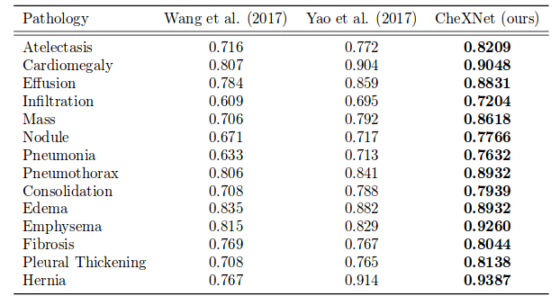

# Convolutional Neural Networks for Multi-Label Image Classification
\label{chp:dnn_mlc}

```{r, include=FALSE}
knitr::opts_chunk$set(echo = TRUE, message = FALSE, warning = FALSE)

library(tidyverse)
```

## Introduction

This post is about using convolutional neural networks (CNNs) to perform multi-label image classification (MLIC). MLIC is a generalisation of the single-label image classification task. It allows for an input image to be annotated with more than one label (*i.e.* classes are not mutually exclusive) which is often required in real-world applications. CNNs have showed its superiority over other methods when it comes to single-label image classification and other Computer Vision tasks. Here we investigate how it can be used to solve the lesser researched problem of MLIC.

+ compared to object detection (or in intro chapter)
+ say something on applications (many)
+ objective of chapter
+ outline of chapter

## Applications

MLIC is a more general and practical problem compared to single-label classification since most real-world images contain multiple objects of different categories. Some interesting (for me at least) datasets for MLIC are listed below:

+ [**Planet: Understanding the Amazon from Space**](https://www.kaggle.com/c/planet-understanding-the-amazon-from-space/data): The dataset consist of $\pm$ 100,000 satellite images of the Amazon rainforest labeled with various land cover/land use classes along with atmospheric conditions. Each satellite image is associated with at least one label (see Figure \@ref(fig:apps) (a)) and therefore fits into the MLIC framework. The data was released as part of a Kaggle competition. The competition hosts wanted a model that can accurately monitor the Amazon from satellite images in order to help them prevent deforestation.

+ [**ChestX-ray8**](https://nihcc.app.box.com/v/ChestXray-NIHCC/folder/36938765345): The $\pm$ 110,000 images in this dataset are chest X-rays labeled with various thoracic pathologies where each image can have multiple labels (see Figure \@ref(fig:apps) (b)). The data was released by the NIH (National Institute of Health) to promote the development of computer aided diagnosis and detection.

+ [**WIDER-Attribute**](http://riemenschneider.hayko.at/vision/dataset/task.php?did=337): This is a human attribute prediction benchmark dataset. From the dataset we can get $\pm$ 60,000 images of individuals labeled with their corresponding attributes (see Figure \@ref(fig:apps) (c) for an example).


```{r apps, fig.cap="Examples of input-output pairs in a MLIC problem.", echo=FALSE}
#library(egg)
library(grid)
library(gridExtra)
library(imager)

head_a <- textGrob("(a)")
head_b <- textGrob("(b)")
head_c <- textGrob("(c)")

planet <- load.image('figures/train_24.jpg') %>% rasterGrob()
planet_lab <- "partly_cloudy\nprimary\nconventional_mine" %>% textGrob()

chest <- load.image('figures/00000013_025.png') %>% rasterGrob()
chest_lab <- "Cardiomegaly\nInfiltration\nMass\nNodule" %>% textGrob()

wider <- load.image('figures/marchin.jpg') %>% rasterGrob()
wider_lab <- "male\nsunglass\nhat\nlong_sleeve" %>% textGrob()

input_img <- textGrob("Input Image", rot = 90)
label_ax <- textGrob("Labels", rot = 90)

lay <- rbind(c(NA, 1, 2, 3),
             c(4, 5, 6, 7),
             c(8, 9, 10, 11))

grid.arrange(head_a, head_b, head_c, 
             input_img, planet, chest, wider,
             label_ax, planet_lab, chest_lab, wider_lab,
             #nrow = 3, ncol = 3,
             layout_matrix = lay,
             heights = c(0.1,0.6,0.3), widths = c(0.1, 0.3, 0.3, 0.3))
```

## Main Challenges

Here, we show how MLIC is different to single-label classification[^compare] and how these differences make the MLIC task more challenging. We will first look at the differences in terms of the input images, then how the multi-label output presents some new challenges, followed by the added complexity of evaluating MLIC models.

[^compare]: I chose to compare MLIC to single-label classification since it is one of the more commonly known and basic tasks in computer vision. MLIC also has close relationships with (weakly-supervise) object detection and image captioning.

### How are the input images different to conventional image classification?

Objects in a typical multi-label image come in various sizes and positions, wheras in a typical single-label image, the object is usually in the center and covering a large part of the image. See for example in Figure \@ref(fig:apps) (c) where the image region related to 'sunglass' is very small compared to the region related to 'male'. The objects in a multi-label image are often also only partially visible, for example in Figure \@ref(fig:apps) (a) where the 'partly_cloudy' region covers a big part of the 'primary (forest)' region. Notice the presence of spatial relations between label regions in a multi-label image. Again in Figure \@ref(fig:apps) (c) we can observe that the image regions related to 'sunglass' and 'hat' will usually be close to each other, in contrast to 'hat' and say 'shoes', which will rarely occur in the same proximity.

This diverse and complex contents of multi-label images make it difficult to learn effective feature representations and classifiers. This raises a question on the optimality of transfer learning from single-label image datasets to do MLIC, since the nature of the two types of images differ greatly. Using a network pre-trained on a object detection dataset might be a better starting point.

One approach to make better use of single-label feature representations is to transform the MLIC problem into mutliple multiclass classification problems over various regions of the images, *i.e.* identify patches in an image which is likely to be related to only one label and perform a single-label image classification on each of those patches. This is a common approach in object detection. An example of such an approach in MILC can be found in @Wei2014 (see Figure \@ref(fig:HCP)). However, we will not consider this method, since the so-called 'hypotheses extraction' step can be tedious and requires a separate algorithm. It therefore does not meet our requirements of an end-to-end network solution.

```{r HCP, fig.cap="An illustration of the infrastructure proposed in @Wei2014.", echo=FALSE}
knitr::include_graphics('figures/hcp.png')
```

### How does the multi-labeledness influence learning? \label{mlcnn_corr}

The output space of a MLIC problem can get really big. The number of possible label combinations increases exponentialy with the increase in the number of unique labels in the dataset. This is said to be the key challenge in learning from multi-labeled data - handling such large label spaces. Not only does it require a large amount of computational power (which is not necessarily such a big problem anymore, thanks to DL + GPUs) but it also introduces other problems that needs to be considered in the modeling process, such as extreme class imbalance and label sparsity.

In our examples, the number of labels is relatively small. However, in the YouTube multi-label video classification [challenge](https://www.kaggle.com/c/youtube8m) there are 4716 unique labels. On average, each video in the training set is assoicated with only 3.7 labels and only 14 of the labels occur in more than 1% of the training videos.

```{r ytdist, eval=FALSE, include=FALSE}
library(tidyverse)
yt_labels <- read_csv('data/yt_labels.csv', col_names = FALSE)
yt_labels <- lapply(yt_labels$X2, strsplit, " ")

mean(sapply(yt_labels[1:10], function(a) length(unlist(a))))

temp <- prop.table(table(unlist(yt_labels))) %>% as.data.frame()

sum(temp$Freq > 0.01)
```

To more effectively learn in such large output spaces, algorithms can try to exploit the label dependency structures in the data. As an illustration of such structures, see Figure \@ref(fig:corr) for the normalised label co-occurrence matrices of the human attribute prediction dataset. See how 'male' almost never occur with 'longHair' and 'skirt', and most of the time when 'formal' is relevant to an image, so to is 'longSleeve'. These are the types of "correlation" in the labels we would want a model to exploit. In a perfect world, we would expect a model to identify a skirt regardless of whether or not a male is already identified. However, the data is never a 'perfect world' and knowing whether or not the person in an image is a male might help the model to determine if he/she is wearing a skirt, especially if there are only a few examples of skirts in the training data and/or the skirt is only partially visible.

```{r corr, fig.cap="The normalised label co-occurrence matrix for WIDER-attribute dataset. The colour intensity in cell (i,j) indicates the number of times label i and j co-occurred divided by the number of times label i occurred.", echo=FALSE}
library(tidyverse)
wider_labs <- read_csv('data/wider_labels.csv')
library(corrplot)
wider_LS <- unique(unlist(lapply(wider_labs$tags, strsplit, " ")))
wider_LS <- na.omit(wider_LS)

wider_Y <- do.call("rbind", lapply(wider_labs$tags, function(a) {
  as.numeric(wider_LS %in% unlist(strsplit(a, " ")))
}))

wider_YY <- t(wider_Y) %*% wider_Y

wider_m <- wider_YY/diag(wider_YY)
colnames(wider_m) <- rownames(wider_m) <- wider_LS

corrplot(wider_m, cl.lim = c(0,1))
```

Exploiting these correlations is not a trivial task and has been the main focus of multi-label classification (MLC[^mlc]) research. The correlations are usualy asymmetric and depend on the input. We explore the different approaches later in the post.

[^mlc]: I know this might be confused with MLIC when not read carefully.

One more consideration for MLIC is that the number of labels associated with an image is unknown. For example in the Chest X-ray data the number of labels associated with an image ranges from 0 to 9. The reason this might be a challenge is as follows. The output of most multi-label classifiers (including DNNs) are in the form of numeric scores for each label, which can usually be interpreted as the likelihood of a label's presence. The problem arises when we need to map these numeric scores to a binary code to ultimately indicate which labels are relevant or not (sometimes referred to as label calibration). In binary classification we threshold the numeric scores to map it to a binary code, for example if $f(x) > 0.5$ let $y = 1$ or $y=0$ otherwise. In multiclass classification the label with highest class score is assigned a 1 and the rest 0. This is more complicated in MLC since the optimal threshold may vary across labels and if we rather want to choose the $k$ labels with the highest class score, we first need a way to determine $k$.

```{r, include=FALSE, eval=FALSE}
library(tidyverse)
chest_labs <- read_csv('data/chest_labels.csv')
chest_LS <- unique(unlist(lapply(chest_labs$`Finding Labels`, strsplit, "\\|")))

chest_Y <- do.call("rbind", lapply(chest_labs$`Finding Labels`, function(a) {
  as.numeric(chest_LS %in% unlist(strsplit(a, "\\|")))
}))

range(apply(chest_Y, 1, sum))
```

There are some interesting proposals in the literature which we will have a look at soon. Note that the solution to the above mentioned challenges are highly dependent on the chosen evaluation metric for the problem. The evaluation metric or loss function of an MLIC problem is again more complex than for the single-label case - we discuss it next.


### [CNN-RNN: A Unified Framework for Multi-label Image Classification](https://arxiv.org/pdf/1604.04573.pdf)

The CNN-RNN architecture has proven its worth in sequential prediction tasks like machine translation and image captioning. In this work the CNN-RNN network is applied to MLIC by treating the problem as an ordered prediction problem. Their proposed CNN-RNN network is able to effectively learn the semantic redundancy and the co-occurrence dependency in an end-to-end manner. Although in the prediction phase a beam search is required and therefore the complete approach is not strictly what we are looking for. 

The multi-label RNN learns a low dimensional joint image-label embedding to model the semantic relevance between images and labels. The image embedding is done by a CNN (VGG pretrained on ImageNet), while each label has its own learnable embedding vector. In this space a long short term memory (LSTM) recurrent layer is used to model the high-order label co-occurrence dependency. The LSTM layer is able to maintain contextual information about the previously predicted labels in it internal memory states. At each time step the probability of a label is computed based on teh image embedding and the output of the recurrent neurons. This approach is comparable to that of CCs. During prediction, the multi-label prediction with the highest probability can be approximately found with beam search algorithm. See Figure \@ref(fig:cnn-rnn1) for an illustration of this framework.

```{r cnn-rnn1, echo=FALSE, fig.cap="An illustration of the CNN-RNN framework."}
knitr::include_graphics('figures/cnn-rnn1.png')
```

In their experiments they tested the model on the the three most common MLIC benchmark datasets, NUS-WIDE, MSCOCO and PASCAL VOC 2007. However, again only in terms of fixed top-$k$ metrics. Overall their model showed the best results, including better than the WARP approach. They also showed how the binary cross-entropy loss gives better results than WARP. Surprisingly, they did not fine-tune the CNN part of the network, supposedly for simplicitly reasons, which would definitely improve their results.

An added bonus of this framework is that the RNN allows the model to adapt its focus on the image features for each label prediction, meaning for each label, the model can look at different parts of the image. In theory this should help to recognise smaller objects, however the authors reported that small objects were still hard to classify.

A major drawback of this approach is that the order of the prediction path during training should be pre-specified. There is no best way to determine this order. The authors suggests making the assumption that the labels appearing the most should be the easiest to learn and therefore predicting them first.

### [Annotation Order Matters:Recurrent Image Annotator for Arbitrary Length Image Tagging](https://arxiv.org/pdf/1604.05225.pdf)

+ another RNN based approach.
+ experiment with different label orders and find rare-first to work the best.
+ evaluation using fixed annotation length is not realistic and arbitrary length annotation is required.
+ propose Recurrent Image Annotator (RIA) (uses CNN+RNN)
+ in the annotation phase, RIA receives an image as input and the outputs a label one-by-one (inspired by image captioning).
+  The advantages of using RNN do not only include its nature to generate varied length outputs, but also  its ability to refer to previous inputs when predicting the current time step output. Such ability allows RNN to exploit the correlations of both image-to-tag and tag-to-tag.
+ no natural order, so we have to choose of learn an order.

+ see Figure \@ref(fig:ria) for an illustration.

```{r ria, fig.cap="An illustration of the RIA framework.", echo=FALSE}

```

+ use a linear projection layer to embed the image into a lower dimensional space, suitable for the RNN,
+ same with the label vectors
+ all very similar to the original CNN-RNN (can be seen as representative)
+ predict until stop signal, predicted
+ cross-entropy loss
+ experimented with four label orders: dictionary (alphabetical) order, random order, rare-first order and frequent-first order
+ tested on lesser known datasets
+ used VGG pretrained
+ Adam opt.
+ rare-first did the best

    
### [ChestX-ray8: Hospital-scale Chest X-ray Database and Benchmarks on Weakly-Supervised Classification and Localization of Common Thorax Diseases](https://arxiv.org/pdf/1705.02315.pdf)

This works introduce the Chest X-ray dataset mentioned earlier. Along with the dataset, they published a few benchmark results on the data. They took the transfer learning approach of using a pretrained CNN and swapping out the top layers for a specific purpose. Here they experimented with 4 differenct CNN architecutres pretrained on ImageNet: AlexNet, GoogleLeNet, VGG and ResNet 50 (which gave the best results). For their top layers they chose a transition layer, Global pooling layer and prediction layer (see Figure \@ref(fig:chestnet8)).

```{r chestnet8, fig.cap="Illustration of the framework proposed in this work.", echo=FALSE}

```

The transition layer is a convolutional layer (?) transforming the activations from the different base CNNs to an uniform dimension. This is crucial since they don't train the base CNN layers on the dataset (which is something worth experimenting). 

The global pooling layer is a novel pooling method to serve as an in-between of the max and average pooling layers. They called it the log-sum-exp pooling layer and defined it as

$$
x_{p}=x^{*}+\frac{1}{r}\cdot \log\left[\frac{1}{S}\sum_{(i,j)\in \boldsymbol{S}}\exp(r\cdot(x_{ij}-x{*}))\right],
$$

where $x^{*}=\max\left\{|x_{ij}|,(i,j)\in \boldsymbol{S}\right\}$, $X_{ij}$ is the activation value at $(i,j)$, $(i,j)$ is one location in the pooling region $\boldsymbol{S}$, and $S = s\times s$ is the total number of locations in $\boldsymbol{S}$. When $r\to\infty$ the operation is equivalent to max pooling and when $r\to 0$ it becomes equivalent to the average pooling operation. The use of this pooling gave negligible improvements in terms of accuracy and added complexity because $r$ is a hyperparameter that needs to be tuned. However, the authors were also interested in extracting the pathologie's localisations in the images, and this pooling method seemed to improve the quality of these localisation maps. See Figure \@ref(fig:chestnet8) for an illustration of the pooling operations and why it may help with localisation.

Although not specified, I suspect the prediction layer is a standard fully connected layer with a sigmoid activation. They experimented with the hinge, euclidean, cross-entropy and weighted cross-entropy (W-CE) loss functions. They found W-CE to give the best results. W-CE is defined as

$$
J_{WCE}=\beta_{P}\sum_{y_{c}=1}-\ln(f(\boldsymbol{x}_{c}))+\beta_{N}\sum_{y_{c}=0}-\ln(1-f(\boldsymbol{x}_{c}))
$$
where $\beta_{P}=\frac{|P|+|N|}{|P|}$ and $\beta_{N}=\frac{|P|+|N|}{|N|}$, with $|N|$ the number of positive classes and $|N|$ the number of negative classes. Therefore the positive labels will be given more weight if there are few of them. They argue that this formulation is necessary since otherwise the network struggles to find positive instances because of the sparsity and imbalance in the labels.

By performing a global pooling after the transition layer, the weights learned in the prediction layer can function as the weights of spatial maps from the transition layer. Therefore, we can produce weighted spatial activation maps for each disease class by multiplying the activation from transition layer and the weights of prediction layer.

### [Order-Free RNN with Visual Attention for Multi-Label Classification](https://arxiv.org/pdf/1707.05495.pdf)

#### Summary

+ predetermined label order for LSTM is not ideal
+ inconsistency between training and predictiion phases
+ present a novel deep learning framework of visually attended RNN (visual attention + LSTM)
+ this model learns the correct label order from the image
+ improved attention module to accommodate labels associated with small image regions.
+ Therefore, how to introduce the flexibility in learning optimal label order while jointly exploiting the associated visual information would be the focuses of our proposed work.
+ 3 modules: mapping, attention, prediction - see Figure \@ref(fig:impCNNRNN)
+ mapping extracts visual features from image with pretrained CNN
+ the attenion module learns a set of feature maps describing the corresponding layer of image semantic information.
+ prediction module is a LSTM followed by a final prediction layer.
+ during the LSTM prediction process, after each step the attention module is updated by the hidden state guiding the network to visually attend the next area of interest in the image.
+ FC layer after CNN as initial prediction
+ use prediction of previous time step to order labels by confidence
+ use candidate pooling to avoid predicting duplicates
+ also use beam search to find best prediction path

```{r impCNNRNN, fig.cap="Illustration of the framework proposed for an improved CNN-RNN.", echo=FALSE}
knitr::include_graphics('figures/impCNNRNN.png')
```

+ tested on MSCOCO and NUS-WIDE
+ does not do better than SRN
+ compares other label orders
+ can visualise attention
    
## [Learning to diagnose from scratch by exploiting dependencies among labels](https://arxiv.org/pdf/1710.10501.pdf)    

#### Summary

+ predicting the absence of a label is just as important as predicting its presence
+ takes conditional dependence into account
+ use of out-of-box RNN decoders are naive
+ show no need for pretraining since images data are large
+ significant dependencies among labels in this dataset
+ show that ordering does not seem to impose as a significant constraint when models are sufficiently trained
+ used densenet as CNN encoder since better for smaller amounts of data
+ use a LSTM and treat the mlc as a sequence prediction of fixed length
+ no attention mechanism and no need to know when to stop
+ sigmoid at each step
+ runs for the $K$ iterations
+ use greedy search

### [Multi-label Image Recognition by Recurrently Discovering Attentional Regions](https://arxiv.org/pdf/1711.02816.pdf)

#### Summary

+ capable of automatically discovering semantic-aware regions over image scales and simultaneously capturing their long-range contextual dependencies.
+ incorporate a recurrent memorized-attention module in the neural network to simultaneously locate the attentional regions and predict the labels on various located regions. Our proposed method does not resort to the extraction of object proposals and is thus very efficient and can be trained in an end-to-end mode.
+ see \@ref(fig:rnnatt)
    
```{r rnnatt, fig.cap="Illustration of the framework proposed for this RNN with improved attention.", echo=FALSE}
knitr::include_graphics('figures/rnnatt.png')
```    

+ uses a VGG CNN
+ the spatial transformer (ST) locates an attentional region for the LSTM, and the LSTM predicts the scores regarding this region for multi-label classification and simultaneously updates the parameters of ST. Finally, the scores from several attentional regions are fused to achieve the final label distribution.
+ details on ST
+ category wise max pooling 
+ for some reason they use the euclidean loss
+ still need to look at the rest of the complicated details.


### [CheXNet: Radiologist-Level Pneumonia Detection on Chest X-Rays with Deep Learning](https://arxiv.org/pdf/1711.05225.pdf)

CheXNet is the latest attempt to improve the performance on the Chest X-ray dataset. Their main focus was on detecting Pneumonia, however, they also extend the model to do MLIC. In Figure \@ref(fig:chexnetres) we see how much better CheXNet does compared to the other methods.

```{r chexnetres, fig.cap="This table reports the AUC per pathology for CheXNet compared to the previous baselines.", echo=FALSE}

```

No novel MLC technique was used in CheXNet. The boost in performance came from using a more modern CNN architecture, known as DenseNet. This time the network was trained from scratch (no transfer-learning). The classification layer was a standard fully-connected layer with an elementwise sigmoid activation, supervised with the binary cross-entropy sum over all labels.

This is a good example of how the base CNN influences the performance of a network and why it is unfair to compare MLIC techniques when the base networks are different.


+ Meta Analysis:

    - unsure if this is necessary
    - maybe can come earlier to show why a overview/ comparision is valuable
    - want to compare things like what datasets were tested on, way of evaluation, base networks, results, etc.
