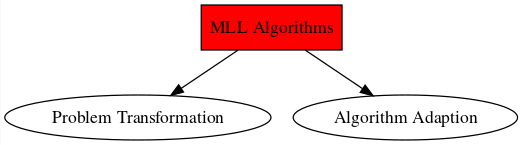

# Multi-Label Learning

## Introduction

+ why this chapter
+ aim is to cover the core of MLL literature
+ update of previous reviews
+ to highlight areas to focus on for further studies

> cannot find good literature on multi-target learning - might not want to add the above paragraph

The birth of the ML field (around 1999) came from the need to assign multiple labels to text documents. Contributions in [@Schapire99improvedboosting] and [@Schapire2000a] adapted a boosting algorithm to handle ML data. [@Elisseeff] defined a ranking based SVM to deal with ML problems in the areas of text mining and also bioinformatics. [@Lewis2004] released an important benchmark collection for ML text classification. Another highly cited ML SVM implementation is [@Boutell2004a], with application in scene/image classification. [@Zhang2006] showed how to apply neural networks to a ML problem and [@Zhang2007] adapted the KNN algorithm for ML input. The first overview on the subject was given in [@Tsoumakas] where the author discussed the most relevant ML learning approaches. Then came applications to music, [@Trohidis2008] and [@Turnbull2008]. [@Vens2008] showed how to use decision trees for hierarchical ML classification. Important papers introducing unique ML approaches are [@Tsoumakas2007b], [@Furnkranz2008] and [Read2011a]. A crucial step for ML learning was to make it accesible and useable to more reasearchers. The authors of [@Tsoumakas2011] developed a Java library for ML learning. Later on [@Madjarov2012a] did a empirical study on the most important ML algorithms up to that date, comparing 12 multi-label learning methods using 16 evaluation measures over 11 benchmark datasets. More recent extensive reviews of ML learning are given in [@Zhang2014] and [@Gibaja2014]. 

> not sure which papers to include here. The aim is to highlight the most important. Difficult to determine. Should I visualise timeline of contributions?

> what does recent research focus on? Extreme ML learning?

The rapid growth of the ML learning is probably owed to the vast and expanding range of ML application domains, the biggest being text and multimedia categorisation especially those generated and/or stored on the web. Other application domains common to ML learning are: biology, chemical data analysis, social network mining and E-learning amongst others. A thorough list of applications and their citations can be found in [@Gibaja2014].

> Say something of video classification? Create my own list of applications?

The key challenge in ML learning is to exploit dependecies amongst labels, *e.g.* using the information on the relevance of label $l_{i}$ to predict label $l_{j}$, $i,j \in \{1,2,\dots,K\}$, $i\neq j$. This is especially difficult for a ML learner when there are many labels. It is not uncommon for ML datasets to have hundreds of thousands of labels. Proof of this can be found at [this](https://manikvarma.github.io/downloads/XC/XMLRepository.html) ML data repository. Algorithms that can accurately and efficiently model label dependence on these datasets are rare [@Sorower]. This is a focus area of recent ML research, called extreme multi-label learning [@Xu2016]. A more formal definition of label dependence will be given later on. An in-depth discussion on the unique challenges (thorough list by [@Gibaja2014]) that arise from dealing with label dependence and some of the possible strategies to follow will also be covered.

### Basic Idea

### Applications

+ thorough list by [@Gibaja2014]
+ text; multimedia; biology; chemical data analysis; social network mining; e-learning; other
+ examples and citations
+ mention importance

### In the Literature

+ history
+ database analysis
+ show trend
+ most cited papers
+ mention important reviews:

[@Tsoumakas2007], [@Sorower], [@Zhang2014], [@Gibaja2014], Tutorial: [@CarvalhoAndreCPLFde2009], [@Gibaja2015]

+ see [@Gibaja2015] for different MLL resources 

### Challenges and Ongoing Research

+ key challenge = output space
+ mention challenges casused by key challenges
+ from [@Gibaja2014]
+ worth highlighting that recent research has shifted its focus to problems on large scale labels - focus on scalability
+ Label Dependence: conditional vs marginal; mentions order categorisation; asymetric and local
+ Dimensionality Reduction
+ Reduction of the Input Space: feature selection; feature extraction
+ Reduction of the Output Space: HOMER; Label reduction with association rules; CCA; compressed sensing; principal label space transform; compressed labelling
+ MIML
+ Semi-supervised and Active Learning
+ Online MLL and Data Streams
+ Hierachical MLC
+ Dealing with Class Imbalance: label skew
+ Mention extreme MLC and maybe add a section somewhere in chapter
+ list also in [@Alazaidah2016]

### Aim of this Chapter

+ the goal of this chapter: review + highlight limitations to be studied further
+ outline

## The Paradigm

+ consider adding the settings described by Read and [@Gibaja2015]

### Learning Framework

+ mathematical definition with notation of the task of ML learning.
+ real-valued output + thresholding function (ranking vs classification)

The task of ML classification is to find a function $h$ that accurately maps the observations contained in $X$ to the label matrix $Y$, i.e., $h:X\to Y$, so that given a new observation, $h$ can determine which labels belong to it. The accuracy aforementioned is a topic that will be discussed shortly. The measurement thereof is another unique problem for ML classification.

On the other hand, the goal of ML ranking is to find a function $f:X\to G$, where $G$ is a similar matrix to $Y$, but with the $g_{ij}$ a real value representing the relative confidence score that label $j$ is relevant to observation $i$. $f$ is found by optimising a ranking metric, also discussed shortly. From the confidence scores of observation $i$, $f(\boldsymbol{x}_{i})$, a ranking $\boldsymbol{r}_{i}$ can be obtained, giving the rank of labels in descending order of $f(\boldsymbol{x}_{i})$.

> mention the calibration factor of [@Zhang2014]. Finding $z_{i}$ from $r_{i}$

$h$ will be referred to as the ML classifier and $f$ as the ML ranker. When ML learner will be a collective term covering both $h$ and $f$. Before different ML learners can be discussed, an understanding of how the output of these algorithms are evaluated is necessary, since fitting $f$ of $h$ envolves optimising an evaluation metric. (always?)

### Multi-Label Data and Repositories

+ properties of a ML data set: label cardinality, label density, label diversity
+ Simulating [@TorresTomas2014] (also gives citations to other papers)
+ above has no control over label correlation
+ partitioning mentioned in [@Gibaja2015] - referred to [@Sechidis]
+ [@Sorower]
+ details of benchmark datasets in appendix (learn how to link)

### Key Challenge

+ key challenge is the size of the output space: label sets grows exponentially with increase in labels
+ solution is to exploit label correlations efficiently
+ [@Sorower] has a section on exploiting label dependence
+ mention label dependence chapter
+ first-order, second-order, high-order strategies grouping

### Threshold Calibration

+ calibrate real-valued output against thresholding function output in order to determine labels of unseen instances.
+ constant vs induced from training data + ad hoc specific to certain learning algorithms
+ alternative to choose top k labels

## Evaluation Metrics

The evaluation of the performance of ML algorithms is another distinct problem to this setting. Compared to the single-label case, many more evaluation metrics exist, with subtle or obvious differences in their measurement. According to [@Madjarov2012a] it is essential to evaluate a ML algorithm on multiple and contrasting measures because of the additional degrees of freedom introduced by the ML setting. In addition, care should be taken when reporting multiple measures and with their interpretation. Since some of the measures are contrasting it is dangerous to report multiple metrics and conclude that on average one learner is better than the other. This was highlighted in [@Dembcz2012], where the authors suggested that when evaluating the performance of a ML learner, it should be made clear which metric(s) it is aiming to optimise, otherwise the results can be misleading. It is impossible (?) for a learner to have superior performance over others in terms of all the multi-label evaluation metrics simultaneously.

The evaluation measures of predictive performance of multi-label learnerss can be divided into two groups: example-based and label-based measures. Example-based measures compares the actual versus the predicted labels for each observation and then computes the average across all the observations in the dataset. Where label-based measures computes the predictive performance on each label separately and then averages across all labels [@Madjarov2012a]. For both groups the measures can further be partitioned into metrics from a classification persepective and measures from a ranking perspective, *i.e.* metrics for $h$ and metrics for $f$ respectively. The most commonly used metrics in each of the groups will be introduced here.

### Brief Taxonomy

+ more complicated than single label metrics
+ introduce example based vs label based
+ for classification and ranking
+ diagram / table + where they are used

```{r eval-tax, includ = FALSE, eval=FALSE}
grViz('figures/eval-tax.gv') %>% export_svg() %>% 
  charToRaw %>% rsvg %>% png::writePNG('figures/eval-tax.png')
```


+ \autoref{fig:eval-tax} is just an example. The image quality is lacking.

### Example-based Metrics

+ subset accuracy; hamming loss; accuracy; precision; recall; one-error; coverage; ranking loss; average precision
+ definition + brief interpretaion where it is unclear

For the following definitions, let $y_{i}$ be the set of true labels for observation $\boldsymbol{x}_{i}$ and $z_{i}$ the set of predicted labels for the same observation, obtained from the predicted indicator vector of $\hat{h}(\boldsymbol{x}_{i})$. The Hamming loss is then defined as
$$
\text{hloss}(h)=\frac{1}{n}\sum_{i=1}^{n}\frac{1}{K}|z_{i}\triangle y_{i}|,
$$
where $\triangle$ stands for the symmetric difference and $|.|$, the size of the set. For example, $|\{1,2,3\}\triangle\{3,4\}|=|\{1,2,4\}|=3$. Thus the Hamming loss counts the number of labels not in the intersection of the predicted subset of labels and the true subset of labels, as a fraction of the total size of the labelset, averaged across each observation in the dataset. When $h$ returns perfect predictions for each observation in the dataset, $\text{hloss}(h)=0$, and if $h$ predicts for each observation that it belongs to all the labels except for its the true labels, $\text{hloss}(h)=1$.

Accuracy is defined as
$$
\text{accuracy}(h)=\frac{1}{n}\sum_{i=1}^{n}\frac{|z_{i}\cap y_{i}|}{|z_{i}\cup y_{i}|}.
$$
Thus for each observation the number of correctly predicted labels is calculated as a proportion of the sum of the correctly and incorrectly predicted labels. These quantities are then averaged over each observation in the dataset. If the $h$ perfectly predicts the relevant subset of labels for each observations, $\text{accuracy}(h)=1$. If $h$ does not manage to predict a single correct label for any observation, $\text{accuracy}(h)=0$.

The precision and recall are respectively defined as
$$
\text{precision}(h)=\frac{1}{n}\sum_{i=1}^{n}\frac{|z_{i}\cap y_{i}|}{|z_{i}|},
$$
and
$$
\text{recall}(h)=\frac{1}{n}\sum_{i=1}^{n}\frac{|z_{i}\cap y_{i}|}{|y_{i}|}.
$$
Precision calculates the average proportion of correctly predicted labels in terms of the number of labels predicted, across all the observations in the dataset. Recall calculates a similar average, with the only difference that the proportion is calculated in terms of the number of true labels per observation. Both these metrics lie in the range $[0,1]$ with larger values desirable.

The harmonic mean between the precision and the recall is called the $F_{1}$-score and is defined as
$$
F_{1}=\frac{1}{n}\sum_{i=1}^{n}\frac{2|z_{i}\cap y_{i}|}{|z_{i}|+|y_{i}|}.
$$
The perfect classifier will result in a $F_{1}$-score of 1 and the worst possible score is zero.

The subset accuracy or classification accuracy is defined as
$$
\text{subsetacc}(h)=\frac{1}{n}\sum_{i=1}^{n}I(z_{i}=y_{i}),
$$
where $I(.)$ is the indicator function. This the subset accuracy is the proportion of observations that were perfectly predicted by $h$.

The above are all performance measures of ML classifiers. If the ML learner outputs real-valued confidence scores, these ranking metrics can be used to evaluate the learner's performance:

One-error:


Coverage:

Ranking Loss:

Average Precision:

### Label-based Metrics

+ micro vs macro ito tp, tn, fp, fn
+ auc example

The idea with label-based measures is to compute a single-lable metric for each label based on the number of true positives ($TP$), true negatives ($TN$), false positives ($FP$) and false negatives ($FN$) made by the classifier on a dataset and then obtaining an average of the values [@Gibaja2014]. Note, $TN_{k}$, $TP_{k}$, $FN_{k}$ and $FP_{k}$ denote the quantities for label $l_k$, $k=1,2,\dots,K$. Thus $TP_{k}+TN_{k}+FP_{k}+FN_{k}=n$. Let $B$ be any binary classification metric, i.e. $B\in \{\text{accuracy},\text{precision},\text{recall},F_{1}\}$. $B$ can be written in terms of $TN_{k}$, $TP_{k}$, $FN_{k}$ and $FP_{k}$, for example 
$$
\text{accuracy}(TN_{k}, TP_{k}, FN_{k}, FP_{k})=\frac{TP_{k}+TN_{k}}{TP_{k}+TN_{k}+FP_{k}+FN_{k}}.
$$
$B$ is then calculated for each label and then an average is calulated. The averaging can be done either by the micro or the macro approach. The micro approach considers predictions of all observations together and then calculates the measure across all labels, i.e.
$$
B_{micro}=B\left(\sum_{k=1}^{K}TP_{k},\sum_{k=1}^{K}TN_{k},\sum_{k=1}^{K}FP_{k},\sum_{k=1}^{K}FN_{k}\right).
$$
Whereas the macro approach computes one metric for each label and then the values are averaged over all the labels, i.e.
$$
B_{macro}=\frac{1}{K}\sum_{k=1}^{K}B(TP_{k},TN_{k},FP_{k},FN_{k}).
$$
Note, also that $\text{accuracy}_{micro}(h)=\text{accuracy}_{macro}(h)$ and that $\text{accuracy}_{micro}(h)+\text{hloss}(h)=1$, since Hamming loss is the average binary classification error.

Again, all of the above mentioned metrics are from a classification perspective. An example of a label-based metric from a ranking persepective is the macro- and micro-averaged AUC:

Most multi-label classifiers learn from the training observations by explicity or implicitly optimising one specific metric [@Zhang2014]. That is why in [@Dembcz2012] the authors reccomended specifying which of the metrics a new proposed algorithm aims to optimise in order to show if it is succesful. But at the same time it is important to test the algorithm on numerous metrics for fair comparisons against other algorithms [@Zhang2014], [@Madjarov2012a]. It might be that a algorithm does very well in terms of the Hamming loss, but performs poorly according to the subset accuracy, or vice versa, as shown in [@Dembcz2012]. In [@Tsoumakasc] they claim that the Hamming loss reported together with the micro-average $F$-measure gives a good indication of the performance of a multi-label classifier.

These multi-label metrics are usually non-convex and discontinuous [@Zhang2014]. Therefore multi-label classifiers resort to considering surrogate metrics which are easier to optimise. 

> probably should add an example or maybe later

Other than predictive performance, are there other aspects on which multi-label classifiers can be evaluated, such as efficiency and consistency. Multi-label algorithms should be efficient in the sense that it takes the least amount of computational power for a given level of predictive performance [@Madjarov2012a]. These classifiers can take a considerable amount of time to train when complicated ensembles are being implemented on datasets with huge labelsets. In cases where live updating and predictions are needed, this may be a problem [reference]. The other desirable attribute of multi-label classifiers are that they are consistent. This means that the expected loss of the classifier converges to the Bayes loss when the number of observations in the training set tends to infinity. Actually only a very few number of multi-label classifiers satisfy this property [@Zhou2011], [@Koyejo2015].

### Theoretical Results

+ evaluate perfomance on many metrics for fairness
+ something on label dependence link that will be discussed in next chapter
+ minimisation of surrogate loss functions and consistency
+ consistency [@Zhou2011]:

They were the first to do a theoretical study on the consistency of multi-label learning algorithms, focusing on the ranking loss and the hamming loss. A learning algorithm is said to be consistent if its expected risk converges to the Bayes risk as the size of the training data increases. They found that any convex surrogate loss is inconsistent with the ranking loss and therefore proposed a partial ranking loss (which is consistent with some surrogate loss functions) as an alternative. They also show how some recent multi-label algorithms are inconsistent in terms of the hamming loss and provides a discussion on the consistency of approaches which transforms the multi-label problem into a set of binary classification tasks.

## Learning Algorithms

### Simple Catergorisation

There are numerous multi-label learning algorithms. It is difficult to keep up with the all the latest proposed methods. These algorithm can be categorised in a number of ways, *e.g.* the review [@Zhang2014] and the tutorials [@Gibaja2015] and [@CarvalhoAndreCPLFde2009], all have different ways of grouping the algorithms. The categorisation for this thesis is chosen to satisfy the criteria of being common, simple and intuitive. Nevertheless, the characteristics of the algorithms leading to the other grouping variants will still be given in the remarks of the algorithms.

```{r mll-tax, eval=FALSE, include=FALSE}
library(DiagrammeR)
library(DiagrammeRsvg)
library(magrittr)
library(svglite)
library(rsvg)
library(png)

grViz('figures/MLL-tax.gv') %>% export_svg() %>% 
  charToRaw %>% rsvg %>% png::writePNG('figures/mll-tax.png')
```



+ still need to edit \autoref{fig:mll-tax}

+ want to keep it simple and representative but also give table with full list of methods
+ many proposals
+ scrutinise 8 representative algorithms for feasibility concerns
+ representativeness criteria: broad spectrum; primitive impact; favourable impact
+ introduce PT vs AA
+ diagram of categorisation
+ very thorough one in [@Gibaja2015]
+ mention ensemble category

### Problem Transformation Methods

Problem transformation methods consist of first transforming the multi-label problem into one or more single-label problem(s) and then fitting any standard supervised learning algorithm(s) to the single-label data. For that reason, problem transformation methods are called algorithm independent, i.e. once the data is transformed, any single-label classifier can be used [@Tsoumakasc].

The two main problem transformation algorithms are the binray relevance and label powerset transformations. Both methods suffer from several limitations but they form the basis of arguably any problem transformation method. The state-of-the-art problem transformations algorithms are most of the times extensions of either the standard binary relevance or label powerset algorithms [@Alazaidah2016]. Therefore the understanding of these two basic methods are crucial in dealing with the more complex, modern problem transformation methods.

#### Binary Relevance

+ basic idea
+ notation
+ cross-training
+ T-criterion for avoiding empty prediction
+ psuedo-code
+ remarks: first-order; parallel; straightforward; building block of state-of-the-art; ignores potential label correlations; may suffer from class-imbalance; computational complexity

The most common transformation method is binary relevance (BR). BR transforms the mutli-label into $K$ single-label problems by modelling the presence of the labels separately. Typically $K$ single-label binary data sets, $D_{k}=(X,\boldsymbol{Y}_{k})$ for $k=1,...,K$, would be constructed from the multi-label data set, $D=(X,Y)$. To each $D_{k}$ any single-label classifier can be applied. In the end, predictions $\hat{\boldsymbol{Y}}_{1},...,\hat{\boldsymbol{Y}}_{K}$ are obtained separately which can then be combined to allocate all the predicted relevant variables to each instance. Note, that it may occur that all of the single-label learners produces zeroes, which would imply that the instance belongs to an empty set. To avoid this [@Zhang2014] suggests following the T-criterion rule. The rule states, briefly, that in such a case the labels associated with the greatest output should be assigned to the instance. Clearly, this will only work if the base learners used gives continuous outputs and it will only make sense if all the base learners are of the same type. I suppose these rules are ad-hoc and I can think of alternatives.

> With this approach the standard single label feature selection procedures can be applied. The relevant subset of features can be identified for each label. This is convenient since it is not unlikely that the optimal subset of features will differ from label to label.

The biggest drawback for this approach is that it models each label separately and ignores the possible correlations between labels. Thus BR assumes that there are no correlations between the labels. However, these correlations can be very helpful in predicting the labels present. This is a first-order strategy. Also it can be time consuming since data sets with hundreds of labels is not rare. This would mean more than a hundred models should be fit and tuned separately. But this complexity scales linearly with increasing $K$, which is actually not so bad when comparing to other multi-label algorithms. Grouping the labels in a hierachical tree fashion may become useful when $K$ is very large [@Cherman2011] (see also Incorporating label dependency into the binary relevance framework for multi-label classification by the same authors).

Another argument against BR from [@Readb]: The argument is that, due to this information loss, BR's predicted label sets are likely to contain either too many or too few labels, or labels that would never co-occur in practice.

Advantage of BR by [@Readb]:
Its assumption of label independence makes it suited to contexts where new examples may not necessarily be relevant to any known labels or where label relationships may change over the test data; even the label set $L$ may be altered dynamically - making BR ideal for active learning and data stream scenarios.

Nevertheless, BR remains a competitive ML algorithm in terms of efficiency and efficacy, especially when minimising a macro-average loss function is the goal [@Luaces]. The most important advantage of BR is that it is able to optimise several loss functions [@Luaces] also see small proof. They also show empirically that BR tends to outperform ECC when there are many labels, high label dependency and high cardinality, i.e. when the multi-label data becomes more complicated.

Compared to label powerset (LP) which will be discussed later, BR is able to predict arbitrary combinations of labels [@Tsoumakasb] not restricted only to those in the training set.

[@Cherman2011] also proposes a variation of BR called BR+. Its aim is to keep the simplicity of BR but also to consider the possible label correlations. It does so by also creating $K$ binary data sets but this time each of these data sets treat all the label columns not to be predicted by the current single-label classifier as features to the classifier. Thus each sinlge-label classifier will have $p + K - 1$ inputs. So now when predicting label $l$, all of the original features in $X$ and the remaining variables $\boldsymbol{Y}_{k}$, $k\neq l$, are used as inputs for classifier $l$. (second order strategy?)

The problem arises when predicting unseen instances for which the labels are unknown. Thus the input needed for each binary classifier is not available. One workaround is to obtain an initial prediction of the labels using an ordinary BR approach and then using these predictions as inputs to the BR+ algorithm. The BR+ algortihm will most likely produce different predictions to the initial predicitons or BR which can then also be used in a next round of BR+. These steps can be continued until convergence but this seems like the classifier chains approach. (to be investigated).

[@Tsoumakasb] mentions the 2BR strategy that seems very similar/identical to BR+. They describe the 2BR method as follows: first train a binary classifier on each of the $K$ binary data sets and then use their predictions (and or probabilities) as so called meta-features for a second round of BR. They mention that it might be better to train the base and meta learners on separate parts of the training data to avoid biased predictions. They suggest using a cross-validation approach for both learners to also avoid size constraints of the training data. They describe this approach as a stacked generalisation, also mentioned in [@Tsoumakasa], [@Godbole], [@Pachet2009] calls it classifier fusion.

The adding of all the base learner predicitions as meta-feature to the meta-learners is not necessarily desirable. Some label pairs might have no correlation and adding predictions for those labels as inputs to the meta-learner will add noise to the model and waste computation time. [@Tsoumakasb] suggests a solution called corerlation-based pruning. They calculate the pairwise correlations between labels, $\phi$, and only add base learner prediction of label $i$ as a meta-feature to meta-learner $j$ if $\phi_{ij}$ is greater than some threshold. In this way only label-pairs that are highly correlated will be used in the final prediction of each other.

+ BR performs well for Hamming loss, but fails for subset 0/1 loss.
+  It is not clear, in general, whether the meta-classifier b should be trained on the BR predictions h(x) alone or use the original features x as additional inputs. Another question concerns the type of information provided by the BR predictions. One can use binary predictions, but also values of scoring functions or probabilities, if such outputs are delivered by the classifier @[@Dembcz2012].


#### Classifier Chains

+ basic idea
+ notation
+ importance of ordering
+ ECC brief explanation
+ psuedo-code
+ remarks: high-order; considers label correlations in a random manner; not parallel; computational complexity

Another extension of BR, similar to 2BR and BR+, is the classifier chains (CC) approach introduced by [@Readb]. It also consists of transforming the mutli-label data set $D$ to $K$ single-label data sets but the transformations are done sequentially in the sense that the label previously treated as a response will be added as a feature for predicting the next label. This will give data sets similar to $D_{1}=(X,\boldsymbol{Y}_{1}),D_{2}=(X,\boldsymbol{Y}_{1},\boldsymbol{Y}_{2}),...D_{K}=(X,\boldsymbol{Y}_{1},\boldsymbol{Y}_{2},...,\boldsymbol{Y}_{K})$, where the last column of each is the response that needs to be predicted. To each of these single-label data sets a classifier can be trained and then their predictions are combined in the same fashion as BR. CC keeps the simplicity of BR but has that additional capacity to model label dependencies by passing label information between classifiers. This should raise the question of what order of labels should the chain consist of and should it stop after one cycle?

In a response to this, the ensembles of classifier chains (ECC) was suggested by [@Readb]. Here the term ensemble refers to an ensemble of multi-label classifiers instead of an ensemble of binary classifiers already mentioned before. ECC trains $m$ classifier chains, each with a random chain ordering and a random subset of instances. These parameters of ECC contributes to the uniqueness of each classifier chain which helps with variance reduction when their predictions are combined. These predictions are summed by label so that each label receives a number of votes. A threshold is used to select the most popular labels which form the final predicted multi-label set [@Readb] (copied from). More details still to cover in article.

CC and ECC has an advantage over the ensemble methods of BR, that it is not necessary for an initial step of training to obtain predictions of labels that can later be used as features, it does this simultaneously.

Paper still need to look at for CC [@Sucar2013].

#### Calibrated Label Ranking

+ basic idea
+ notation
+ process for unseen instance
+ threshold function
+ enriched version of pairwise comparison
+ psuedo-code
+ remarks: second-oder; one-vs-one; mitigates class imbalance issue; quadratic increase in classifiers and improvements thereof; computational complexity

#### Random k-Labelsets

+ basic idea
+ notation
+ LP
+ limitations of LP: incompleteness and inefficiency
+ why rakel improves it
+ psuedo-code
+ remarks: high-order; ensembling; computational complexity

The other widely known problem transformation approach is the label powerset (LP) algorithm. Each combination of the labels is seen as a distinct class and then a standard multiclass classification learner can be applied. More formally, the transformation $h:L\to P(L)$ is applied [@Tsoumakasc]. Thus label correlations are taken into account but LP has other limitations. The number of possible classes increase exponentially with the increase in $K$ and some of the classes/combinations are under-represented (if represented at all) in the training set. This leads to the difficult problem of learning from unbalanced classes and also restricts the algortihm to only predict combinations of labels present in the training set. Labels (or labelsets) that only occur a limited number of times are called tail labels. These are generally the ones difficult to model and a classifier can easily neglect their importance [@Xu2016].

One way to reduce the number of resulting classes after a label powerset transformation is to create meta-labels (not to be confused with meta in the stacking sense) [@Read]. Meta-labels represent partitions of the label set, but I still do not fully understand the concept. Seems like after the transformation we still end up with a multi-label problem. Investigate further.

Another option is to throw away the combinations that appear infrequently in the training set. This obviously limits the possible output of the mutli-label algorithm even more. Sounds like PPT [@Reada].

The best way, according to the literature [@Zhang2014], to overcome the two main limitations of LP is another ensemble based approach (similar idea to stacking) called random $k$-labelsets (RA$k$EL). It was first introduced in [@Tsoumakasc]. It reduces the number of classes to predict from and allows each class to have more training instances compared to the LP method [@Lo2013]. Each learner in the ensemble constructs an LP classifier from a random subset of $k$ labels, referred to as $k$-labelsets. The randomness of this approach can also be its downfall, since the chosen subsets may not cover all labels and inter-label correlations [@Rokach]. We will use the term $L^{k}$ to denote the set of all distinct $k$-labelsets on $L$. The size of $L^{k}$ is given by $|L^{k}| = {{|L|}\choose{k}}$. The RA$k$EL algorithm iteratively constructs $m$ LP classifiers from a randomly select $k$-labelset, where each $k$-labelset is sampled from $L^{k}$ without replacement. The parameters to be tuned for RA$k$EL is the size of the ensemble (number of iterations), $m$, and the size of the labelsets, $k$. If $k=1$ and $m=|L|=K$ this is just an ensemble of BR classifiers. If $k=|L|$ then it becomes the ordinary LP method. [@Tsoumakasc] suggests a small $k$ with a sufficient number of ensembles, $m$, which they show to manage label correlations efficient- and effectively.

To make a prediction on a new instance, the new instance is feeded to each classifier in the ensemble and then their outputs are combined. To determine if label $j$ is relevant for this new instance, the proportion of classifiers in the ensemble indicating that label $l$ is relevant is obtained and then the final output is 1 if this proportion is greater than some threshold $t$. Intuitively $t=0.5$ makes sense, since this is equivalent to a majority vote, but RA$k$EL has been shown to work for a wide range of $t$-values.

Another factor to consider is the value of $k$. We do not want it to big. Also how many models should be included in the ensemble?

There are other ways of choosing subsets of the labelset, references in [@Rokach].

Note, with all these ensemble extensions, we can still try different ways of ensembling/stacking, especially with RA$k$EL. Not only taking the average but also by assigning weights to each model or by fitting a model to the predictions. Think [@Lo2013] is an example of this with generalised $k$-labelsets ensemble.

+ LP takes the label dependence into account, but the conditional one: it is well-tailored for the subset 0/1 loss, but fails for the Hamming loss. 
+ LP may gain from the expansion of the feature or hypothesis space.
+ One can easily tailor LP for solving the Hamming loss minimization problem, by marginalization of the joint probability distribution that is a by-product of this classifier.

### Algorithm Adaption Methods

These are methods tackling the multi-label learning task by adapting, extending and/or customising an existing supervised learning algorithm [@Madjarov2012a]. 

The main weakness of algorithm adaption methods is that they are mosty tailored to suit a specific model, whereas problem transformation methods are more general and allows for the use of many well-known and effective single-label models [@Rokach] (algorithm independent).

#### Multi-Label k-Nearest Neighbour (ML-kNN)

+ basic idea
+ procedure
+ psuedo-code
+ remarks: first-order; merits of lazy learning and Bayesian reasoning; mitigate class-imbalance; extensions/variations; computational complexity

#### Multi-Label Decision Tree (ML-DT)

+ basic idea
+ procedure
+ psuedo-code
+ remarks: first-oders; efficient; improve with pruning and or ensembling; computational complexity

#### Ranking Support Vector Machine (Rank-SVM)

+ basic idea
+ procedure
+ psuedo-code
+ remarks: second-order; variants; computational complexity

#### Collective Multi-Label Classifier (CML)

+ basic idea
+ procedure
+ psuedo-code
+ remarks: second-order; conditional random field model; DAG; computational complexity

### Summary

+ table: basic idea; order; complexity (test/train); domains; optimised metric
+ interpretation
+ comment on applicability to data sets
+ first-order AA is not BR

## Related Learning Strategies

+ multi-instance
+ ordinal classification
+ multi-task learning
+ data streams classification
+ multi-task learning; multiple-labels learning; multi-intance learning; reverse multi-label learning; preferential text classification; weak label problem; multi-valued multi-label; graded multi-label; multi-view learning

## Pitfalls and Guidelines

+ choosing algo is hard
+ more empirical evidence is needed; with with wide range of data sets, algos and measures; compare with statistical tests and consider computation time (training and test)
+ part on statistical tests in [@Gibaja2015]
+ gives reccomendations from empirical study
+ mentions label dependence modelling from dembcsz
+ trees for efficiency, ensembles for predictive performance, transformation methods for flexibility

## Conclusion

+ what was done in the paper
+ no formal charaterisation on the underlying concept or any principled mechanism on the appropriate usage of label correlations
+ correlations might be asymmetric and or local
+ label correlation understanding is holy grail of ML
+ complement of this paper would be a broad empirical study

+ what follows in next chapter(s)
+ highlight challenges again and mention those we are going to focus on: label dependence, high dimensionality
+ consider the addition of empirical study 
+ will actually contribute empirically but with specific questions in mind (end of each chapter)


