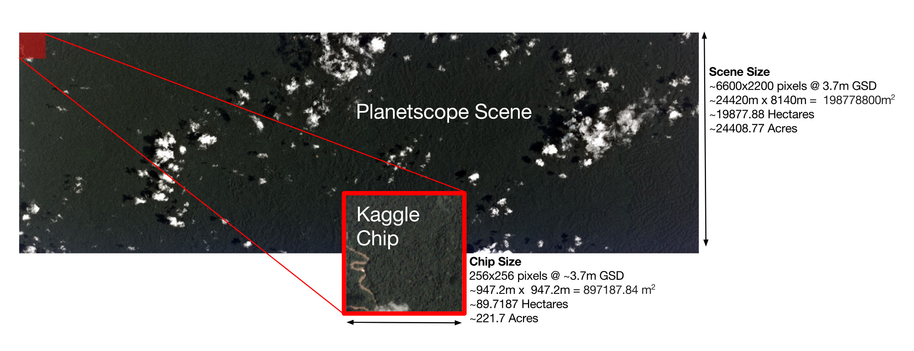
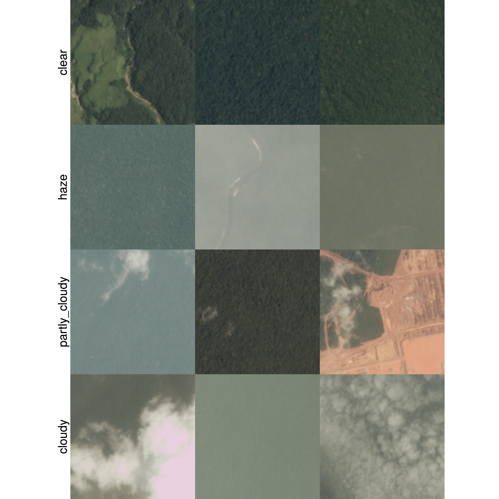
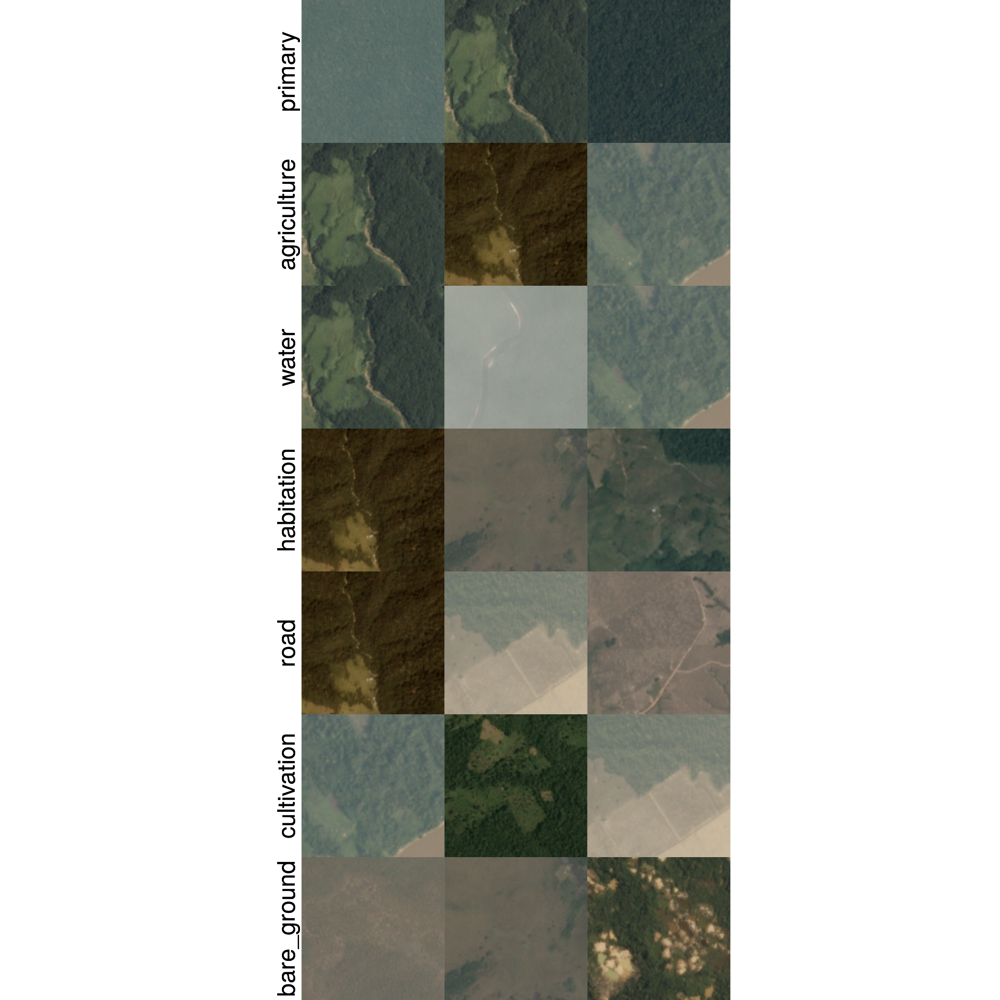
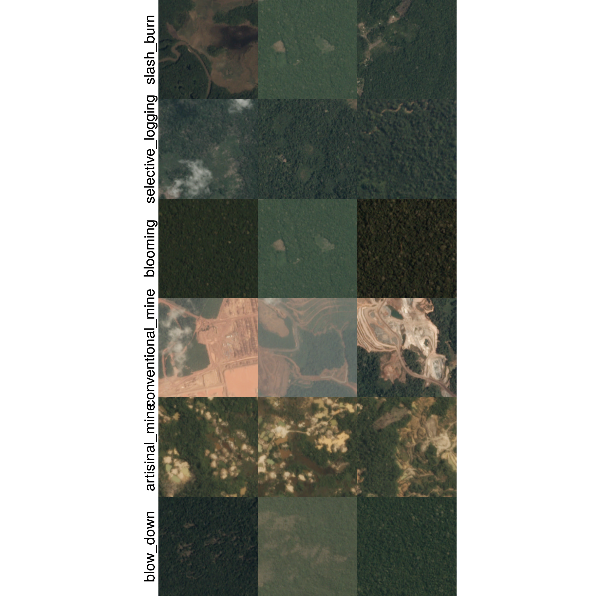

# Introduction
\label{chp:intro}

## Motivation

The motivation for this thesis is two-fold:

1. Image classification is a highly relevant topic in Computer Vision, Machine Learning and Statistical Learning. It is a thoroughly researched domain and already by many regarded as a 'solved' problem. This progress is mainly attributed to the yearly large-scale image classification competition, *ImageNet*[^imagenet], and the development of *Convolutional Neural Networks* (CNNs). The last five winners of ImageNet all used a variant of CNNs in their solution. However, the main focus up until recently was on problems of single label classification. Therefore, the field of multi-label image classification is nowhere near the maturity level of its single-label counterpart. Multi-label classification has a wide range of applications, not only in image classification. It has been applied to problems in text categorisation, multimedia, biology, chemical data analysis, social network mining and e-learning among others. This is most likely the reason why it has seen such a rapid increase of academic publications (see \autoref{pubsperyear}). However, researchers have not yet reached consensus on how to deal with many of the aspects when learning from multi-labelled data, *e.g.* dependency between labels. There are a very limited number of publications specifically dealing with multi-label classification of images, even more so while using CNNs for this task. The field can gain from an up-to-date review of the literature, more statistical perspectives on some of the challenges, additional benchmark datasets and quality empirical evaluations of the theory.  

```{r pubsperyear, include=FALSE, eval = FALSE}
library(tidyverse)
library(ggthemes)
pubsperyear_data <- read_csv("data/Scopus-2251-Analyze-Year.csv")
p <- pubsperyear_data %>% gather(database, No, -YEAR) %>% 
  #mutate(ind2017 = YEAR >= 2017) %>% 
  filter(YEAR < 2017) %>% 
  ggplot(aes(YEAR, No)) +
  geom_line() +
  theme_minimal() +
  labs(x = "Year", y = "# Documents") +
  facet_wrap(~database, labeller = function(variable, value) {
    dnames <- list(Scopus = "(a) Scopus", SemSchol = "(b) Semantic Scholar")
    return(dnames[value])}) 

ggsave("pubsperyear.png", plot = p, device = "png", path = "figures", width = 7, height = 4)
```

![Line graphs illustrating the rise in multi-label learning publications per year for two databases. The database searches were done on 24-03-2017. The searches were not identical since they were limited to the search features of the databases. (a) The search on Scopus (cite) was for all documents (conference papers, articles, conference, articles in press, reviews, book chapters and books) in any subject area with either the words *multi-label* or *multilabel* and either the words *learning* or *classification* found in either their titles, abstracts or keywords. (b) The search on Semantic Scholar was based on machine learning principles and thus automatically decides which research documents are relevant to a specific search query. The query used was *multilabel multi-label learning classification*. The search only returns research in the computer science and neuroscience fields of study. More technical details can be found on the respective engine's websites. \label{pubsperyear}](figures/pubsperyear.png)

2. Deforestation is a massive global problem. It contributes to reduced biodiversity, habitat loss, climate change and other devastating effects. It is said that the world loses an area of forest the size of 48 football fields per minute and the area most affected is in the Amazon basin (cite Kaggle). This problem can be fought more effectively by governments and local stakeholders if better data about the location of deforestation and human invasion on forests are continuously available to them - an ideal task for machine learning! Planet[^planet] and SCCON[^sccon] constructed a dataset of labelled satellite images taken of the Amazon basin and released it as part of a competition on Kaggle[^kaggle], challenging competitors to build algorithms that can automatically label these images with atmospheric conditions and various classes of land use/cover[^usecover]. Resulting algorithms will help the global community better understand where, how, and why deforestation happens all over the world - and ultimately how to respond.

[^imagenet]: http://www.image-net.org/
[^planet]: Designer and builder of the world's largest constellation of Earth-imaging satellites - www.planet.com
[^sccon]: Remote sensing experts - www.sccon.com.br/eng
[^kaggle]: Runs programming contests to crowd source machine learning solutions - www.kaggle.com
[^usecover]: Land cover indicates the physical land type such as forest or open water whereas land use documents how people are using the land.

## Thesis Objectives

This thesis works towards building a multi-label classifier that can label satellite images of the Amazon as accurately as possible. The method thought best to achieve this goal is to:

1. Identify the most important and latest developments in the literature for: multi-label classification, image classification and *remote sensing* (analysis of satellite images).
2. Provide an extensive review and discussion of these methods and how they compare to each other.
3. Empirically evaluate and compare them on the satellite image data in order to find the best strategies for our labeling task.

Since practically every state-of-the-art solution to an image classification problem is a CNN, it is reasonable to restrict the space of possible classifiers to CNNs. This thesis should provide the reader with a clear understanding of CNNs and how to effectively apply them to a multi-label classification problem, and especially in the domain of remote sensing. The main contribution of this thesis is a review of multi-label CNNs.

> update this section as progress is made with thesis.

## Data

This section covers an initial introduction to the data available for the problem at hand. The elements of the data important to know before moving on will be discussed here and the rest will be addressed throughout the thesis, as it becomes relevant to the discussion. This is done here to get a better understanding of the problem before exploring the literature.

### Image Format

The data for this task comes from a set of images (also referred to as chips). Each chip is a small excerpt from a larger image of a specific scene in the Amazon taken by satellites. The chip size in pixels is $256\times 256$, representing roughly 90 hectares of land, and is taken from a larger scene of $6600\times 2200$ pixels. All of the satellite images were taken between January 1, 2016 and February 1, 2017. The format of these images differ from the standard image format. Each image contains four color bands: red (R), green (G), blue (B) and near infrared (NIR), where the standard format images usually only contain R, G and B. The additional NIR colour channel is common in remote sensing[^remsens] applications and supposedly allows for clear distinction between water and vegetation in satellite images, for example. 

Another difference between these images and the usual format is that these have pixel intensities in 16-bit digital number format as opposed to the usual 8-bit of standard RGB images. This allows the colours in the images to have a much higher range since 16-bit pixel intensities have 65536 ($2^{16}$) levels, compared to 256 levels of 8-bit images. This becomes useful, for example, to distinguish between very dark or very bright areas in an image. If the pixel values of a chip gets flattened out into a vector, it will be of size 262144 ($256\times 256 \times 4$). However, CNNs take the images in their array form as input.

[^remsens]: The use of satellite- or aircraft-based sensor technologies to detect and classify objects on Earth [https://en.wikipedia.org/wiki/Remote_sensing].

### Collection and Labelling of the Images

The image collection was created by first specifying a "wish list" of scenes containing the phenomena the creators wanted to be included, in addition to a rough estimate of the number of such scenes that are necessary for a sufficient representation in the final collection. This set of scenes was then searched for manually on Planet Explorer[^planexp]. From these scenes the 4-band chips were created. A schematic of this process can be seen in \autoref{fig:chipcreate}. The chips were labelled manually by crowd sourcing. The utmost care was taken to get a large and well-labelled dataset, but that does not mean the labels all correspond to the ground-truth, *i.e.* the data will contain some inherent error. The creators believe that the data has a reasonable high signal to noise ratio.



[^planexp]: A web based interactive map of Earth consisting of satellite images, similar to Google Earth - www.planet.com/explorer

Note, the training and test splits were determined by the Kaggle competition creators. The training chips are labeled but at the time of writing this, the test chips are not yet made available to competitors. Predicted labels for the test chips can be submitted to Kaggle to evaluate in terms of the $F_{2}$-score, a metric which will be discussed in Chapter ??. This setup prevents competitors from using the test chips for training a classifier. There are 40479 training chips and 61669* test chips.

### Class Labels

The class labels for the images can be divided into three groups: atmospheric conditions, common land cover/use phenomena and rare land cover/use phenomena. In total there are 17 posssible labels. Each chip will have one atmospheric label and zero or more common and rare labels. Chips that are labeled as cloudy should have no other labels.

The atmospheric condition labels are: *clear*, *haze*, *partly cloudy* and *cloudy*. They are relevant to a chip when:

+ **clear**: there are no evidence of clouds.
+ **haze**: clouds are visible but they are not so opaque as to obscure the ground.
+ **partly cloudy**: scenes show opaque cloud cover over any portion of the image but the land cover/use phenomena are still visible.
+ **cloudy**: 90% of the image is obscured with opaque cloud cover.

```{r, include=FALSE, eval = FALSE}
library(tidyverse)
library(stringr)
train_labels <- read_csv("~/Documents/Kaggle/Amazon/train.csv")
label_list <- strsplit(train_labels$tags, " ")

atmos_labels <- c("clear", "haze", "partly_cloudy", "cloudy")
atmos_files <- lapply(atmos_labels, function(a) {
  lab_ind <- sapply(label_list, function(b) a %in% b)
  train_labels$image_name[lab_ind][1:3]
})

library(jpeg)
atmos_paths <- lapply(atmos_files, function(a) paste0("~/Documents/Kaggle/Amazon/train-jpg/", a, ".jpg"))
atmos_imgs <- lapply(atmos_paths, function(a) lapply(a, readJPEG))
library(ggmap)
library(gridExtra)
atmos_grobs <- lapply(atmos_imgs, function(a) lapply(a, ggimage))

grobs_arranged <- lapply(1:length(atmos_grobs), function(a){
  arrangeGrob(grobs = atmos_grobs[[a]], ncol = length(atmos_grobs[[a]]), respect = TRUE, left = atmos_labels[a])
})

ggsave("figures/atmos.png", grid.arrange(grobs = grobs_arranged, ncol = 1))
```



Examples of chips with atmospheric labels can be found in \autoref{fig:atmos-egs}. Each chip should only have one atmospheric label and therefore this classifying task simplifies to a multiclass problem. This allows for the option to break up the labeling task of all the labels into two tasks: a multiclass classification problem for the atmospheric labels and a multi-label classification problem for the land cover/use labels. This approach might save some computational time and give extra information to the multi-label learners for classifying the land cover/use labels. We will experiment with these approaches in Chapter ??.

The common land cover/use labels are: *primary*, *agriculture*, *water*, *habitation*, *road*, *cultivation* and *bare ground*. They are relevant to a chip when:

+ **primary**: it is primarily consisting of rain forest (virgin forest), *i.e.* dense tree cover.
+ **agriculture**: it contains any land cleared of trees that is being used for agriculture or range land.
+ **water**: it contains any one of the following: rivers, reservoirs, or oxbow lakes.
+ **habitation**: it contains human homes or buildings.
+ **road**: it contains any type of road.
+ **cultivation**: it shows signs of smaller-scale/informally cleared land for farming.
+ **bare ground**: it contains naturally (not the caused by humans) occurring tree-free areas.

```{r, include=FALSE, eval = FALSE}
common_cover_labels <- c("primary", "agriculture", "water", "habitation", "road", "cultivation", "bare_ground")
common_cover_files <- lapply(common_cover_labels, function(a) {
  lab_ind <- sapply(label_list, function(b) a %in% b)
  train_labels$image_name[lab_ind][1:3]
})

common_cover_paths <- lapply(common_cover_files, function(a) paste0("~/Documents/Kaggle/Amazon/train-jpg/", a, ".jpg"))
common_cover_imgs <- lapply(common_cover_paths, function(a) lapply(a, readJPEG))
common_cover_grobs <- lapply(common_cover_imgs, function(a) lapply(a, ggimage))

grobs_arranged <- lapply(1:length(common_cover_grobs), function(a){
  arrangeGrob(grobs = common_cover_grobs[[a]], ncol = length(common_cover_grobs[[a]]), respect = TRUE, left = common_cover_labels[a])
})

ggsave("figures/common-cover.png", grid.arrange(grobs = grobs_arranged, ncol = 1))
```



Examples of chips with common land cover/use labels are found in \autoref{fig:common-cover-egs}. According to the competition page on Kaggle, small, single-dwelling habitations are often difficult to spot but usually appear as clumps of a few pixels that are bright white. Roads sometimes look very similar to rivers and therefore these two labels might be noisy. The NIR band might give a classifier additional information to help distinguish between the two. Cultivation is a subset of agriculture and is normally found near smaller villages, along major rivers or at the outskirts of agricultural areas. It typically covers very small areas.

The less common land cover/use labels are: *slash and burn*, *selective logging*, *blooming*, *conventional mine*, *artisinal mine* and *blow down*. Chips are tagged with these labels when:

+ **slash and burn**: there are signs of the farming method that involves the cutting and burning of the forest to create a field. These look like cultivation patches with black or dark brown areas.
+ **selective logging**: winding dirt roads are present adjacent to bare brown patches in otherwise primary rain forest. Selective logging is the practice of selectively removing high values tree species from the rainforest.
+ **blooming**: there are signs of trees flowering. Blooming is a natural phenomena where particular species of flowering trees bloom, fruit and flower at the same time. These trees are quite big and the phenomena can be seen in the chips. They usually appear as white dots.
+ **conventional mine**: it contains signs of large-scale legal mining operations.
+ **artisinal mine**: it contains signs of small-scale (sometimes illegal) mining operations.
+ **blow down**: there are signs of trees uprooted or broken by wind. High speed winds (~160km/h) in the Amazon are generated when the cold dry air from the Andes settles on top of the warm moist air in the rainforest and then sinks down with incredible force, toppling larger rainforest trees. These open areas are visible from space.

```{r, include=FALSE, eval = FALSE}
rare_cover_labels <- c("slash_burn", "selective_logging", "blooming", "conventional_mine", "artisinal_mine", "blow_down")
rare_cover_files <- lapply(rare_cover_labels, function(a) {
  lab_ind <- sapply(label_list, function(b) a %in% b)
  train_labels$image_name[lab_ind][1:3]
})

rare_cover_paths <- lapply(rare_cover_files, function(a) paste0("~/Documents/Kaggle/Amazon/train-jpg/", a, ".jpg"))
rare_cover_imgs <- lapply(rare_cover_paths, function(a) lapply(a, readJPEG))
rare_cover_grobs <- lapply(rare_cover_imgs, function(a) lapply(a, ggimage))

grobs_arranged <- lapply(1:length(rare_cover_grobs), function(a){
  arrangeGrob(grobs = rare_cover_grobs[[a]], ncol = length(rare_cover_grobs[[a]]), respect = TRUE, left = rare_cover_labels[a])
})

ggsave("figures/rare-cover.png", grid.arrange(grobs = grobs_arranged, ncol = 1))
```



Examples of chips with these less common land cover/use labels are given in \autoref{fig:rare-cover-egs}. These labels are more challenging to identify in the chips and since they also appear less frequently, it might be difficult for the classifier to learn these labels.

## Code and Reproducibility

All of the code for this project, including the source docoments, is made available at https://github.com/jandremarais/Thesis. The data is hosted on Kaggle at https://www.kaggle.com/c/planet-understanding-the-amazon-from-space/data. More instructions on how to implement the code is contained in the file named, `README.md`, in the GitHub repository.

## Important Concepts and Terminology

Not suprisingly, a convolutional neural network is a type of neural network. Neural networks will be discussed in \autoref{ch:nn}

Important concepts to understand Neural Networks and and ultimately CNNs.

### Image Classification

There are three main tasks in computer vision (CV), namely: image classification, object detection and image segmentation. Traditional image classification is the task of assigning one label from a fixed set of categories to an input image. More recently the task has been generalised to assigning multiple labels to an input image, *i.e.* multi-label classification (MLC). First, we will only look at the single label case.

Image classification is the core of computer vision tasks and probably the most explored since it has a large variety of practical applications. It can be shown that the other two CV tasks, detection and segmentation, can be reduced to classification. Classification will be the main theme of this thesis but we will have a look at segmentation and detection later on.

Instead of hard coding rules on how to classify images into an image classification model, it can learn to classify images by seeing many examples of images and its corresponding labels. In this way it learns the visual appearance of each class. This is sometimes referred to as a data-driven approach. A very intuitive approach to image classification (and supervised learning in general) is called the nearest neighbour approach.

Although this approach is rarely used in practice, this description helps with the understanding of the image classification problem. The nearest neighbour classifier will take a test image, compare it to every single one of the training images, and predict its label to be the label of the closest training image. This leaves the question of how to measure the similarity between images.

An image is a grid of many small, square cells of different colors. These cells are known as pixels and one pixel represents one color. A grayscale image, 32 pixels wide and 32 pixels long, can be represented by a $32\times 32$ matrix of integers, where each integer represents the 'brightness' (intensity) of each pixel. These integers are usually in $[0,255]$, such that the greater the integer the brighter the pixel, *i.e.* a pixel with intensity 0 is totally black and a pixel with intensity 255 is totally white. Note that a color image consists of 3 color bands, red, green and blue (RGB), *i.e.* the color of one pixel is determined by 3 integers each representing the intensity of the color red, green and blue, respectively. 


The (dis)similarity between two images can now be measured pixel by pixel. It is possible to represent the grayscale image mentioned above in a vector of length $32\times 32$. Suppose a grayscale Image 1 is flattened out to be represented by the vector $\boldsymbol{I}_{1}=\{I_{11},I_{12},\dots,I_{1p}\}$ and similary, Image 2 by $\boldsymbol{I}_{2}$, where $p=32\times 32$. Then the dissimilarity between Image 1 and Image 2 can be calculated by the $L_{1}$-distance:

$$
d_{1}(\boldsymbol{I}_{1},\boldsymbol{I}_{2})=\sum_{j=1}^{p}|I_{1j}-I_{2j}|.
$$


Now, suppose we want to predict the label of an test image $a$, then the nearest neighbour approach would assign the label of train image $b^{*}$ to test image $a$ if:

$$
b^{*} = \arg\min_{b} d_{1}(\boldsymbol{I}_{a},\boldsymbol{I}_{b}),
$$
for $b=1,2,/dots,N$, where $N$ is the number of training images. Of course there are other ways of measuring the dissimilarity between images. Another example would be to use the $L_{2}$-distance:

$$
d_{2}(\boldsymbol{I}_{1},\boldsymbol{I}_{2})=\sqrt{\sum_{j=1}^{p}(I_{1j}-I_{2j})^{2}}.
$$

The chosen metric depends on the use case.

The nearest neighbour approach can be generalised to use more than 1 nearest neighbour when predicting the label of a test image. This approach is called the $k$-Nearest Neighbours ($k$-NN). The only difference is that, you now search for the $k$ (instead of just 1) images with the smallest dissimilarity with the test image and then combine the labels of these $k$ images, either through averaging or majority voting, to predict the label of the test image. Choosing the right value of $k$ is important and is usually done by cross-validation. See Hastie ref.

The advantage of using $k$-NN is that it is simple and requires no time to train. Unfortunately, when it comes to test time, the algorithm needs to calculcate the distance between the test image and all the other images in the training set, which is computationally very expensive. Also in [Haste ref], they show that $k$-NN suffers severely from the *curse of dimensionality* and that it is mostly only useful to classify lower dimensional objects. Images are very high-dimensional objects.

The dissimilarity measures discussed above are actually proven to be very poor in discriminating between images in an image classification problem. Images that are nearby in terms of the $L_{1}$ and $L_{2}$ distances are much more of a function of the general color distribution of the images, or the type of background rather than their semantic identity. Refer to the $t$-SNE figure.


### Score Function

The following simple approach to image classification naturally extends to neural networks and convolutional neural networks and is therefore very important to comprehend. This approach has to major components: a score function and a loss function. The score function maps raw data (*e.g.* an image) to a set of class scores, and a loss function quantifies the agreement between the predicted class scores and the actual ground truth labels associated with the raw data. This approach can then be described as an optimization problem in which the minimisation of the loss function with respect to the parameters of the score function is the main goal.

Some notation is needed to formally define this approach. Suppose we have $N$ training images $\boldsymbol{x}_{i}\in \mathbb{R}^{p}$ each associated with a label $y_{i}\in \{1,2,\dots, K\}$, where $i=1,2,\dots,N$ and $K$ is the number of possible categories an image can belong to and $p$ the number of pixels of each image. The score function is then defined as the function $f$ that maps the raw image pixels to class scores:

$$
f:\mathbb{R}^{p}\to\mathbb{R}^{K}.
$$

The simplest possible score function is a linear mapping:

$$
f(\boldsymbol{x}_{i},W,b)=W\boldsymbol{x}_{i}+\boldsymbol{b}.
$$

In the above equation, Image $i$ is flattened out to be represented by a $p$-dimensional vector. The paramters of $f$ are the matrix $W:K\times p$ and the vector $\boldsymbol{b}$, often called the weights and biases, respectively. These terms are comparable to the coefficient and constant terms in a statistical linear model and thus should not be confused with bias in the statistical sense.

We assume the pairs $(\boldsymbol{x}_{i},y_{i})$ to be fixed, but we do have control over the $W$ and $\boldsymbol{b}$ terms. Our goal will be to set these in such a way so that the computed class scores for each image in the training set match the associated ground truth label as close as possible. What we have described thus far is very similar to the approach taken by convolutional neural networks, but instead the function, $f$, which maps the raw pixels to class scores, is much more complicated with plenty more parameters to tune.

Notice that this score function determines the score for each class as a weighted sum of the pixel values across all 3 of its color bands. We would imagine that a linear classifier trained to classify, say, ships would have a weight matrix that assigns heavier weights to blue pixels on the sides of an image, which loosely corresponds to water.

If we picture the images as points in a high-dimensional space, $f$ is a hyperplane, $W$ determines the angle of the hyperplane and $\boldsymbol{b}$ translates the hyperplane through the space. Another interpretation of this linear classifier is that each row of the weight matrix is a so-called template for the corresponding class. The linear classifier matches the input image with each of the class templates in $W$ by calculating a dot product. A high class score would translate to a higher similarity between the input image and the class template. This interpretation is closely related to the nearest neighbour approach, but here only the test image's distance (here the negative of the inner product) to each of the $K$ class templates are calculated instead of its distance to each of the $N$ images in the training set.

Later on it becomes too cumbersome to keep track of two sets of parameters, $W$ and $\boldsymbol{b}$, and therefore, for the rest of the thesis we will write the linear classifier as:

$$
f(\boldsymbol{x}_{i},W)=W\boldsymbol{x}_{i},
$$
where $\boldsymbol{b}$ is now contained in the last(/first?) column of $W$ and the last element of $\boldsymbol{x}_{i}$ is now the constant, $1$. This is the so-called bias trick.

Note that thus far we have used raw pixel values in the range of $[0,255]$ as input. However, in practice, it is more common to subject the input images to some preprocessing before inputting them into the score function. The benefits of this will be made clear in the optimisation section. Common preprocessing techniques are the centering and scaling of the pixels so that their values lie in the range of $[-1,1]$. To center the input image, is to calculate a *mean image* from the training images and subtract each of its pixel values to from the corresponding pixel values of each image in the training set. This is identical to zero mean centering for standard statistical learning tasks - each pixel is seen as in input feature. Scaling is done by dividing each pixel by a function of its variance accross the whole training set.

### Loss Function

To evaluate the agreement between the score function and the ground truth labels, we need a loss function. A loss function, also known as the cost function or the objective, is high when the score function does a poor job of mapping the input images to the class scores, and low when it does so accurately. There are multiple ways of defining such a loss function.

#### Multiclass Support Vector Machine Loss

A commonly used loss is the Multiclass Support Vector Machine (SVM) loss. In statistical learning this is more commonly known as the Hinge Loss. The SVM loss is designed in such a way that it wants the correct class for each image to have a score higher than the incorrect classes by some fixed margin $\Delta$. More precisely, the multiclass SVM loss for the $i$-th example with label $y_{i}$ can be given by:

$$
L_{i}=\sum_{j\neq y_{i}}\max (0,s_{j}-s_{y_{i}}+\Delta),
$$
where $s_{j}=f(x_{i},W)_{j}$ is the score for the $j$-th class computed for image $i$. Here $L_{i}$ consists of $K-1$ components, each representing an incorrect class. A component will make no contribution to the loss if the calculated class score for the corresponding incorrect class is less than the correct class score by a margin of $\Delta$, *i.e.* $s_{y_{i}}-s_{j}>\Delta$. It will make a positive contribution otherwise. As an example, suppose we have three predicted class scores for an image $s = [4, 5, -3]$ and that the second class is the true label. Let $\Delta = 2$. The loss computed for this image will then consist of 2 components:

$$
\begin{aligned}
L_{i}&=\max(0, 4-5+2)+\max(0,-3-5+2)\\
&=1+0
\end{aligned}
$$
We see that although the predicted class score for class 1 was smaller that the predicted class score for the true label, class 2, it was still within a margin of $\Delta=2$ and there had a positive contribution to the loss. The predicted class score for class 3 was far lower than predicted class score for the true label and therefore did not make any contibution to the loss. In summary, the SVM loss function wants the score of the correct class to be larger than the incorrect class scores by at least $\Delta$, if not, we will accumulate a loss.

Note that the loss is typically evaluated on a set of images and not just one, as we have describe thus far. The average loss of a set with $N$ images can be written as $L=\frac{1}{N}\sum_{i=1}^{N}L_{i}$. Another variation of the SVM loss is to replace the $\max(0,\cdot)$ term with the term, $\max(0,\cdot)^{2}$, which results in the squared hinge loss or the $L_{2}$-SVM loss. This penalises violated margins more heavily and may work better in some cases. [https://arxiv.org/abs/1306.0239]

There is still one problem with the SVM loss described thus far. Suppose we have found a weight matrix $W$ that correctly classifies all input images and by the correct margins, *i.e.* $L_{i}=0$, $\forall i$, then setting the weight matrix to $\lambda W$, for $\lambda>1$ will have the same solution. This means the solution to the optimisation problem is not unique. It would make the optimisation task easier if we could remove this ambiguity. This can be done by adding a penalty term to the loss function, also know as regularisation. The mosty common regularisation penalty, $R(W)$, is the $L_{2}$-norm:

$$
R(W)=\sum_{k}\sum_{l}W_{k,l}^{2},
$$
which is simply the sum of the squared elements of the weight matrix. The full SVM loss can now be defined as:

$$
L=\frac{1}{N}\sum_{i}L_{i}+\lambda R(W).
$$
The two components of the loss can be called the *data loss* and the *regularisation loss*. $\lambda$ determines how much regularisation should be done. If $\lambda$ is large, more regularisation will take place. The value of $\lambda$ is typically determined through cross-validation.

The regularisation penalty ensures a unique (or less solutions?) solution to the optimisation problem by restricting the weight parameters in size. Greater weight parameters will result in bigger loss, if everything else remain constant. Another appealing property is that penalising large weights tends to improve generalisation, because it means that no input dimension can have a very large inlfuence on the scores all by itself.

Typically, only the weight parameters are regularised, since the bias terms do not control the strength of influence of an input dimension. Howerver, in practice the often turns out to have a negligible effect. 

To return to the value of $\Delta$ - it turns out that $\Delta$ and $\lambda$ control the same trade-off and therefore we can safely set $\Delta=1$ and only use cross-validation for determining $\lambda$. This might not seem obvious, but the key to understanding this is to realise that the weights in $W$ have a direct influence on the class scores and therefore also on the differences between them. If all the elements in $W$ are shrinked, all the differences in class scores will shrink and if all the elements are scaled up, the opposite will happen. Therefore, the margin $\Delta$ becomes meaningless in the sense that the weights can shrink or stretch to match $\Delta$. Thus the only real trade-off is how large we allow the weights to be and this we specify through $\lambda$.

#### Softmax Classifier

The linear classifier combined with the SVM loss we call the SVM classifier. We will now look at the Softmax Classifier, which is the linear classifier combined with a different loss function. In statistics, the softmax classifier is better known as the multiclass logistic regressor. The biggest difference between the SVM classifier and the softmax classifier is that the latter gives a slightly more intuitive ouput in the form of normalised class probabilities, instead of the uncalibrated and less interpretable output of the SVM classifier. The loss function used for the softmax classifier is the *cross-entropy loss*:

$$
\begin{aligned}
L_{i}&=-\log\frac{e^{f_{y_{i}}}}{\sum_{j}e^{f_{j}}}\\
&=-f_{y_{i}}+\log\sum_{j}e^{f_{j}}.
\end{aligned}
$$
As before, the full loss is the mean of $L_{i}$ over the whole dataset with an additional regularisation penalty.

To see where this loss function comes from, first consider the softmax function:

$$
h_{j}(\boldsymbol{z})=\frac{e^{z_{j}}}{\sum_{k}e^{z_{k}}}.
$$
$h_{j}(\boldsymbol{z})$ squeezes the elements of the real-valued vector, $\boldsymbol{z}$, to fit in the range of $[0,1]$ and that their sum always add to 1. Now, in information theory, the cross-entropy between a 'true' distribution $p$ and an estimated distribution $q$ is defined as:

$$
H(p,q)=-\sum_{x}p(x)\log q(x).
$$

Consider the case where the 'true' distribution, $p$, is a vector of zeros except at the $y_{i}$-th position, where the value is 1, and the estimated distribution, $q$, is the estimated class probabilities, $q=\frac{e^{f_{y_{i}}}}{\sum_{j}e^{f_{j}}}$. Clearly, $H(p,q)$ then simplifies to $L_{i}$. Thus the softmax classifier minimises the cross-entropy between the estimate class probabilities and the true distribution.

In the probabilistic interpretation of this classifier, we are minimising the negative log likelihood of the correct class, which can be interpreted as performing *maximum likelihood estimation* (MLE). From this view, the term $R(W)$ can be interpreted as coming from a Gaussian prior over the weight matrix, $W$, where instead of MLE we are performing *maximum a posteriori*.

To be clear, the softmax classifier interprets the scores computed by $f$ to be the unnormalised log probabilities. Therefore, it undergoes the exponentiating and division (to become the normalized probabilities) before being used as input the cross-entropy loss.


Note that although we used the term 'probabilities' to describe the output the softmax classifier, these are not probabilities in the statistical sense. They do sum to 1 and are in the range of $[0,1]$, but they are still technically confidence scores rather than probabilities, *i.e.* their order is interpretable but not their absolute values. The reason for this is that they depend heavily on the regularisation strength determined by $\lambda$. The higher $\lambda$ is, the more uniform the probabilities become.

SVM and Softmax comparable. See http://cs231n.github.io/linear-classify/

> remember, only single label multiclass classification has been considered thus far and that some of these do not hold for multilabel classification.

### Optimisation

From the previous sections we learned that the key components for the image classification task is the score function and the loss function. We looked at the linear mapping of raw pixel values to class scores and various loss functions, such as the hinge loss and cross-entropy loss, to evaluate the mapping against the ground truth labels. Putting all of this together, the SVM classifier can be reduced to the problem of minimising the loss:

$$
L=\frac{1}{N}\sum_{i}\sum_{j\neq y_{i}}\left[\max(0,f(\boldsymbol{x}_{i};W)_{j}-f(\boldsymbol{x}_{i};W)_{y_{i}}+1)\right]+\alpha R(W),
$$
where $f(\boldsymbol{x}_{i};W)=W\boldsymbol{x}_{i}$. This process of minimising the loss is also known as optimisation, which is the third key component. Optimisation is the process of finding the set of parameters $W$ that minimise the loss function.

Once we get to convolutional neural networks, the only major difference is the use of a more complicated score function. The loss and optimisation components remain mostly unchanged.

> Visualise a loss function in 2-dimensions to give idea of how it looks. [http://cs231n.github.io/optimization-1/]

> SVM classifier has a convex loss function. Whole research field in convex optimisation. When we get to more complex neural netorks, the loss becomes non-convex.

> The loss functions we use are technnically non-differentiable, since there are 'kinks' in the loss function (gradients not define everywhere). However, the subgradient still exists and is commonly used instead. [https://en.wikipedia.org/wiki/Subderivative]

For this discussion on how to minimise the loss function with respect to $W$, we will use the SVM loss. The methods discussed may seem odd, since it is a convex optimisation problem. We only use this example for simplicity, since when we get to complex neural networks, the optimisation will not be a convex problem.

The core idea of this approach to minimise the loss with respect to $W$ is that of iterative refinement - start with a random $W$ and then iteratively refining it to get a lower loss. Finding the best set of weights, $W$ is hard, but the problem of refining a specific set of weights to only be slightly better, is much easier.

A helpful analogy is that of the blindfolded hiker, who is on a hilly terrain, trying to reach the bottom. The height of the terrain represents the loss achieved. A possible strategy for the hiker to reach the bottom would be to test a step into a random direction and the only take the step if it leads downhill. In optimisation terms, we can start with a random initialisation of $W$, generate random perturbations $\delta W$ to it and if the loss ath the perturbed $W + \delta W$ is lower, we will perform an update. This approach is better than a random search of $W$ but still inefficient and computationally expensive.

It turns out that it is actually not necessary to randomly search for a good direction to move towards. The best direction can be determined mathematically. This best direction along which the weights should change corresponds to the direction of steepest descend and is related to the gradient of the loss function. In the hiking analogy, this approach roughly corresponds to feeling the slope of the hill below our feet and stepping down the direction that feels the steepest.

In one-dimensional functions, the slope is the instantaneous rate of change of the function at any specified point. The gradient is a generalisation of slope for multi-dimensional functions and is simply a vector of slopes, better known as derivatives, for each dimension in the search space. Mathematically, the expression for the derivative of a 1-dimensional function with respect to its input is:

$$
\frac{df(x)}{dx}=\lim_{h\to 0}\frac{f(x+h)-f(x)}{h}.
$$

When the function of interest take a vector of numbers instead of a single number, we call the derivatives partial derivatives. The gradient is simply the vector of partial derivatives in each dimension.

There are two approaches to computing the gradient: the **numerical gradient** and the  **analytic gradient**. Their pro's and con's are discussed in the following section.

#### Computing the Gradient Numerically

Iterate over all dimensions one by one, make a small change, $h$, along that dimension and calculate the partial derivative of the loss function along that dimension by seeing how much the function changed. Ideally, we want $h$ to be as small as possible, since the mathematical formulation requires $h\to 0$. In practice it often works better to compute the numeric gradient using the centered difference formula: $\frac{f(x+h)-f(x-h)}{2h}$.

Note that the update of $W$ should be made in the negative direction of the gradient, since we wish to decrease the loss function.

The gradient tells us the direction in which the function has the steepest rate of increase, but it does not tell us how far along this direction we should step, *i.e.* what is the value of the step size? This value is also known as the *learning rate* and we will soon learn that it is one of the most important hyperparameters of a neural network. Choosing a small step size in the direction of steepest descent will ensure consistent but slow progress. A large step in this direction may lead to a quicker descent but also has the risk of overshooting the optimal point.

The obvious downfall of this approach (in addition to that is only an approximation) is that we need to calculate the gradient in each direction/dimension. Neural networks have millions of parameters and therefore optimising them in this manner is clearly not feasible.

#### Computing the Gradient Analytically

The second way to compute the gradient is analytically using Calculus. A direct formula for the gradient can be derived and it also very fast to compute. This approach is more error prone to implement which is why in practice it is very common to perform a *gradient check*, which is the comparision of the analytic gradient to the numeric gradient to chech the correctness of the implementation.

By using the SVM loss for a single data point as an example:

$$
L_{i}=\sum_{j\neq y_{i}}\left[\max(0,\boldsymbol{w}_{j}^{T}\boldsymbol{x}_{i}-\boldsymbol{w}_{y_{i}}^{T}\boldsymbol{x}_{i}+\Delta)\right].
$$

Now, we want to differentiate the function with respect to the weights. Taking the gradient *w.r.t.* $\boldsymbol{w}_{y_{i}}$, gives:

$$
\nabla_{\boldsymbol{w}_{y_{i}}}L_{i}=-\left(\sum_{j\neq y_{i}}\mathbb{I}(\boldsymbol{w}_{j}^{T}\boldsymbol{x}_{i}-\boldsymbol{w}_{y_{i}}^{T}\boldsymbol{x}_{i}+\Delta>0)\right)\boldsymbol{x}_{i},
$$
where $\mathbb{I}$ is the indicator function. This is simply the data vector scaled by the negative of the number of classes scores that did not meet the desired margin. The gradient with respect to the other rows of $W$ where $j\neq y_{i}$ is:

$$
\nabla_{\boldsymbol{w}_{j}}L_{i}=\mathbb{I}(\boldsymbol{w}_{j}^{T}\boldsymbol{x}_{i}-\boldsymbol{w}_{y_{i}}^{T}\boldsymbol{x}_{i}+\Delta>0)\boldsymbol{x}_{i}.
$$

Determining these equations are the tricky part. Once this is done, it is easy to implement the expressions and use them to perform gradient updates.

#### Gradient Descent

The procedure of repeatedly evaluating the gradient and then performing a parameter update is called *gradient descent*. This is by far the most common and established way of optimising neural network loss functions. Although there are some 'bells and whistles' to add to this algorithm, the core ideas remains the same when optimising neural networks.

One of the advantages of gradient descent is that a weight update can be made by only evaluating the gradient over a subset of the data, called *mini-batch gradient descent*. This is extremely helpful for large-scale applications, which are almost the norm for Deep Learning, since it is not necessary to compute the full loss function over the entire dataset. This leads to faster convergence and allows for the processing of large datasets that are too big to fit into a computer's memory. A typical batch consists of 64/128/256 data points, but it depends on the computational power at hand. The gradient computed using a mini-batch is only an approximation of the gradient of the full loss. This seems to be sufficient in practice since the data points/images are correlated. 

The specification of the mini-batch size is not very important and is usually determined based on memory constraints. Usually they are in powers of two, because in practice many vectorised operation implementations work faster when ther inputs are sized in powers of 2. The extreme case of mini-batch gradient descent is when the batch size is selected to be 1. This is called *Stochastic Gradient Descent* (SGD). Recently, this is much less common, since it is more efficient to calculate the gradient in larger batches compared to only using one example. However, it is still widely acceptable to use the term SGD even though you are referring mini-batch gradient descent. This is actually the norm.


#### Backpropagation

Way of computing gradients of expressions through recursive application of the chain rule. Critical to understanding the optimisation of neural networks.

The core problem for this section is: We are given some function $f(\boldsymbol{x})$, where $\boldsymbol{x}$ is a vector of inputs, and we are interested in computing the gradient of $f$ at $\boldsymbol{x}$, *i.e.* $\nabla f(\boldsymbol{x})$. In our case, $f$ corresponds to the loss function (*e.g.* SVM loss) and the inputs $\boldsymbol{x}$ will consists of the training data and the neural network weights.

Consider this simple example to introduce some of the conventions. Suppose we have the following function $f(x,y)=xy$. The partial derivative for either input is then:

$$
\begin{aligned}
\frac{\partial f}{\partial x}&=y,\\
\frac{\partial f}{\partial y}&=x
\end{aligned}
$$
These indicate the rate of change of $f$ with respect to $x$ and $y$ respectively surrounding an infinitelly samll region near a particular point. For example, if $x=2$ and $y=-5$, then $f(x,y)=-10$. The derivative on $x$ is $-5$, which tells us that if we were to increase the value of $x$ by a tiny amount, the effect on the whole expression would be to decrease by 5 times that amount.

As used before, the vector of partial derivatives is called the gradiemt, $\nabla f$. So for the previous simple example we have $\nabla f=\left[\frac{\partial f}{\partial x},\frac{\partial f}{\partial y}\right]=[y,x]$. What follows are another two simple examples that will prove to be useful in later discussions.

For $f(x,y)=x+y$, $\nabla f=[1,1]$, and if $f(x,y)=\max(x,y)$, then $\nabla f =\left[\mathbb{I}(x\geq y), \mathbb{I}(y\geq x)\right]$. Technically, $nabla f$ for the latter function is called a subgradient, since the derivative for $\max(x,y)$ is not defined everywhere (?).

#### Compound Expressions with the Chain Rule

Now for the calculating of a more complicated expression, we will use the chain rule. Consider the expression $f(x,y,z)=(x+y)z$. Note that this expression can be decomposed into two expressions: $q=x+y$ and $f=qz$. From the previous simpler examples, we saw how to calculalte the gradient for these simple expression of addition and multiplication separately. But what we are really interested in is how to calculate the gradient of $f$ *w.r.t.* its inputs, $x,y,z$. This can be done using the *chain rule*. According to the chain rule, $\frac{\partial f}{\partial x}=\frac{\partial f}{\partial q}\frac{\partial q}{\partial x}$, and similarly for $\frac{\partial f}{\partial y}$ and $\frac{\partial f}{\partial z}$. This can be viewed as the simplest form of backpropogation.


Suppose we want to compute the gradient at inputs $x=-2$, $y=5$ and $z=-4$. First, we make a *foreward pass* to compute the outputs from the given inputs, *i.e.* $q=3$ and then $f=-12$. These values are shown in green in the circuit diagram. The following step is to make a *backward pass* (backpropogation), which is to start at the end and recursively apply the chain rule to copmute the gradients, shown in red in the circuit diagram, all the way to the inputs of the circuit. In the example, $\frac{\partial f}{\partial f}=1$, $\frac{\partial f}{\partial z}=3$, $\frac{\partial f}{\partial q}=-4$, $\frac{\partial f}{\partial x}=-4$ and $\frac{\partial f}{\partial y}=-4$. The gradients can be thought of as flowing backwards through the circuit.

Each circle in the diagram can be referred to as a gate. Notice that every gate (the addition gate $(+)$ and the multiplication gate $(*)$) gets some inputs and can right away compute its output value and the local gradient of its inputs with respect to its output value. This is done completely indpendently without being aware of any of the details of the full circuit that they are embedded in. However, during backpropogation the gate will eventually learn about the gradient of its ouput value on the final output of the entire circuit. According to the chain rul, the gate should take that gradient and multiply it into every gradient it normally computes for all of its inputs. Let us look at the example again to make this clear.

The $(+)$ gate received inputs $[2,-5]$ and computed output 3. It also computed its local gradient with respect to both of its inputs, which is 1, since it is an addition operation. The rest of the circuit copmuted the final value to be -12. During the backward pass, the $(+)$ gate learns that the gradient for its output was -4. It then takes that gradient and multiplies it to all of the local gradients for its inputs, which results in -4 and -4. This implies that if $x,y$ were to decrease (responding to their negative gradients) then the $(+)$ gate's output would decrease, which in turn makes the $(*)$ gate's output increase. Thus backpropogation can be thought of as gates communicating to each other through the gradient signal whether they want their outputs to increase or decrease, so as to make the final output higher.

#### Modularity

We introduced addition gates and multiplication gates, but any kind of differentiable function can act as a gate. We can also group multiple gates into a single gate or decompose a function into multiple gates whenever it is convenient. Consider the following expression to illustrate this:

$$
f(\boldsymbol{w},\boldsymbol{x})=\frac{1}{1+e^{-(w_{0}x_{0}+w_{1}x_{1}+w_{2})}}.
$$

This function is actualy a common piece in a neural network, but for now we can view it as mapping from inputs $\boldsymbol{x},\boldsymbol{w}$ to a single number. The function is made up of multiple gates, and aside from the ones already discussed (addition, multiplication and max), they are:

$$
\begin{aligned}
f(x)&=\frac{1}{x} &\implies \frac{df}{dx}&=-\frac{1}{x^{2}}\\
f_{c}(x)&=c+x &\implies \frac{df}{dx}&=1\\
f(x)&=e^{x} &\implies \frac{df}{dx}&=e^{x}\\
f_{a}(x)&=ax &\implies \frac{df}{dx}&=a
\end{aligned}
$$
where $c,a$ are constants. The full circuit for this expression is then:


The long chain of functions (gates) on the dot product of $\boldsymbol{x}$ and $\boldsymbol{w}$ is the decomposition of the *sigmoid function*:

$$
\sigma(x)=\frac{1}{1+e^{-x}}.
$$
The derivative of the sigmoid function simplifies to a very convenient expression:

$$
\frac{d\sigma(x)}{dx}=\frac{e^{-x}}{(1+e^{-x})^{2}}=\left(\frac{1+e^{-x}-1}{1+e^{-x}}\right)\left(\frac{1}{1+e^{-x}}\right)=(1-\sigma(x))\sigma(x).
$$
Therefore in any real practical application it would be very useful to group the operations of the tail chain into a single gate.

#### Patterns in Backward Flow

It is interesting to note that in many cases the backward-flowing gradient can be interpreted on an intuitive level. Take the three most commonly used gates in neural networks, (add, mul, max), as an example. All of them have very simple interpretations in terms of how they act during backpropogation. Consider the following example circuit:


From the diagram above, the following patterns should be clear:

+ The add gate always takes the gradient on its output and distributes it equally to all of its inputs, regardless of what their values were during the forward pass. This is because the local gradient for the add operation is always 1 for all its inputs.

+ The max gate routes the gradient to exactly one of its inputs, the input that had the highest value during the forward pass. This because the local gradient for a max gate is 1 for the highest value and 0 for all other values.

+ The multiply gate switches the gradients of its inputs and then multiply it by its output gradient.

Notice that if one of the inputs to the multiply gate is very small and the other is very big, then the multiply gate will do something slightly unintuitve: it will assign a relatively huge gradient to the small input and a tiny gradient to the large input. This is good to know, since in linear classifiers where the weights are multiplied by the inputs, it means that if the inputs are multiplied by a 1000, then the gradient on the weights will be 1000 times larger and you would have to lower the learning rate by that factor to compensate. This show how important preprocessing is for the optimisation of a classifier.

The above sections were concerned with single variables, but all concepts extend in a straight-forward manner to matrix and vector operations. However, one must pay closer attention to dimensions and transpose operations.

+ http://cs231n.github.io/

## Outline

The structure of this thesis is built to mimic the workflow of fitting a supervised learning model to data. At each step, the relevant literature will be critically reviewed and discussed. Thereafter the proposed and recommended strategies will be applied to our data to see if the results match the literature and to find the best methods for our application.

In any supervised learning problerm, it is essential to become familiar with the data and the task at hand before moving on to the training process. The background information of the data has already been discussed. In Chapter ?? the unique proppertes of multi-label data will be investigated and what steps are recommended to follow for data with certain properties. It is very important to clearly define the objective of the supervised learning task. For this thesis, prediction accuracy is more important than making inferences on the data (models also giving insight into the data is a bonus). The evaluation metric for our task will be introduced and discussed in Chapter ?? along with other ways to evaluate multi-label classifiers.

Other things still to mention:

+ basic ML strategies
+ ML resampling strategies for class imbalance and error estimates
+ orders of complexity
+ label dependence
+ input space reduction
+ output space reduction
+ final predictions and evaluations (maybe MDS of actual vs predicted)

+ might want to include short history/timeline of ML
+ might want to do a meta analysis of the literature on main topics

