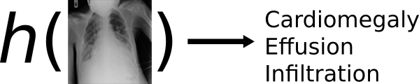

# Introduction

## The Task \label{sec:task}

The focus of this thesis is to produce a system that can identify multiple thoracic pathologies[^thor] from a chest X-ray image of a patient. Suppose this system is denoted by the function $h(\cdot)$, then it can be illustrated by the diagram in \autoref{fig:task}.



[^thor]: Pathologies that are located in the thorax region - between the neck and abdomen.

We formulate this task as a multi-label image classification task [@Wang2017], since the inputs are images and each image can be associated with more than one pathology, *i.e.* label. We denote an X-ray image by the vector

$$
\boldsymbol{x}_{i}=
\begin{bmatrix}
x_{i1} \\
x_{i2} \\
\vdots \\
x_{ip}
\end{bmatrix},
$$
for $i=1,2,\dots,N$, where $N$ is the number of X-rays in the dataset and $p$ the number of pixels in each X-ray image. We also refer to $\boldsymbol{x}$ as an observation. Suppose the set of all possible labels is defined as $\mathcal{L}=\{\lambda_{1},\lambda_{2},\dots,\lambda_{K}\}$ then each observation is associated with a subset of the full labelset, $Y_{i}\subseteq\mathcal{L}$. Therefore we require a system that is a mapping from the input space to the labelspace [@Zhang2014], *i.e.*:

$$
h:\mathbb{R}^{p}\to2^{\mathcal{L}}.
$$
We also refer to $h(\cdot)$ as the classifier or the model.

How do we model such an $h(\cdot)$ that produces accurate mappings? Following the *supervised learning* framework [see @Hastie2009, Ch. 2] for classification, $h(\cdot)$ is learned by example, *i.e.* from the data. The dataset consist of $N$ input-output pairs (also known as examples) and is denoted by 
$$
(\boldsymbol{x}_{i},Y_{i})_{i=1}^{N}.
$$

To learn $h(\cdot)$ from the data, we first need to assume its functional form (or its shape). Suppose the mapping performed by $h(\cdot)$ is defined by a set of parameters $\theta$ such that the configuration of $\theta$ determines how $h(\cdot)$ processes $\boldsymbol{x}$ to produce $Y$, however limited to the form we initially assumed for $h(\cdot)$. Suppose a specific paramater configuration $\hat{\theta}$ produces an output $\hat{Y}_{i}$ for $\boldsymbol{x}_{i}$, *i.e.*

$$
h_{\hat{\theta}}(\boldsymbol{x}_{i})\to\hat{Y}_{i},
$$
then we can measure how much the prediction made by $h_{\hat{\theta}}(\cdot)$ deviates from the ground truth by some *loss function*, $L(Y_{i},\hat{Y}_{i})$. The loss function should produce large values if the prediction is far from the truth and values close to zero if the prediction matches the true label(s). Therefore our task can now roughly[^simple] be reduced to the optimisation problem of finding the optimal parameters $\hat{\theta}$ such that the loss between the predictions and the ground truth is a minimum:

$$
\hat{\theta}=\arg\min_{\theta}\sum_{i=1}^{N}L\left(Y_{i}, h_{\theta}(\boldsymbol{x}_{i})\right)
$$
This minimum can be found using any appropriate optimisation procedure.

[^simple]: This is a slight simplification of the real task, used to convey a basic understanding. The actual optimisation problem includes a penalty term for regularisation, which we discuss later.

The solution to our task can now be summarised by the following four main components:

+ The **data**, $(\boldsymbol{x}_{i},Y_{i})_{i=1}^{N}$,
+ The **classifier**, $h_{\theta}(\cdot)$,
+ The **loss function**, $L$, and
+ The **optimisation procedure**.

In this work the data is the recently released ChestX-ray14 dataset [@Wang2017] which contains 112,120 frontal-view chest X-ray images individually labeled with up to 14 different thoracic diseases. An in-depth look at the data is given in \Cref{sec:chx14}. 

For the classifier we use an artifical neural network (ANN) that specialises in detecting patterns from images, called a *convolutional neural network* (CNN). Exploring the different CNN architectures applicable to multi-label image classification will make up the main body of work for this thesis, as well as how these perform on our specific task. CNNs are described in \Cref{chp:cnn} and how they can be adapted to better fit the multi-label image classification problem in \Cref{chp:mlcnn}. The results of the experiments done on our data can be found in \Cref{chp:results}. We attempt to cover most of the approaches proposed in the literature, in addition to some novel methods.

Not only is the evaluation of a multi-label classifier an ambiguous task, finding an appropriate surrogate loss function that can efficiently be minimised by the optimisation procdure is a challenging part of the problem. A handful of such loss functions have been proposed in the literature, which we also explore in \Cref{chp:mlcnn} and experiment with in \Cref{chp:results}.

The most common optimisation procedure used along with neural networks is the *stochastic gradient descent* (SGD) algortihm. We provide a brief overview of this method in \Cref{sec:optim} and discuss some of the bells and whistles that can be added to improve the algorithm in \Cref{chp:cnn}. A detailed overview and experimentation of the best optimisation procedures for this problem is beyond the scope of this thesis. We will use the most robust, consistent and simplest method proved by the literature for our task.

> remove outline details to outline section

An effective exploration and implementation concerning the above components should assist us in achieving the objectives described in the following section.

## Objectives

The main target for this work is to achieve competive results with the state-of-the-art (SotA) approach on the ChestX-ray14 dataset reported in [@Rajpurkar2017]. However, along the way we also aim to to accomplish the following sub-objectives:

+ Develop a thorough understanding of CNNs and how they are applied to an image classification problem.
+ Collect and review all the latest research on CNNs applied to multi-label image classification and develop a thorough understanding of how these methods compare to each other in addition to how they should perform in certain scenarios.
+ Learn how the existing approaches can be tweaked or adapted to optimally fit to our data.
+ Provide rigorous empirical evaluations of the selected existing approaches as well as the novel adaptions proposed in this thesis on the ChestX-ray14 dataset, such that the conclusions made here can safely be used in future research on this dataset and possibly other multi-label image classification problems.
+ Design reproducible experiments for any researcher or person with an interest in the field to replicate the results and further build on the approaches.

Before we delve into the details of our work, we first want to motivate why each of these objectives are important to accomplish.

## Motivation

The chest X-ray is one of the most commonly accessible radiological examinations for screening and diagnosis
of many thoracic pathologies [@Wang2017]. For diseases like pneumonia, it is currently the best available method for diagnosis [@WHO2001]. However, the diagnosis of thoracic diseases from X-rays require the availability of expert radiologists. An effective *computer aided diagnosis* (CAD) system can help increase the accessibility to expert knowledge by breaking down some of the usual barriers facing patients, the major one being the financial cost of an examination. A CAD system can assist radiologist to make more accurate diagnosis but at a quicker rate and therefore increasing the availability of such expert knowledge and thus driving down the cost of an examination. Maybe someday in the near future, such systems will become fully autonomous providing everyone with free, 100% trustworthy diagnosis. This is why we found the application in this domain to be important and worthy of study.

Multi-label image classification is not restricted to the application to the diagnosis of lung diseases from chest X-rays. In fact, it can be appplied to many important real-world problems. Teaching a computer to "see", *i.e.* parse complex real-world imagery, will assist in the automation of many tasks. An example of another interesting and important problem that fits into the multi-label image classification framework is in the analysis of satellite imagery. Recently, a Kaggle competition[^amazon] was hosted where the task was to design a system that can identify multiple land cover and land use classes from satellite images of the Amazon Rainforest. The effective development of such a system would assist authorities to track the changes in the forest on a large scale and ultimately help with the fight against deforestation.

[^amazon]: https://www.kaggle.com/c/planet-understanding-the-amazon-from-space

Although the original proposal for CNNs dates back to some time ago [based on a series of work done by @Hubel1962, @Fukushima1980 & @LeCun1999] the first publication of a sucessful large-scale implementation was fairly recently [@Krizhevsky2012]. Ever since, the SotA in most *computer vision* (CV) tasks are dominated by CNNs. Its success is attributed to its remarkable ability to learn useful representations from raw inputs [@Lecun2015] such as images in its pixel value form. However, up to now, the main focus of CNN research was on problems concerning the simpler scenario of multiclass image classification, where each image is only associated with a single label. See the annual large scale image classifcation competition known as ImageNet [@Russakovsky2015] as an example of such a problem. \autoref{fig:IN_err} plots the misclassification error rate of the winning model for each year. Note the large drop in the error rate from 2011 to 2012 where a CNN was used for the first time in this competition.

```{r, echo=FALSE, fig.cap="The misclassification error rate for the winning ImageNet model per year.\\label{fig:IN_err}", cache=TRUE}
library(tidyverse)
data.frame(Year = 2010:2017, Error = c(0.28191, 0.25770, 0.16422, 0.1174, 0.0666, 0.03567, 0.02991, 0.02251)) %>% 
  ggplot(aes(Year, Error)) + geom_line() + geom_point() + theme_minimal() +
  ggtitle("Error rate of winning ImageNet model by year") + 
  geom_hline(yintercept = 0.051, linetype = "dashed") + 
  scale_x_continuous(breaks = 2010:2017, minor_breaks = NULL) +
  scale_y_continuous(breaks = seq(0, 0.3, 0.05)) +
  annotate("text", x = 2012.1, y = 0.16422, label = "First CNN", hjust = 0) +
  annotate("text", x = 2010, y = 0.06, label = "Human performance", hjust = 0)
```

Far less attention is given to the application of CNNs on a multi-label image classification problem. Which is arguebly a more relevant task since most of real-world images can be associated with more than one class. Although a fairly trivial adaption can be made to a single-label[^sl] CNN to apply it to a multi-label case (see \Cref{sec:mlcnn_basic}), it does not explicitly deal with some of the unique challenges of modeling images with multiple labels like exploiting label correlation and detecting objects of different scales. Only a handful of publications address some of these issues [see for example @Gong2013, @Wei2014, @Wang2016, @Zhu2017, @Chen2017]. This is still a developing research direction and many of the publications are made in isolation, which warrants further study and comparisons of approaches in this area.

[^sl]: Referring to binary or multiclass classification tasks.

Since theory and practice does not always go hand-in-hand, it is usually advantageous to complement a theoretical study with empirical results. Another motivation for empirical study is that we regard the ability to implement an approach equally as important as understanding the theory behind it. We characterise a good empirical experiment as one that is *rigorous* and *reproducible*. Recently the field of *Deep Learning*, which is the class of statistical learning models multi-layer ANNs, including CNNs, belong to, has been criticised for the growing gap between the understanding of its techniques and its practical successes[^talk] where most of the recent focus was on the latter. The speakers urged the deep learning community to be more rigorous in their experiments where, for them, the most important part of rigor is better empiricism, not more mathematical theories. Better empiricism in classification may include for example practices such as using cross-validation to estimate the generalisation ability of a model and reporting standard errors. Empirical studies should be more than just trying to beat the benchmark and should also consist of simple experiments that aid in the understanding of how the techniques work. 

[^talk]: How do I cite the talk given at NIPS2017 - https://www.youtube.com/watch?v=Qi1Yry33TQE

On the other hand, we want all our experiments to be as reproducible as possible, *i.e.* provide all the code, data and necessary documentation to reproduce the experiments that were done in this thesis[^git]. This is often an overlooked feature of experiments, but is however crucial for transparent and accountable reporting and making your work useful for others to build upon.

[^git]: All of these are shared publicly at https://github.com/jandremarais/Thesis

The task and framework for the research problem in this thesis has been discussed in addition to the further objectives of this study along with why they are important to achieve. We are now equiped to delve deeper into the details of convolutional neural networks for multi-label image classification and how it can be applied the problem of diagnosing thoracic diseases from chest X-rays. The structure for the remainder of the thesis is as follows.

## Outline

In \Cref{chp:dataeval} we do a exploratory analysis of the data and highlight some of the challenges for learning from our specific dataset. We also have a look at ... 

> give outline for rest of thesis once done.
> use the information already given at the end of task section.