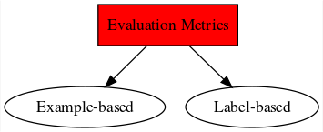

# The Multi-Label Framework

> The new plan for this chapter is to introduce all the ml concepts necessary to understand before fitting the model. First we need to define the ML learning objective. Then we will look at ML data set properties. Important: class imbalance, label correlation (should I talk about exploiting it here?). Then we will discuss evaluation metrics. This chapter might become very long.

## Introduction

Multi-label (ML) learning belongs to the supervised learning paradigm and can be viewed as a generalisation of the traditional single-label learning problem. Suppose the data set to be analysed consists of a set of observations each representing a real-world object such as an image or a text document. In the single-label context each object is restricted to belonging to a single, mutually exclusive class, *i.e.* each observation is associated with a single label. One can quite effortlessly come up with tasks that will not fit into this framework: an image annotation problem where each image contains more than one semantic object, a text classification task where each document has multiple topics or an acoustic classification task where the recordings contain the sounds of multiple bird species. Therefore the need for a ML learner that can assign a set of labels to an observation. Let $\mathcal{L}=\{l_{1},l_{2},\dots,l_{K}\}$ denote the complete set of possible labels that can be assigned to an observation. Whereas a single-label learner aims to find which single label $l_{k}$, $k=1,2,\dots,K$, belongs to a given observation, a ML learner is capable of assigning a set of labels $L \subseteq \mathcal{L}$ to the observation. 

According to [@Zhang2014], ML learning can be considered a sub-problem of a wider framework, called multi-target learning, covering all problems where an observation is associated with multiple outputs. When the output variables are binary, it is a ML learning problem. But problems also exist where the output variables are multi-class or numerical and in these settings the problems are respectively known as multi-dimensional learning and multi-output regression. It is also possible that the output variables are combinations of the aforementioned types. 

As should be expected, the ML framework has a few concepts novel to the single-label case which should be reviewed before looking at the algorithms for ML learning. In this chapter, the core notation for the thesis will be introduced and a clear definition of the task of ML learning will be given. Then, a deep look is taken into the unique properties of ML data and how these might affect the performance of classifiers. The concepts of label correlation and class imbalance will also be introduced, however, how to deal with these will be discussed in the next chapter (for now). Finally, we will get to the evaluation metrics of ML algorithms. This is an important topic in ML learning, often neglected in the literature [cite]. After completing this chapter, the reader will have a good basis to be able to move on to the discussion of ML learning algorithms.

## Notation

The following notation will be used throughout the thesis. Define the input matrix as
$$
X=
\begin{bmatrix}
x_{11} & x_{12} & \dots & x_{1p} \\
x_{21} & x_{22} & \dots & x_{2p} \\
\vdots & \vdots & \ddots & \vdots \\
x_{n1} & x_{n2} & \dots & x_{np}
\end{bmatrix} =
\begin{bmatrix}
\boldsymbol{x}_{1}^{\intercal} & \boldsymbol{x}_{2}^{\intercal} & \dots & \boldsymbol{x}_{n}^{\intercal}
\end{bmatrix},
$$
where $n$ is the number of observations and $p$ is the number of features. $\boldsymbol{x}_{i}^{\intercal}$ represents the $p$-dimensional vector that forms the $i$-th row of $X$. For a text classification problem, $x_{ij}$ might indicate the number of times a word $j$ appeared in document $i$. Define the label or output matrix as 
$$
Y = 
\begin{bmatrix}
y_{11} & y_{12} & \dots & y_{1K} \\
y_{21} & y_{22} & \dots & y_{2K} \\
\vdots & \vdots & \ddots & \vdots \\
y_{n1} & y_{n2} & \dots & y_{nK}
\end{bmatrix} =
\begin{bmatrix}
\boldsymbol{y}_{1}^{\intercal} & \boldsymbol{y}_{2}^{\intercal} & \dots & \boldsymbol{y}_{K}^{\intercal}
\end{bmatrix} = 
\begin{bmatrix}
\boldsymbol{Y}_{(1)} & \boldsymbol{Y}_{(2)} & \dots & \boldsymbol{Y}_{(K)}
\end{bmatrix},
$$
where $K$ is the size of the label set $\mathcal{L}$. $Y$ only contains zeros and ones, *i.e.* $y_{ik}=1$ if label $l_{k}$, $k=1,\dots,K$, is present for observation $i$ and $y_{ik}=0$ if it is absent. Thus $\boldsymbol{Y}_{(k)}$ is a $n$-dimensional binary vector indicating which observations are associated with label $l_{k}$. A ML data set will be defined as $D=\begin{bmatrix} X & Y \end{bmatrix}$, which contains the $n$ input-output pairs, $\{\left(\boldsymbol{x}_{i},\boldsymbol{y}_{i}\right)|i=1,\dots,n\}$. Note that, $\boldsymbol{y}_{i}=(y_{1},y_{2},\dots,y_{K})$, $y_{k}\in \{0,1\}$, used here is the label vector, however, it is also common to use the label set notation, *i.e.* $L_{i} \subseteq \mathcal{L}$, where $\mathcal{L}$ is the complete label set and $L_{i}$ is the set of relevant labels for observation $i$.

## The Task of Multi-Label Learning

A more formal definition of the ML learning task will be given in the following chapter. However, it is important to note that we will define the utlimate task of ML learning as the assigning of multiple labels to an observation. ML learning covers to very similar approaches, namely, ML classification and ML ranking. ML classification algorithms output whether or not labels are relevant to an observation (binary) and ML ranking algorithms outputs a real-valued score assigned to each label indicating its relative importance to an observation. Thus with ML ranking, for each observation we seek a list of labels ordered by their scores representing the confidence in how relevant they are to the specific observation. Many classifiers base their final (categorical) prediction on the thresholding of the real-valued output of the algorithm and thus can also be used for ranking. Similarly, ranking algorithms can also be used for classification if a thresholding function is applied to the real-valued output. (see [@Zhang2014] for a more brief description)

+ mathematical definition with notation of the task of ML learning.
+ real-valued output + thresholding function (ranking vs classification)

The task of ML classification is to find a function $h$ that accurately maps the observations contained in $X$ to the label matrix $Y$, i.e., $h:X\to Y$, so that given a new observation, $h$ can determine which labels belong to it. The accuracy aforementioned is a topic that will be discussed shortly. The measurement thereof is another unique problem for ML classification.

On the other hand, the goal of ML ranking is to find a function $f:X\to G$, where $G$ is a similar matrix to $Y$, but with the $g_{ij}$ a real value representing the relative confidence score that label $j$ is relevant to observation $i$. $f$ is found by optimising a ranking metric, also discussed shortly. From the confidence scores of observation $i$, $f(\boldsymbol{x}_{i})$, a ranking $\boldsymbol{r}_{i}$ can be obtained, giving the rank of labels in descending order of $f(\boldsymbol{x}_{i})$.

> mention the calibration factor of [@Zhang2014]. Finding $z_{i}$ from $r_{i}$

$h$ will be referred to as the ML classifier and $f$ as the ML ranker. When ML learner will be a collective term covering both $h$ and $f$. Before different ML learners can be discussed, an understanding of how the output of these algorithms are evaluated is necessary, since fitting $f$ of $h$ envolves optimising an evaluation metric. (always?)

Let $\mathcal{D}=\{(\boldsymbol{x}_{i},\boldsymbol{y}_{i})\}_{i=1}^{n}$ define a multi-label dataset. $\boldsymbol{x}$, is the feature/input/instance vector of an observation and is given by a $p$-dimensional real-valued vector, $\boldsymbol{x}=(x_{1},x_{2},\dots,x_{p})$, *i.e.* $\boldsymbol{x}\in \mathcal{R}^{p}$. Each instance, $\boldsymbol{x}$ is associated with a subset of labels $L\in 2^{\mathcal{L}}$, where $2^{\mathcal{L}}$ represents the powerset of the full set of labels, $\mathcal{L}=\{l_{1},l_{2},\dots,l_{K}\}$. The subset $L$ is represented as an indicator vector $\boldsymbol{y}=(y_{1},y_{2},\dots,y_{K})$, where $y_{k}=1$ if $l_{k}\in L$ or else $y_{k}=0$, for $k=1,2,\dots,K$. We assume examples in $\mathcal{D}$ to be independently and identically distributed (*i.i.d.*) from $P(\boldsymbol{X},\boldsymbol{Y})$. Let $h$ define a multi-label classifier, which is a mapping, 
$$
h:\boldsymbol{X}\to \boldsymbol{Y}
$$
(not sure about this notation). The risk of $h$ is defined as the expected loss over the joint distribution $P(\boldsymbol{X},\boldsymbol{Y})$:
$$
R_{L}(h)=E_{\boldsymbol{X}\boldsymbol{Y}}\left[L\left(\boldsymbol{Y},h(\boldsymbol{X})\right)\right],
$$
where $L(.)$ is a multi-label loss function. The MLC task boils down to given training data, $\mathcal{D}$, drawn independently from $P(\boldsymbol{X},\boldsymbol{Y})$, learn a classifier $h$ that minimizes the risk with respect to a specific loss function, *i.e.*
$$
h^{*}=\arg\min_{h}E_{\boldsymbol{X}\boldsymbol{Y}}\left[L\left(\boldsymbol{Y},h(\boldsymbol{X})\right)\right]=\arg\min_{h}E_{\boldsymbol{X}}\left[E_{\boldsymbol{Y}|\boldsymbol{X}}\left[L\left(\boldsymbol{Y},h(\boldsymbol{X})\right)\right]\right],
$$
where $h^{*}$ is the so-called risk-minimizing model and can be determined in a pointwise way by the risk minimizer,
$$
h^{*}(\boldsymbol{x})=\arg\min_{\boldsymbol{y}}E_{\boldsymbol{Y}|\boldsymbol{X}}\left[L(\boldsymbol{Y},\boldsymbol{y}))\right].
$$
Note, here we allow $h(\boldsymbol{x})$ to take on real values, *i.e.* $h(\boldsymbol{x})\in\mathcal{R}^{K}$, for the sake of generality. This is to cover multi-label ranking functions and multi-label classifiers that output real real values before thresholding.

## Multi-Label Indicators

As with all supervised learning problems, no one ML algorithm performs optimally on all problems. It is common practice in classical single output supervised learning to first consider, for example, the number of features ($p$) and the number of observations ($n$) in a data set before deciding on which model(s) to fit to the data. The same naturally holds for a ML problem but with added complexity. The multiple outputs of the data introduces many more factors to consider before continuing to the modelling phase. Some ML data sets have only a few labels per observation, while others have plenty. In some ML data sets the number of label combinations is small, whereas in others it can be very large. Some labels appear more frequently than others. Moreover, the labels can be correlated or not. These characteristics can have a serious impact on the performance of a ML classifier. This is the reason why several specific indicators have been designed to assess ML data set properties.

The two standard measures for the multi-labeledness of a data set are *label cardinality* and *label density*, introduced by [@Tsoumakas]. The label cardinality of a ML data, $D$, set is the average number of labels per observation:

$$
LCard(D)=\frac{1}{n}\sum_{i=1}^{n}\sum_{k=1}^{K}y_{ik}.
$$
This measure can be normalised to be independent of the label set size, which results in the label density indicator:

$$
LDens(D)=\frac{1}{K}LCard(D)=\frac{1}{nK}\sum_{i=1}^{n}\sum_{k=1}^{K}y_{ik}.
$$
According to [@Tsoumakas] it is important to distinguish between these two measures, since two data sets with the same label cardinality but with a great difference in the number of labels might not exhibit the same properties and cause different behaviour to the ML classification methods. These two measures give a good indication of the label frequency of a data set, but we are also interested in the uniformity and regularity of the labeling scheme. The authors of [@Read2011a] suggested measuring the proportion of distinct label sets and the proportion of label sets with the maximum frequency. Consider the number of distinct label sets, also referred to as the label diversity [@Zhang2014], which can be defined as:

> there are multiple ways this is defined in the literature - still need to decide on which one I want to use

$$
LDiv(D)=|\{Y|\exists \boldsymbol{x}:(\boldsymbol{x},Y)\in D\}|,
$$
by [@Zhang2014]. ([@Read2011a] uses $\exists !$ instead of $\exists$ and $Y$ as a vector $\boldsymbol{y}$. I want to consider a way of defining it in matrix notation. Maybe with an indicator function. Some papers define it as $DL$ instead of $LDiv$.) The proportion of distinct label sets in $D$ is then

$$
PLDiv\{/PUniq/PDL\}(D)=\frac{1}{n}LDiv(D).
$$

The proportion of label sets with the maximum frequency is defined by [@Read2011a] as:

$$
PMax(D)=\max_{\boldsymbol{y}}\frac{\mathrm{count}(\boldsymbol{y},D)}{n},
$$
where $\mathrm{count}(\boldsymbol{y},D)$ is the frequency that label combination $\boldsymbol{y}$ is found in data set $D$. This represents the proportion of observations associated with the most frequently occurring label sets. High values of $PLDiv$ and $PMax$ indicate an irregular and skewed labeling scheme, respectively, *i.e.* a relatively high number of observations are associated with infrequent label sets and a relatively high number of observations are associated with the most common label sets. (*think about this again*) When this is the case, and the labels are modelled separately, the classifiers will suffer from the class imbalance problem, a common problem in supervised classification tasks. More detail about this will be adressed shortly.

Very little research has been done on how all these ML indicators affect the performance of a ML classifier. [@Chekina2011] made a worthy attempt. Their goal was to find a way of determining which ML algorithm to use given a data set with specific properties and with a specific evaluation metric to optimise. They approached this problem by training a so called meta-learner on a meta-data set containing the performance of multiple ML algorithms on benchmark data sets with different properties. This trained meta-learner is then able to predict which ML algorithm is most likely to give the best results in terms of a specific evaluation metric, given the properties of the data set to be analysed. Although we will not use their meta-learner for this thesis, we will consider some of the additional findings in their research. They found that the following properties (among others) of a ML data set was important to their trained meta-model (which was based on classification trees) in predicting which ML algorithm is most appropriate: $K$; $LDiv(D)$; $LCard(D)$; the standard deviation, skewness and kurtosis of the number of labels per observation in $D$; number of unconditionally dependent label pairs (based on what?); average of $\chi^{2}$ -scores of all dependent label pairs; number of classes with less than 2, 5 and 10 observations; ratio of classes with less than 2, 5, 10 and 50 observations; average, minimal and maximal entropy of labels (def of entropy?); average observations per class. This strengthens the argument that it is important to take ML indicators into account before the training process.

> Some rules that they found that I might refer to later:

+ for micro-AUC target evaluation measure if label cardinality of training data is above 3.028 then the 2BR method (among the single-classifiers) should be used.
+ Another example for an extracted rule is for ranking loss evaluation measure: if minimum of label entropies is zero (i.e. there is at least one certain label in the training set), number of labels is less than 53 and skewness of label cardinality is below or equal to 2.49 then the EPS method (among ensembles) should be used.


## Benchmark Data Sets

The progress of areas in machine/statistical learning is highly dependent on the availability of quality and diverse benchmark data sets. This enables researchers to compare their methods in a wide variety of environments. Recently, a decent amount of ML data sets has been published, but not without critique. [@Luaces] argues that the MULAN[^mulan] ML data set repository does not have data sets that are truely ML and that most of the data sets are very similar to each other. Most of the data sets have low cardinality and low label dependence. The problem with this is that these data sets may not show the true performance of ML algorithms. In [@Gibaja2015] the authors also comments on the lack of thorough, comparative empirical studies on these benchmark sets.

[^mulan]: A Java library for ML learning - http://mulan.sourceforge.net/datasets-mlc.html.

Some of the most popular and recent ML benchmark data sets will be introduced here along with their properties. This will give us some form of a reference to compare our data set of satellite images against.

+ [@Read2011a] defines a complexity measure as $n\times p\times K$

+ [@Gibaja2015a] long list of datasets. Other than MULAN: Plant and Human, Slashdot, LangLog, IMDB
+ [@Sorower]
+ https://manikvarma.github.io/downloads/XC/XMLRepository.html
+ yelp dataset: http://www.ics.uci.edu/~vpsaini/
+ also new yt8m

## Sampling and Resampling

+ Simulating [@TorresTomas2014] (also gives citations to other papers)
+ partitioning mentioned in [@Gibaja2015] - referred to [@Sechidis]
+ [@Luaces] Therefore they created a ML data generator to simulate ML data on which algorithms can be evaluated.

## Class Imbalance

+ [@Charte2015]

Maybe include the following headers here:

## Learning Objective

## Evaluation Metrics

The evaluation of the performance of ML algorithms is another distinct problem to this setting. Compared to the single-label case, many more evaluation metrics exist, with subtle or obvious differences in their measurement. According to [@Madjarov2012a] it is essential to evaluate a ML algorithm on multiple and contrasting measures because of the additional degrees of freedom introduced by the ML setting. In addition, care should be taken when reporting multiple measures and with their interpretation. Since some of the measures are contrasting it is dangerous to report multiple metrics and conclude that on average one learner is better than the other. This was highlighted in [@Dembcz2012], where the authors suggested that when evaluating the performance of a ML learner, it should be made clear which metric(s) it is aiming to optimise, otherwise the results can be misleading. It is impossible (?) for a learner to have superior performance over others in terms of all the multi-label evaluation metrics simultaneously.

The evaluation measures of predictive performance of multi-label learnerss can be divided into two groups: example-based and label-based measures. Example-based measures compares the actual versus the predicted labels for each observation and then computes the average across all the observations in the dataset. Where label-based measures computes the predictive performance on each label separately and then averages across all labels [@Madjarov2012a]. For both groups the measures can further be partitioned into metrics from a classification persepective and measures from a ranking perspective, *i.e.* metrics for $h$ and metrics for $f$ respectively. The most commonly used metrics in each of the groups will be introduced here.

### Brief Taxonomy

+ more complicated than single label metrics
+ introduce example based vs label based
+ for classification and ranking
+ diagram / table + where they are used

```{r eval-tax, includ = FALSE, eval=FALSE}
grViz('figures/eval-tax.gv') %>% export_svg() %>% 
  charToRaw %>% rsvg %>% png::writePNG('figures/eval-tax.png')
```



+ \autoref{fig:eval-tax} is just an example. The image quality is lacking.

### Example-based Metrics

+ subset accuracy; hamming loss; accuracy; precision; recall; one-error; coverage; ranking loss; average precision
+ definition + brief interpretaion where it is unclear

For the following definitions, let $y_{i}$ be the set of true labels for observation $\boldsymbol{x}_{i}$ and $z_{i}$ the set of predicted labels for the same observation, obtained from the predicted indicator vector of $\hat{h}(\boldsymbol{x}_{i})$. The Hamming loss is then defined as
$$
\text{hloss}(h)=\frac{1}{n}\sum_{i=1}^{n}\frac{1}{K}|z_{i}\triangle y_{i}|,
$$
where $\triangle$ stands for the symmetric difference and $|.|$, the size of the set. For example, $|\{1,2,3\}\triangle\{3,4\}|=|\{1,2,4\}|=3$. Thus the Hamming loss counts the number of labels not in the intersection of the predicted subset of labels and the true subset of labels, as a fraction of the total size of the labelset, averaged across each observation in the dataset. When $h$ returns perfect predictions for each observation in the dataset, $\text{hloss}(h)=0$, and if $h$ predicts for each observation that it belongs to all the labels except for its the true labels, $\text{hloss}(h)=1$.

Accuracy is defined as
$$
\text{accuracy}(h)=\frac{1}{n}\sum_{i=1}^{n}\frac{|z_{i}\cap y_{i}|}{|z_{i}\cup y_{i}|}.
$$
Thus for each observation the number of correctly predicted labels is calculated as a proportion of the sum of the correctly and incorrectly predicted labels. These quantities are then averaged over each observation in the dataset. If the $h$ perfectly predicts the relevant subset of labels for each observations, $\text{accuracy}(h)=1$. If $h$ does not manage to predict a single correct label for any observation, $\text{accuracy}(h)=0$.

The precision and recall are respectively defined as
$$
\text{precision}(h)=\frac{1}{n}\sum_{i=1}^{n}\frac{|z_{i}\cap y_{i}|}{|z_{i}|},
$$
and
$$
\text{recall}(h)=\frac{1}{n}\sum_{i=1}^{n}\frac{|z_{i}\cap y_{i}|}{|y_{i}|}.
$$
Precision calculates the average proportion of correctly predicted labels in terms of the number of labels predicted, across all the observations in the dataset. Recall calculates a similar average, with the only difference that the proportion is calculated in terms of the number of true labels per observation. Both these metrics lie in the range $[0,1]$ with larger values desirable.

The harmonic mean between the precision and the recall is called the $F_{1}$-score and is defined as
$$
F_{1}=\frac{1}{n}\sum_{i=1}^{n}\frac{2|z_{i}\cap y_{i}|}{|z_{i}|+|y_{i}|}.
$$
The perfect classifier will result in a $F_{1}$-score of 1 and the worst possible score is zero.

The subset accuracy or classification accuracy is defined as
$$
\text{subsetacc}(h)=\frac{1}{n}\sum_{i=1}^{n}I(z_{i}=y_{i}),
$$
where $I(.)$ is the indicator function. This the subset accuracy is the proportion of observations that were perfectly predicted by $h$.

The above are all performance measures of ML classifiers. If the ML learner outputs real-valued confidence scores, these ranking metrics can be used to evaluate the learner's performance:

One-error:


Coverage:

Ranking Loss:

Average Precision:

### Label-based Metrics

+ micro vs macro ito tp, tn, fp, fn
+ auc example

The idea with label-based measures is to compute a single-lable metric for each label based on the number of true positives ($TP$), true negatives ($TN$), false positives ($FP$) and false negatives ($FN$) made by the classifier on a dataset and then obtaining an average of the values [@Gibaja2014]. Note, $TN_{k}$, $TP_{k}$, $FN_{k}$ and $FP_{k}$ denote the quantities for label $l_k$, $k=1,2,\dots,K$. Thus $TP_{k}+TN_{k}+FP_{k}+FN_{k}=n$. Let $B$ be any binary classification metric, i.e. $B\in \{\text{accuracy},\text{precision},\text{recall},F_{1}\}$. $B$ can be written in terms of $TN_{k}$, $TP_{k}$, $FN_{k}$ and $FP_{k}$, for example 
$$
\text{accuracy}(TN_{k}, TP_{k}, FN_{k}, FP_{k})=\frac{TP_{k}+TN_{k}}{TP_{k}+TN_{k}+FP_{k}+FN_{k}}.
$$
$B$ is then calculated for each label and then an average is calulated. The averaging can be done either by the micro or the macro approach. The micro approach considers predictions of all observations together and then calculates the measure across all labels, i.e.
$$
B_{micro}=B\left(\sum_{k=1}^{K}TP_{k},\sum_{k=1}^{K}TN_{k},\sum_{k=1}^{K}FP_{k},\sum_{k=1}^{K}FN_{k}\right).
$$
Whereas the macro approach computes one metric for each label and then the values are averaged over all the labels, i.e.
$$
B_{macro}=\frac{1}{K}\sum_{k=1}^{K}B(TP_{k},TN_{k},FP_{k},FN_{k}).
$$
Note, also that $\text{accuracy}_{micro}(h)=\text{accuracy}_{macro}(h)$ and that $\text{accuracy}_{micro}(h)+\text{hloss}(h)=1$, since Hamming loss is the average binary classification error.

Again, all of the above mentioned metrics are from a classification perspective. An example of a label-based metric from a ranking persepective is the macro- and micro-averaged AUC:

Most multi-label classifiers learn from the training observations by explicity or implicitly optimising one specific metric [@Zhang2014]. That is why in [@Dembcz2012] the authors reccomended specifying which of the metrics a new proposed algorithm aims to optimise in order to show if it is succesful. But at the same time it is important to test the algorithm on numerous metrics for fair comparisons against other algorithms [@Zhang2014], [@Madjarov2012a]. It might be that a algorithm does very well in terms of the Hamming loss, but performs poorly according to the subset accuracy, or vice versa, as shown in [@Dembcz2012]. In [@Tsoumakasc] they claim that the Hamming loss reported together with the micro-average $F$-measure gives a good indication of the performance of a multi-label classifier.

These multi-label metrics are usually non-convex and discontinuous [@Zhang2014]. Therefore multi-label classifiers resort to considering surrogate metrics which are easier to optimise. 

> probably should add an example or maybe later

Other than predictive performance, are there other aspects on which multi-label classifiers can be evaluated, such as efficiency and consistency. Multi-label algorithms should be efficient in the sense that it takes the least amount of computational power for a given level of predictive performance [@Madjarov2012a]. These classifiers can take a considerable amount of time to train when complicated ensembles are being implemented on datasets with huge labelsets. In cases where live updating and predictions are needed, this may be a problem [reference]. The other desirable attribute of multi-label classifiers are that they are consistent. This means that the expected loss of the classifier converges to the Bayes loss when the number of observations in the training set tends to infinity. Actually only a very few number of multi-label classifiers satisfy this property [@Zhou2011], [@Koyejo2015].

### Theoretical Results

+ evaluate perfomance on many metrics for fairness
+ something on label dependence link that will be discussed in next chapter
+ minimisation of surrogate loss functions and consistency
+ consistency [@Zhou2011]:

They were the first to do a theoretical study on the consistency of multi-label learning algorithms, focusing on the ranking loss and the hamming loss. A learning algorithm is said to be consistent if its expected risk converges to the Bayes risk as the size of the training data increases. They found that any convex surrogate loss is inconsistent with the ranking loss and therefore proposed a partial ranking loss (which is consistent with some surrogate loss functions) as an alternative. They also show how some recent multi-label algorithms are inconsistent in terms of the hamming loss and provides a discussion on the consistency of approaches which transforms the multi-label problem into a set of binary classification tasks.

## Label Dependence

