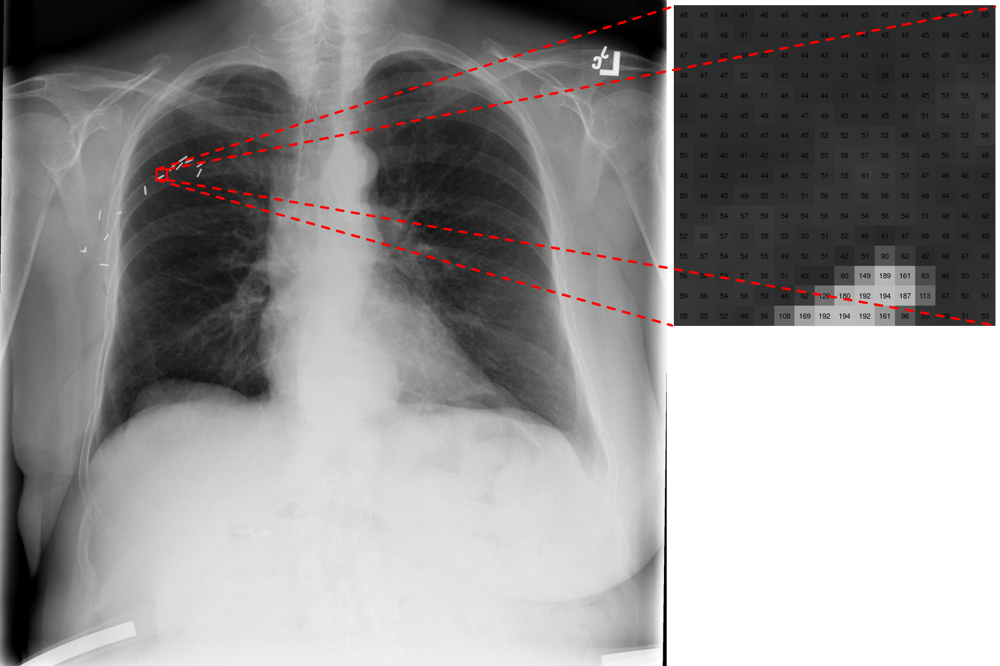

```{r, echo=FALSE, warning=FALSE, message=FALSE}
library(tidyverse)
library(knitr)
library(kableExtra)
```

# Data and Evaluation \label{chp:dataeval}

In \Cref{sec:task} we identified the data as one of the four main components of the multi-label image classification problem. Before any statistical learning algorithm is applied a thorough exploratory analysis of the data develops a better understanding of the problem. It is necessary to become familiar with the data and its properties since these should be taken into account in the modelling stage. In this chapter we explore the basic properties of the data, the important multi-label indicators and the nature of the input-output pairs. From this analysis we identify the possible challenges for applying multi-label CNNs to this dataset.

The performance evaluation of a multi-label learning system is much more complicated than in the single-label scenario. \Cref{sec:mleval} zooms in on the importance of various multi-label metrics, how they are defined and which are important to our task. We also look at the considerations for splitting multi-label data into training and testing sets to ensure robust estimates.

## The data 

### Description \label{sec:chx14}

This ChestX-ray14 dataset [@Wang2017] consists of 112,120 X-ray images with disease labels from 30,805 unique patients ($N=112120$). To put it into perspective, the second largest publicly available chest X-ray dataset[^openi] to date has only 4,143 frontal view data points. The large number of X-rays in ChestX-ray14 better facilitates the data hungry process of deep neural network training. All X-rays were resized to $1024\times 1024$, meaning the total number of raw features (the pixels) for each X-ray is $p=1048576$, since X-rays only have one color channel compared to color RGB images with 3 channels (see \autoref{sec:imgasdata}). This is quite a large size for a typical image classification problem, for example the images in ImageNet are only of size $224\times 224$.

[^openi]: https://openi.nlm.nih.gov

The labels for each X-ray were obtained by using *Natural Languape Processing* techniques to text-mine disease classifications from the corresponding radiological reports. The authors expect the labels to be >90% accurate. The original publication of ChestX-ray14 had a total of eight possible disease labels but the latest version is labeled with up to 14 possible diseases ($K=14$), they include: *Atelectasis*, *Consolidation*, *Infiltration*, *Pneumothorax*, *Edema*, *Emphysema*, *Fibrosis*, *Effusion*, *Pneumonia*, *Pleural_thickening*, *Cardiomegaly*, *Nodule*, *Mass* and *Hernia*. Note, that some X-rays are associated with no labels. This is not a large labelset compared to some of the other benchmark multi-label datasets (see *extreme multi-label learning* [@Zhang2017, @Prabhu2014] where $K$ sometimes reach into the millions).

Examples of the input-output pairs are given in \autoref{fig:examp}. An untrained eye will find it extremely difficult to detect the patterns that defines the relationship between the X-rays and their corresponding diseases. The beauty (and sometimes the danger) of CNNs for image classification, as we will see in \Cref{chp:cnn}, is that in ideal conditions, no prior knowledge of the application domain is necessary for the algorithm to learn the relationships between the inputs and the outputs. Current ideal conditions for deep learning has mostly to do with having enough examples. When the number of training examples are limited, an inspection of the data may provide clues to how a model can be adapted to get the most out of the data. 

```{r, include=FALSE, eval=FALSE}
library(tidyverse)
library(stringr)
label_df <- read_csv('data/chest_labels.csv')
library(magick)

samp_imgs <- c("00000001_001.png", "00000003_003.png", "00000005_000.png", 
               "00000008_002.png","00000013_005.png", "00000011_006.png", 
               "00000012_000.png", "00000032_012.png", "00000053_000.png")

temp <- sapply(samp_imgs, function(a) {
  labs <- unlist(label_df[label_df$`Image Index` == a, "Finding Labels"]) %>% 
    str_replace_all("\\|", "\n")
  
  image_read(paste0('data/sample/', a)) %>% 
    image_annotate(text = labs, size = 60, color = "red")
})

image_append(c(image_append(c(temp[[1]], temp[[2]], temp[[3]])),
               image_append(c(temp[[4]], temp[[5]], temp[[6]])),
               image_append(c(temp[[7]], temp[[8]], temp[[9]]))), stack = TRUE) %>% 
  image_write('figures/examples.png')

```


### Images as Data \label{sec:imgasdata}

To understand how an algorithm can process an image, we need to know how an image is stored and how it is represented as a set of numbers, interpretable by a machine. An image is made up of a grid of many tiny squares (or cells) with different colors. These cells are known as pixels and one pixel represents one color. A grayscale image, 32 pixels wide and 32 pixels long, can be represented by a $32\times 32$ matrix of integers, where each integer represents the 'brightness' (or intensity) of each pixel. These integers usually lie within $[0,255]$, such that the greater the integer, the brighter the pixel. For example, a pixel with an intensity of 0 is totally black, and a pixel with an intensity of 255 is totally white. \autoref{fig:imgzoom} illustrates this representation by showing the pixel values from a zoomed in patch of a chest X-ray. 

Note that a standard color image consists of three spectral bands (or channels), *viz*. red, green and blue (RGB). This means that the color of one pixel is determined by three integers in $[0,255]$, each representing the intensity of the colors red, green and blue. Thus a $32\times32$ image is represented by a 3D-array of size $32\times32\times3$. X-rays are traditionally grayscale images and therefore only have one channel.

```{r, include=FALSE, eval=FALSE}
temp <- image_read('data/sample/00000003_003.png')

img <- image_draw(temp)
rect(240, 260, 256, 276, border = "red", lwd = 4)
#arrows(x0 = 248, y0 = 400, y1 = 285, col = "red", lwd = 3)
dev.off()

cutout <- temp %>% image_crop("16x16+240+256")

mat_pix <- image_graph(512, 512, res = 96)
cutout[[1]] %>% as.integer %>% as.data.frame() %>%
  cbind(y = 1:16) %>% gather(x, value, -y, factor_key = TRUE) %>% 
  mutate(x = as.integer(x)) %>% 
  ggplot(aes(x, y)) + 
  geom_raster(aes(fill = value), show.legend = FALSE) +
  scale_y_continuous(trans=scales::reverse_trans(), expand = c(0, 0)) +
  scale_x_continuous(expand = c(0, 0)) + 
  scale_fill_gradient(low = "black", high = "white", limits = c(0,255)) +
  coord_fixed() +
  theme(text = element_blank(), line = element_blank()) +
  geom_text(aes(label = round(value)), show.legend = FALSE, size = 3)
dev.off()

temp <- image_append(c(img, mat_pix)) 

img <- image_draw(temp)
lines(x = c(240, 1032), y = c(260, 10), col = "red", lwd = 4, lty = "dashed")
lines(x = c(240, 1032), y = c(276, 500), col = "red", lwd = 4, lty = "dashed")
lines(x = c(256, 1528), y = c(260, 10), col = "red", lwd = 4, lty = "dashed")
lines(x = c(256, 1528), y = c(276, 500), col = "red", lwd = 4, lty = "dashed")
dev.off()

img %>% image_write('figures/img_zoom.png')             

```



In summary, for each X-ray we have $1024\times 1024=1048576$ values between 0 and 255 representing the brightness of a specific pixel in the image. This matrix can now be given to a learning algorithm. We refer to this representation of an image as its raw representation. Conventional classifiers struggle to make sense of images in its raw form and usually require some visual feature extraction process before classification [@Sanchez2013]. We will see in \Cref{chp:cnn} why this is not necessary for CNNs and how they effectively model images in their raw form.

Some of the reasons why it may be hard to distinguish the signal from the noise in the X-ray images in their raw form is as follows (adapted from [@Karpathy2015]):

+ **Scale variation**. The disease labels exhibit variation in their size. For example, the *Nodule* class is usually a very small part of the X-ray, whereas *Pleural_thickening* typically take up a much larger proportion.
+ **Deformation**. One disease label can appear as many different shapes accross different X-rays. This is the case for the *Mass* label [@Yao2017].
+ **Occlusion**. Some disease labels may only be partially visible, hidden behind other objects in the X-ray image.
+ **Brightness and Contrast**. The X-rays were not all taken in the exact same lighting conditions and therefore vary in their brightness and contrast (see also \autoref{fig:xcomp}).
+ **Background clutter**. The largest part of an X-ray in our dataset is background and totally irrelevant to the classification of disease labels. The background contains clutter such as markings and medical apparatus.

All of these factors may contribute to a relatively high intra-class variance and low inter-class variance. Diseases such as *Atelectasis*, *Consolidation*, *Pneumonia* and *Infiltration* are extremely difficult to distinguish between from X-ray images [@oakdenrayner2017]. Therefore it helps a classifier if the images in its raw form can be mapped to a space with more discriminative features between classes. Next, we explore more of the data in terms of its labels.

### Label Distribution

The complete labelset for our problem is given by 

$$
\mathcal{L}=\{\text{Atelectasis}, \text{Consolidation}, \dots, \text{Hernia}\},
$$
where each X-ray is associated with a subset of $\mathcal{L}$ we denoted as $Y_{i}$ for $i=1,\dots, N$. It is often also useful to denote the output of each observation in vector form, especially when defining statistical learning algorithms. Let the vector representation of the output for the $i$-th observation be

$$
\boldsymbol{y}_{i}=
\begin{bmatrix}
y_{i1} \\ y_{i2} \\ \dots \\ y_{iK}
\end{bmatrix},
$$
where $y_{ik}=1$ if $\lambda_{k}\in Y_{i}$ (the $k$-th label is associated with the $i$-the observation) and $y_{ik}=0$ otherwise, for $k=1,2,\dots ,K$. We index the labels as follows: $\lambda_{1}$: *Atelectasis*, $\lambda_{2}$: *Cardiomegaly*, $\lambda_{3}$: *Consolidation*, $\lambda_{4}$: *Edema*, $\lambda_{5}$: *Effusion*, $\lambda_{6}$: *Emphysema*, $\lambda_{7}$: *Fibrosis*, $\lambda_{8}$: *Hernia*, $\lambda_{9}$: *Infiltration*, $\lambda_{10}$: *Mass*, $\lambda_{11}$: *Nodule*, $\lambda_{12}$: *Pleural_thickening*, $\lambda_{13}$: *Pneumonia* and $\lambda_{14}$: *Pneumothorax*. See \autoref{tab:mlc_def} for some label representation examples.

```{r, cache=TRUE}
library(tidyverse)
df <- data.frame(
  i = 1:3,
  Y = c("$\\{\\text{Cardiomegaly\n Emphysema}\\}$", "$\\{\\text{No Finding}\\}$", "$\\{\\text{Atelectasis, Consolidation, Edema, Pneumonia}\\}$"),
  #Y = c("{Cardiomegaly\n Emphysema}", "{No Finding}", "{Atelectasis, Consolidation, Edema, Pneumonia}"),
  y1 = c(0,0,1),
  y2 = c(1,0,0),
  y3 = c(0,0,1),
  y4 = c(0,0,1),
  y5 = c(0,0,0),
  y6 = c(1,0,0),
  y7 = c(0,0,0),
  y8 = c(0,0,0),
  y9 = c(0,0,0),
  y10 = c(0,0,0),
  y11 = c(0,0,0),
  y12 = c(0,0,0),
  y13 = c(0,0,1),
  y14 = c(0,0,0)
)

colnames(df) <- c("$i$", "$Y_{i}$", "$y_{i1}$", "$y_{i2}$", "$y_{i3}$", "$y_{i4}$", "$y_{i5}$",
                  "$y_{i6}$","$y_{i7}$","$y_{i8}$","$y_{i9}$","$y_{i10}$","$y_{i11}$","$y_{i12}$",
                  "$y_{i13}$","$y_{i14}$")

library(kableExtra)
library(knitr)
kable(df, format = "latex", booktabs = TRUE, escape = FALSE,
      caption = "Examples of label representations.\\label{tab:mlc_def}") %>% 
  kable_styling(latex_options = "scale_down")
```

There are multiple properties of the label distribution that can be investigated. First, we can look at how the label count varies over each label in \autoref{fig:labelcount} (a). The dataset has a fairly imbalanced label distribution, this is quite common in multi-label data. Only three of the labels (*Infiltration*, *Effusion*, *Atelectasis*) are present in more than 10% of the X-rays. Then there are labels such as *Pneumonia* and *Hernia* which occur very rarely, in 1.2% and 0.2% of the data, respectively. 

Another insightful plot is the distribution of the number of labels per observation as in \autoref{fig:labelcount} (b). We see that a large proportion (~54%) of the observations are associated with zero labels and roughly 27% of the observations with exactly one label. Thus only ~19% of the X-rays have multiple labels. The maximum number of labels observed is 9, occuring only twice in the dataset. This shows that the output for each observations is *sparse*, another type of imbalance where only a small proportion of the labels per observation is positive. We refer to all labels for which $y_{ik}=0$ as negative labels.

```{r, echo=FALSE, fig.cap="Bar plots exploring the label distribution in ChestX-ray14. (a) The proportion of observations associated with each label; (b) The distribution of the label count per observation.\\label{fig:labelcount}",cache=TRUE}
library(tidyverse)
library(stringr)
label_df <- read_csv('data/chest_labels.csv')
label_ls <- unlist(strsplit(label_df$`Finding Labels`, "\\|"))
label_ls <- label_ls[label_ls != 'No Finding']
p1 <- table(label_ls) %>% 
  as.data.frame() %>% 
  mutate(label_ls = factor(label_ls, levels = rev(levels(label_ls)))) %>% 
  ggplot(aes(label_ls, Freq/nrow(label_df))) + 
  geom_bar(stat = 'identity') +
  xlab("Label") +
  ylab("Proportion of observations") +
  coord_flip() +
  theme_minimal()

label_ls <- strsplit(label_df$`Finding Labels`, "\\|")
p2 <- table(sapply(label_ls, function(a) {
  ifelse('No Finding' %in% a, 0, length(a))
})) %>% 
  as.data.frame() %>% 
  ggplot(aes(Var1, Freq/nrow(label_df))) + 
  geom_bar(stat = 'identity') +
  xlab("Number of labels per observation") +
  ylab("Proportion of observations") +
  theme_minimal()

library(cowplot)
cowplot::plot_grid(p1, p2, labels = c("(a)", "(b)"))
```

Metrics summarising properties of the label distribution have been proposed in the literature. The two standard measures for the "multi-labeled-ness" of a data set are *label cardinality* and *label density*, introduced by [@Tsoumakas2007]. The label cardinality of a multi-label dataset, $D$, set is the average number of labels per observation:

$$
\text{LCard}(D)=\frac{1}{N}\sum_{i=1}^{N}\sum_{k=1}^{K}y_{ik}.
$$
This measure can be normalised to be independent of the label set size, which results in the label density indicator:

$$
\text{LDens}(D)=\frac{1}{K}\cdot\text{LCard}(D)=\frac{1}{NK}\sum_{i=1}^{N}\sum_{k=1}^{K}y_{ik}.
$$
According to [@Tsoumakas2007] it is important to distinguish between these two measures, since two data sets with the same label cardinality but with a great difference in the number of labels might not exhibit the same properties and cause different behaviour to the *multi-label classification* (MLC) methods. These two measures give a good indication of the label frequency of a data set, but we are also interested in the uniformity and regularity of the labeling scheme. The authors of [@Read2011] suggested measuring the proportion of unique label combinations in the data and the proportion of observations in the data associated with the most frequently occuring label combination. Consider the number of unqiue label combinations, also referred to as the label diversity [@Zhang2014], which can be defined as:

$$
\text{LDiv}(D)=|\{Y|\exists \boldsymbol{x}:(\boldsymbol{x},Y)\in D\}|.
$$
The proportion of unique label combinations in $D$ is then

$$
\text{PLDiv}(D)=\frac{1}{N}\cdot\text{LDiv}(D).
$$
The proportion of observations associated with the most frequently occuring label combination is defined by [@Read2011] as:

$$
\text{PMax}(D)=\max_{Y}\frac{\mathrm{count}(Y,D)}{N},
$$
where $\mathrm{count}(Y,D)$ is the frequency that label combination $Y$ is found in data set $D$. Large values of $\text{PLDiv}$ is an indication that there is a large variety of different label combinations accross the observations which would mean that there are fewer examples per unique label combination (note, the reverse is not necessarily true). Large values of $\text{PMax}$ indicates a skewed labeling scheme, where most of the observations are associated with the most common label combination, which means that the other label combinations have fewer examples in the dataset.

We compare these multi-label indicators of the ChestX-ray14 dataset to those of the most popular multi-label image classification datasets. The results are summarised in \autoref{tab:mlprop}. The datasets compared to are: *PASCAL VOC 2007 & 2012* [@Everingham2010 & @Everingham2012], *NUS-WIDE* [@Chua2009], *WIDER-Attribute* [@Li2016, preprocessed as in @Zhu2017], *MSCOCO* [@Lin2014] and *Planet*[^planet]. Some of these were actually designed for *object detection* learning, however they are also commonly used for multi-label image classification, just without the bounding box outputs.

[^planet]: https://www.kaggle.com/c/planet-understanding-the-amazon-from-space

```{r, eval=FALSE}
get_ml_prop <- function(loc, sepr, lab_col_nm, excl_nm, h=TRUE, mat_form=FALSE) {
  if(mat_form) {
    Y_mat <- read_csv(loc, col_names = h)
    L <- colnames(Y_mat)
  } else {
    # read data csv
    label_df <- read_csv(loc, col_names = h)
    # get label column
    label_str <- label_df[[lab_col_nm]]
    label_str[is.na(label_str)] <- "NA"
    
    L <- unique(unlist(sapply(label_str, function(a) {
      temp <- unlist(strsplit(a, sepr))
      temp[temp != excl_nm]
    })))
    #print(L)
    Y_mat <- t(sapply(label_str, function(a) {
      temp <- unlist(strsplit(a, sepr))
      L %in% temp
    }))
  }
  rownames(Y_mat) <- NULL
  K <- length(L)
  N <- nrow(Y_mat)
    
  LDens <- mean(rowMeans(Y_mat))
  PLDiv <- (1/N) * nrow(unique(Y_mat))
  PMax <- max(plyr::count(Y_mat)$freq/N)
  list(N=N, K=K, LDens=LDens, PLDiv=PLDiv, PMax=PMax)
}

chest_prop <- get_ml_prop(loc = 'data/chest_labels.csv', sepr = "\\|", 
            lab_col_nm ='Finding Labels', excl_nm = 'No Finding') #all

planet_prop <- get_ml_prop(loc = 'data/planet_labels.csv', sepr = " ", 
            lab_col_nm ='tags', excl_nm = 'No Finding') #train

wider_prop <- get_ml_prop(loc = 'data/WIDER/all_tags.csv', sepr = " ", 
            lab_col_nm ='tags', excl_nm = 'NA') #all

mscoco_prop <- get_ml_prop(loc = 'data/MSCOCO/all_tags.csv', sepr = " ", 
            lab_col_nm ='tags', excl_nm = 'NA') #all

nuswide_prop <- get_ml_prop(loc = 'data/NUS-WIDE/all_tags.csv', sepr = " ", 
            lab_col_nm ='tags', excl_nm = 'NA', mat_form = TRUE) # all

voc7_prop <- get_ml_prop(loc = 'data/VOC2007/all_tags.csv', sepr = "\\|", 
            lab_col_nm ='tags', excl_nm = 'NA')

voc12_prop <- get_ml_prop(loc = 'data/VOC2012/all_tags.csv', sepr = "\\|", 
            lab_col_nm ='tags', excl_nm = 'NA')

ml_props <- rbind(chest_prop, planet_prop, wider_prop, mscoco_prop,
                  nuswide_prop, voc7_prop, voc12_prop)

rownames(ml_props) <- c("ChestX-ray14", "Planet*", "WIDER-Attribute", "MSCOCO", "NUS-WIDE", "VOC2007", "VOC2012")
write.table(ml_props, "data/ml_props.txt")
```

```{r, echo=FALSE}
#library(kableExtra)
ml_props <- read.table("data/ml_props.txt")
ml_props <- cbind(Dataset = rownames(ml_props), ml_props, stringsAsFactors=FALSE)
rownames(ml_props) <- NULL
kable(ml_props, format = "latex", booktabs = TRUE, escape = FALSE, digits = 4,
      caption = "Properties of popular multi-label image classification datasets.\\label{tab:mlprop}") %>% 
  add_footnote(label = "Training set only", notation = "symbol") %>% 
  row_spec(1, bold = TRUE)
```

ChestX-ray14 has a decent amount of data points. We note that although ChestX-ray14 has the smallest labelset, it still has fairly sparse output (small $\text{LDens}$), which we also see is not uncommon for images in multi-label datasets. The standout properties for ChestX-ray14 is its limited number of possible label combinations, indicated by $\text{PLDiv}$, and its large proportion of observations belonging to the most common label combination, which is the empty set in this case.

Very little research has been done on how all these multi-label indicators affect the performance of a multi-label classifier. [@Chekina2011] made a worthy attempt. Their goal was to find a way of determining which multi-label algorithm to use given a data set with specific properties and with a specific evaluation metric to optimise. They approached this problem by training a so called meta-learner on a meta-data set containing the performance of multiple multi-label algorithms on benchmark datasets with different properties. This trained meta-learner is then able to predict which multi-label algorithm is the most likely to give the best results in terms of a specific evaluation metric, given the properties of the data set to be analysed. We will not use their meta-learner for this thesis. However, it is useful to note that their  meta-learner found a strong signal between the properties of the dataset and the best performing algorithm for that task. This strengthens the argument that it is important to take multi-label indicators into account before the training process. All of the properties reported in \autoref{tab:mlprop} proved to be important to the meta-learner. 

One other important factor was the average $\chi^{2}$-scores between pairs of labels. The $\chi^{2}$-score between two labels can be viewed as a measure of dependence or correlation between them, since $\phi^{2}=\frac{\chi^{2}}{N}$, where $\phi$ is the Pearson correlation between two binary variables. Label correlation is a very important consideration in MLC. We plot the pairwise sample Pearson correlation between labels in ChestX-ray14 in \autoref{fig:corrs} (a). Not many strong correlations are observed with the highest being between *Emphysema* and *Pneumothorax* (~0.178). This has partly to do with the low label cardinality of the dataset, also observed in [@Tsoumakasb]. Therefore these correlations make more sense relatively than it does in an absolute sense. 

There are two main limitations of using the Pearson correlation as a measure of label dependence: the sample correlation is a 'global' estimate and it assumes the correlation is symmetric. If for example a pair of labels are uncorrelated according to the sample correlation, that does not imply that they are independent for a given $\boldsymbol{x}$, since the sample correlation is the average correlation over all the data points. A distinction can be made between a *conditional dependence* and *unconditional dependence* [@Dembszynski2010]. Two labels, $\lambda_{u},\lambda_{v}$, are said to be unconditionaly dependent if

$$
P(Y_{u},Y_{v})\neq P(Y_{u})\times P(Y_{v}).
$$
This dependence can be estimated from the data using any type of statistical correlation measure such as Pearson correlation. Despite being beneficial on average, modeling unconditional label dependence may not be optimal for a single point $\boldsymbol{x}$ since labels can also be conditionaly dependent, such that

$$
P(Y_{u},Y_{v}|\boldsymbol{X} = \boldsymbol{x})\neq P(Y_{u}|\boldsymbol{x})\times P(Y_{v}|\boldsymbol{x}).
$$
This type of dependence is much harder to detect and model since it requires the conditioning on a typically large input space. Conditional dependence does not imply unconditional independence, nor the other way around. This should be taken into account before any label structure is imposed on the model.

The other drawback of the Pearson correlation as an estimate of the label dependence is that is assumes the dependence is symmetric. This is rarely the case in real life [@Huang] and it is more likely that

$$
P(Y_{u}|Y_v)\neq P(Y_{v}|Y_{u}).
$$
We can inspect these types of label relationships with a co-occurrence plot as in \autoref{fig:corrs} (b). Each cell in the plot is calculated by the formula:

$$
\frac{\sum_{i=1}^{N} y_{iu}y_{iv}}{\sum_{i}^{N}y_{iu}}
$$
where $u$ indicates a label on the $y$-index and $v$ a label on the $x$-axis, *i.e.* the proportion of times label $\lambda_{v}$ is present, given $\lambda_{u}$ is also present. This can be interpreted as an estimate for $P(Y_{v}|Y_{u})$. Now the asymmetry of the label relations are more apparrent. We can see for example that *Effusion* is more likely to occur given *Cardiomegaly*, than *Cardiomegaly* given *Effusion*. Note however that these too are unconditional dependence estimates.

```{r, fig.cap="Visualisations of label dependence estimates. (a) The Pearson correlation matrix. (b) The co-occurrence matrix.\\label{fig:corrs}", cache=TRUE}
label_df <- read_csv('data/chest_labels.csv')
label_str <- label_df[['Finding Labels']]

L <- unique(unlist(sapply(label_str, function(a) {
  temp <- unlist(strsplit(a, '\\|'))
  temp[temp != 'No Finding']
})))
L <- sort(L)
#print(L)
Y_mat <- t(sapply(label_str, function(a) {
  temp <- unlist(strsplit(a, "\\|"))
  as.numeric(L %in% temp)
}))
rownames(Y_mat) <- NULL
colnames(Y_mat) <- abbreviate(L)

m_co <- t(Y_mat) %*% Y_mat/diag(t(Y_mat) %*% Y_mat)
m_cor <- cor(Y_mat)
colnames(m_co) <- rownames(m_co) <- abbreviate(L)
library(ggcorrplot)

p1 <- ggcorrplot(t(m_cor), title = "(a)", show.legend = FALSE) +
  scale_y_discrete(limits = rev(abbreviate(L)))
p2 <- ggcorrplot(t(m_co), title = "(b)", show.legend = FALSE) +
  scale_y_discrete(limits = rev(abbreviate(L)))

cowplot::plot_grid(p1, p2)
```

It would be reckless to further intepret these correlations without any medical expertise. The main purpose of this label correlation discussion was to communicate the different types of label dependence and how they may be estimated on average from the data. In a later discussion we will consider ways for a model to exploit these correlations to improve its prediction accuracy.

### Challenges

From the analysis of the data we highlight the following factor which might make it hard for a CNN to learn discriminative visual features for MLC:

+ **Number of observations**. Although this is by far the biggest dataset of its kind, it awaits to be seen if its sample size is sufficient for learning the complex disease patterns in the X-ray images. Combatting overfitting is a central theme in CNNs and statistical learning in general. Some approaches are discussed in througout the remainder of the thesis.

+ **Image size**. The size of the X-ray images are large relative to other image classification datasets. This may require large amounts of computing power to process. We will need to find an image size the is small enough to process efficiently, without throwing away too much of the information in the image.

+ **Image complexity**. Like most multi-label images, the images in ChestX-ray14 is complex. Labels such as *Mass* have a large amount of withing class variation. Some labels are extremely small, like *Mass* and *Nodule*. Then there are also images that are of poor quality, see \autoref{fig:xcomp}, and on top of that, some diseases are indistinguishable with the naked eye, for example *Atelectasis*, *Consolidation*, *Pneumonia* and *Infiltration*.

+ **Class imbalance and label sparsity**. Classes such as *Pneumonia* and *Hernia* have very little examples in the dataset which makes it harder for a classifier to identify its patterns. Additionaly, there are few positive labels per observation and it might be difficult for a classifier to learn from such sparse outputs.

+ **Dealing with label Correlation**. It is difficult to determine the exact label relationships from the data. We need to design a classifier that is able to take information from other labels into account when it is necessay, but at the same time ignore them when it is not.

```{r, include=FALSE, eval=FALSE}
good_img <- image_read('00000900_001.png')
bad_img <- image_read('00001200_009.png')

image_append(c(good_img, bad_img)) %>% image_write('figures/xcomp.png')
```


To explore the performance of different approaches and how they may overcome these challenges, we first need a measure of such performance for multi-label classifiers. The next section discuss how multi-label classifiers are evaluated.

## Evaluating Multi-Label Models \label{sec:mleval}

### Classification vs Ranking

Recall that the multi-label classifier is of the following form:

$$
h_{\theta}(\boldsymbol{x}_{i})\to Y_{i}
$$
and that the set of labels for observation $\boldsymbol{x}_{i}$, $Y_{i}$, can also be denoted as an indicator vector $\boldsymbol{y}_{i}$. Although a multi-label classifier is trained against the binary ground truth output, it is often not possible for it to directly output a vector of 0's and 1's and returns a real value for each label instead. In the exact same way that, for example, the $k$-*nearest neighbour* algorithm for classification returns the proportions of the classes associated with the observations in a neighbourhood of the input space and the *linear model* returns a weighted average (real) of the input features. Most of the time the algorithm is designed in such a way that the real outputs lie in $[0,1]$, so that it looks like posterior class probabilities, $P(\boldsymbol{y}|\boldsymbol{x})$. Thus we will need some thresholding function to map the real values for each label to binary output. This is similar to binary classification where it is common to map all outputs larger than a threshold of say 0.5 to 1 and the rest to 0, and multiclass classification where the largest output for a given observation is mapped to 1 and the rest to 0.

Thus a multi-label classifier can also be given by:

$$
h(\boldsymbol{x})=t\left((f(\boldsymbol{x})\right),
$$
where $f(\boldsymbol{x})$ is the *label prediction module*, $f:\mathbb{R}^{p}\to\mathbb{R}^{K}$, and $t(\cdot)$ the *thresholding function* or label decision module that takes the real-values for each label and outputs a binary value, *i.e.* $t:\mathbb{R}^{K}\to\{0,1\}^{K}$.

The output of the label prediction module are also referred to as class scores. Suppose we can write 

$$
f(\boldsymbol{x})=\begin{bmatrix}f(\boldsymbol{x})_{1} \\ 
f(\boldsymbol{x})_{2} \\ 
\dots \\
f(\boldsymbol{x})_{K}\end{bmatrix},
$$
then we expect $f(\boldsymbol{x})_{k}$ to be large if the classifier is confident that $\lambda_{k}$ is associated with $\boldsymbol{x}$ and small otherwise, since it is trained to match the binary ground truth outputs. The absolute values of these scores are less important, but we at least want $f(\boldsymbol{x})_{u}>f(\boldsymbol{x})_{v}$ for any $\lambda_{u}\in Y$ and $\lambda_{v} \notin Y$. From this output we can then obtain a ranking of the labels from high to low according to how confident the classifier is that each label is present. This is done by a ranking function, $rank(\cdot)_{k}$, which maps the outputs of $f$, $\{f(\boldsymbol{x})_{1},f(\boldsymbol{x})_{2},\dots,f(\boldsymbol{x})_{K}\}$, to $\{1,2,\dots, K\}$ such that if $f(\boldsymbol{x})_{u}>f(\boldsymbol{x})_{v}$ then $rank(\boldsymbol{x})_{u}<rank(\boldsymbol{x})_{v}$.

However, in MLC, we ultimately want to know which labels are associated with each input and thus the need for $t(\cdot)$. A typical choice for $t(\cdot)$ is

$$
t(a)=\begin{cases}
1 & \text{if }\quad a>0.5\\
0 & \text{otherwise}
\end{cases}.
$$
In some cases the threshold is chosen to optimise certain metrics [@Read2011]. This optimal threshold may vary across different labels. Estimating $t(\cdot)$ can also be treated as a learning problem, *i.e.* estimate it from the data [@Zhang2006, @Quevedo2012, @Li2017]. These approaches are discussed in \Cref{sec:mlc_app}. An example multi-label classifier pipeline may look something in the lines of:

$$
\boldsymbol{x}\to\begin{bmatrix}0.7 \\ 0.1 \\ 0.2 \\ 0.9 \\ 0.4\end{bmatrix}\to\begin{bmatrix}1 \\ 0 \\ 0 \\ 1 \\ 0\end{bmatrix}
$$
We may choose to evaluate a multi-label classifier based on its real output (ranking measures) or on its binary output (classification measures). These are discussed next.

### Metrics

There are a plethora of metrics to evaluate the performance of multi-label classifiers. According to [@Dembszynski2010], it is essential to evaluate multi-label learners on multiple and contrasting measures because of the additional degrees of freedom that the multi-label setting introduces. This provides a better evaluation of the capabilities of an algorithm and helps identifying algorithms which perform well across a range of evaluation measures.

For the following definitions, recall that $\boldsymbol{y}_{i}$ is the indicator vector of true labels for observation $\boldsymbol{x}_{i}$ and $\hat{\boldsymbol{y}}_{i}$ the indicator vector of predicted labels for the same observation, produced by $h_{\hat{\theta}}(\boldsymbol{x}_{i})$, which we will also denote as $\hat{h}$ for brevity. Also, let the predicted output of the label prediction module, $\hat{f}$, be denoted as $\boldsymbol{p}_{i}$, *i.e.*:
$$
f_{\hat{\theta}}(\boldsymbol{x}_{i})=\begin{bmatrix}
p_{i1} \\
p_{i2}\\
\vdots\\
p_{iK}\\
\end{bmatrix}=\boldsymbol{p}_{i}.
$$
Suppose the output corresponding to the $k$-th label is contained in a $N$-sized vector indexed by $(k)$, *i.e.* 
$$
\boldsymbol{y}_{(k)}=\begin{bmatrix}
y_{1k}\\
y_{2k}\\
\vdots\\
y_{Nk}
\end{bmatrix}, \quad
\boldsymbol{p}_{(k)}=\begin{bmatrix}
p_{1k}\\
p_{2k}\\
\vdots\\
p_{Nk}
\end{bmatrix}.
$$

In binary classification, the (dis)similarity between the ground truth binary vector, $\boldsymbol{y}$, and the predicted vector (binary, $\hat{\boldsymbol{y}}$, or real-valued, $\boldsymbol{p}$) is computed. For our discussion the following binary classification- and ranking-based evaluation metrics computed on $n$-sized vectors, are of importance:

+ *error rate*:
$$
\text{err}(\boldsymbol{y},\hat{\boldsymbol{y}})=\frac{1}{n}\sum_{i=1}^{n}I(y_{i}\neq\hat{y}_{i}),
$$
where $I(\cdot)$ is the indicator function.

+ $F_{1}$-*score*:
$$
F_{1}(\boldsymbol{y},\hat{\boldsymbol{y}})=\frac{2\sum_{i=1}^{n}y_{i}\hat{y}_{i}}{\sum_{i=1}^{n}y_{i}+\sum_{i=1}^{n}\hat{y}_{i}}
$$

+ *Average Precision (AP)*:
$$
\text{AP}(\boldsymbol{y},\boldsymbol{p})=\frac{1}{\sum_{i=1}^{n}y_{i}}\sum_{i;y_{i}=1}\frac{\sum_{j;y_{j}=1}I(p_{j}\ge p_{i})}{rank(p_{i})},
$$
where $rank(\cdot)$ sorts the elements in $\boldsymbol{p}$ from highest to lowest, returning values in $\{1,2,\dots,n\}$. It evaluates the average fraction of relevant labels ranked above a specific relevant label, which equals to one if no negative labels are ranked higher than positive labels.

+ *Area under the ROC curve (AUC)*:
$$
AUC(\boldsymbol{y},\boldsymbol{p})=\frac{\sum_{u;y_{u}=1}\sum_{v;y_{v}=0}I(p_{u}\ge p_{v})}{\sum_{i=1}^{n}y_{i}\sum_{i=1}^{n}(1-y_{i})},
$$
which calculates the proportion of correctly ordered positive-negative label pairs.

Since the output of a MLC problem is also just a set of binary outcomes, binary classification evaluation metrics can be harnessed to evaluate multi-label classifiers. It just needs to be decided how the binary measures are aggregated over the entire dataset.

There are three possible aggregation schemes: per *example*, *micro*- and *macro*-averaging. In some literature [@Zhang2014], micro- and macro-averaging are grouped into *label*-based averaging, however we find the example-micro-macro grouping more descriptive.

Suppose a binary performance metric comparing (dis)similarity between two binary vectors is denoted as $B$, *i.e.* $B\in\{\text{err},F_{1},\text{AUC},\dots\}$. Example-based multi-label evaluation metrics can then be given as:

$$
\frac{1}{N}\sum_{i=1}^{N}B(\boldsymbol{y}_{i},\hat{\boldsymbol{y}}_{i}),
$$
which is the metric computed for each observation (or example) and then averaged over all observations in the dataset. An example of an example-based metric is the so called *Hamming Loss* for which $B$ is the binary missclassification rate computed per observation, *i.e.*

$$
\text{hloss}(\hat{h})=\frac{1}{N}\sum_{i=1}^{N}\text{err}(\boldsymbol{y}_{i},\hat{\boldsymbol{y}}_{i})=\frac{1}{N}\sum_{i=1}^{N}\frac{1}{K}\sum_{k=1}^{K}I(y_{ik}\neq\hat{y}_{ik}).
$$
Thus the Hamming loss computes the average number of incorrectly predicted labels for each observation and takes the average over all observations. The Hamming loss is not very informative when the ratio of positive to negative labels is imabalanced. For example, if we predict all zero's for ChestX-ray14, the Hamming loss is overly confident at 0.0516 (the same as the label density). For cases like these it may be more suitable to use $B=F_{1}$ which is known to be less sensitive to class imbalance.

A much stricter example-based metric is the *Subset Accuracy* which is defined as:
$$
\text{subsetacc}(\hat{h})=\frac{1}{N}\sum_{i=1}^{N}I(\boldsymbol{y}_{i}=\hat{\boldsymbol{y}}_{i})
$$
and thus computes the proportion of observations that were perfectly predicted by $\hat{h}$. This gives no in-between reward if $\hat{h}$ is 'almost' correct for a given observation.

Ranking based example-based metrics are any binary metrics measuring the ranking performance of a classifier, averaged over the examples in the dataset, *i.e.* $B\in\{AUC, AP\}$.

Macro-averaged multi-label metrics is given by:
$$
\frac{1}{K}\sum_{k=1}^{K}B(\boldsymbol{y}_{(k)},\hat{\boldsymbol{y}}_{(k)})
$$
and thus calculates $B$ for each label and averages it accross all labels. The micro-averaging process treats the multiple labels as a single variable and then computes a binary measure, *i.e.*
$$
B(\boldsymbol{y}^{*},\hat{\boldsymbol{y}}^{*}),
$$
where 
$$
\boldsymbol{y}^{*}=\begin{bmatrix}
y_{11}\\
y_{12}\\
\vdots\\
y_{1K}\\
y_{21}\\
y_{22}\\
\vdots\\
y_{NK}
\end{bmatrix}, \quad
\hat{\boldsymbol{y}}^{*}=\begin{bmatrix}
\hat{y}_{11}\\
\hat{y}_{12}\\
\vdots\\
\hat{y}_{1K}\\
\hat{y}_{21}\\
\hat{y}_{22}\\
\vdots\\
\hat{y}_{NK}
\end{bmatrix}.
$$
Note that the hamming loss is equivalent to the $\text{err}^{macro}$ and $\text{err}^{micro}$. A more complete taxonomy of multi-label evaluation metrics can be found in [@Wu2016].

The most common measures reported in multi-label image classification are $F_{1}^{micro}$, $F_{1}^{macro}$ and the *mean average precision* (mAP), which is the name given to macro-averaged AP [@Zhu2017]. It may also be useful to evaluate a multi-label classifier on a per label level, depending on the application. For example in [@Wang2017, @Yao2017, @Rajpurkar2017] they reported the per-label AUC scores for ChestX-ray14. Therefore, in our experiments we will report the per-label AUC along with the $F_{1}^{macro}$, $F_{1}^{micro}$ and mAP scores so that we can compare our methods to existing benchmarks and also provide a greater variety of metrics to compare against for future work on ChestX-ray14.

In order to get a feel for some of the discussed multi-label metrics, we provide the following toy example. We evaluate the predictions of three classifiers, $_{1}\hat{h}$, $_{2}\hat{h}$ and $_{3}\hat{h}$ on three data points with ground-truth labels, $Y_{1}=\{\lambda_{2}\}$, $Y_{2}=\{\lambda_{1},\lambda_{3},\lambda_{4},\lambda_{5}\}$ and $Y_{3}=\{\lambda_{2},\lambda_{5}\}$, with $K=5$. Suppose the three classifiers produced the predictions contained in \autoref{tab:toymlpred} and that we choose to threshold the values at 0.5 to determine the final binary output. Their performance in terms of multiple multi-label metrics are reported in \autoref{tab:toymlmet}, with the best performance in terms of each metric is highlighted in bold.

```{r, cache=TRUE}
df <- data.frame(i = 1:3,
                 f1 = c("$(0.1, 0.9, 0.4, 0.3, 0.2)^{\\intercal}$",
                        "$(0.6, 0.7, 0.8, 0.9, 0.6)^{\\intercal}$",
                        "$(0.1, 0.4, 0.2, 0.1, 0.3)^{\\intercal}$"),
                 f2 = c("$(0.2, 0.4, 0.1, 0.4, 0.3)^{\\intercal}$",
                        "$(0.3, 0.2, 0.7, 0.9, 0.8)^{\\intercal}$",
                        "$(0.1, 0.9, 0.2, 0.3, 0.8)^{\\intercal}$"),
                 f3 = c("$(0.1, 0.4, 0.1, 0.7, 0.2)^{\\intercal}$",
                        "$(0.7, 0.1, 0.9, 0.8, 0.7)^{\\intercal}$",
                        "$(0.9, 0.8, 0.1, 0.2, 0.6)^{\\intercal}$"))
colnames(df)[-1] <- c("$_{1}\\hat{f}(\\boldsymbol{x}_{i})$", "$_{2}\\hat{f}(\\boldsymbol{x}_{i})$", "$_{3}\\hat{f}(\\boldsymbol{x}_{i})$")
kable(df, format = "latex", align = "c", booktabs = TRUE, escape = FALSE,
      caption="Toy predictions.\\label{tab:toymlpred}")
```

```{r, cache=FALSE}
library(mldr)
library(kableExtra)

Y_mat <- matrix(c(0, 1, 0, 0, 0,
                  1, 0, 1, 1, 1,
                  0, 1, 0, 0, 1), nrow = 3, byrow = TRUE)

D <- as.data.frame(Y_mat)
D <- mldr_from_dataframe(D, labelIndices = 1:5)

f1 <- matrix(c(0.1, 0.9, 0.4, 0.3, 0.2,
               0.6, 0.7, 0.8, 0.9, 0.6,
               0.1, 0.4, 0.2, 0.1, 0.3), nrow = 3, byrow = TRUE)

f2 <- matrix(c(0.2, 0.4, 0.1, 0.4, 0.3,
               0.3, 0.2, 0.7, 0.9, 0.8,
               0.1, 0.2, 0.2, 0.3, 0.8), nrow = 3, byrow = TRUE)

f3 <- matrix(c(0.1, 0.4, 0.1, 0.7, 0.2,
               0.7, 0.1, 0.9, 0.8, 0.7,
               0.9, 0.8, 0.1, 0.2, 0.6), nrow = 3, byrow = TRUE)


perf1 <- mldr_evaluate(D, f1)[c("hamming_loss", "subset_accuracy", "average_precision",
                       "micro_fmeasure", "macro_fmeasure")] %>% unlist %>% round(4)
perf2 <- mldr_evaluate(D, f2)[c("hamming_loss", "subset_accuracy", "average_precision",
                       "micro_fmeasure", "macro_fmeasure")] %>% unlist %>% round(4)
perf3 <- mldr_evaluate(D, f3)[c("hamming_loss", "subset_accuracy", "average_precision",
                       "micro_fmeasure", "macro_fmeasure")] %>% unlist %>% round(4)

df <- cbind(perf1, perf2, perf3) %>% as.data.frame()

rownames(df) <- c("hloss", "subsetacc", "$AP^{example}$", "$F_{1}^{micro}$", "$F_{1}^{macro}$")
colnames(df) <- c("$_{1}\\hat{h}$", "$_{2}\\hat{h}$", "$_{3}\\hat{h}$")

df_print <- df

df_print[1,] <- cell_spec(df[1, ], bold = ifelse(df[1,] == min(df[1,]), T, F))
df_print[2,] <- cell_spec(df[2, ], bold = ifelse(df[2,] == min(df[2,]), T, F))
df_print[3,] <- cell_spec(df[3, ], bold = ifelse(df[3,] == max(df[3,]), T, F))
df_print[4,] <- cell_spec(df[4, ], bold = ifelse(df[4,] == max(df[4,]), T, F))
df_print[5,] <- cell_spec(df[5, ], bold = ifelse(df[5,] == max(df[5,]), T, F))


kable(df_print, booktabs = TRUE, digits = 4, format ='latex', escape = FALSE,
      caption="Performance of the toy predictions in \\autoref{tab:toymlpred}.\\label{tab:toymlmet}")

```

Some important observations from this example:

+ No one classifier is best in terms of all metrics.
+ There is no difference between the classifiers in terms of the hamming loss.
+ $_{1}\hat{h}$ and $_{3}\hat{h}$ are equivalent in terms of hamming loss, subset accuracya and $F_{1}^{macro}$, whereas $_{1}\hat{h}$ has the better $AP^{example}$ and $_{3}\hat{h}$ the better $F_{1}^{micro}$.
+ $F_{1}^{micro}$ and $F_{1}^{macro}$ measure different things.

A final comment about multi-label metrics is that they are usually non-convex and discontinuous [@Zhang2014] and therefore multi-label classifiers resort to optimising surrogate metrics which are easier to optimise. Most multi-label classifiers learn from the training observations by explicity or implicitly optimising one specific metric [@Zhang2014]. That is why in [@Dembcz2012] the authors reccomended specifying which of the metrics a new proposed algorithm aims to optimise in order to show if it is succesful. But at the same time it is important to test the algorithm on numerous metrics for fair comparisons against other algorithms [@Zhang2014, @Madjarov2012].

Other than predictive performance, there are other aspects on which multi-label classifiers can be evaluated, such as its efficiency. Multi-label algorithms should be efficient in the sense that it strives to take the least amount of computational power for a given level of predictive performance [@Madjarov2012]. These classifiers can take a considerable amount of time to train when complicated ensembles are being implemented on datasets with huge labelsets. In cases where live updating and predictions are needed, this may be a problem.

So far we have only defined the evaluation metrics on an arbitrary set of points, $i=1,2,\dots ,N$. However, on which data points a metric is evaluated is an extremely important consideration. The interpretation of a metric computed on the same data used to build the model is vastly different than on an independent dataset. We discuss these differences and how to obtain these sets for multi-label data in the next section.

### Splitting Multi-Label Data

The collection of data points used to train an algorithm is called the *training* dataset. We can evaluate the performance of the classifier on the training set, but this will however give an overly confident estimate of the prediction accuracy, since the classifier was specifically trained to minimise its error on the training set. What we are more interested in is the prediction accuracy on a totally new set of data points, unseen by the classifier during training. This set of points we refer to as the *test* dataset and a a model's prediction performance on such an independent test set is known as its *generalisation* ability [@Hastie2009, Chp. 7].

Thus given a dataset for a learning problem, we must decide how to split the data into a training and a test set. It is often useful to set aside an additional set of data points for estimating the peformance of different models in order to choose the best one. Such as a set is known as the *validation* set. We should avoid using the test set for this task, since if we specifically choose a model with the best test performance, the performance will be biased towards the test set. Thus the test should ideally only be used at the end of a data analysis for estimating the final chosen model's generalisation performance.

It is difficult to determine how many (and which) observations should be assigned to each set. We want the training set to be large for better model training, but we also want the test and validation sets to be large for more accurate performance estimates. In all the previous work on ChestX-ray14 [@Wang2017, @Yao2017, @Rajpurkar2017], the data was randomly split into a training, validation and test set according to the following proportions: 70%, 10% and 20%.

Another way of estimating a model's generalisation ability is to use *cross-validation*. Cross-validation divides the available data points into equal groups, usually chosen as 5 or 10. In turn, each group acts as the test set whilst the observations in the remaining groups are used in the training set. The performance estimates on each holdout group are then averaged to obtain a final estimate of a model's perfomance. One of the advantages of this approach is that is possible to also compute a standard deviation for the error estimate.

Cross-validation is typically used when the dataset is small, since it allows us to allocate more data to the training set, whilst testing the model on all the available observations. The disadvantage is that it requires a model to be fitted multiple times (as many times as the number of groups), not ideal when the training process is computationaly expensive. Note the notion of what is "small" data is not defined and depends completely on the task and the nature of the data.

The number of observations in each set is not the only consideration when deciding on how to split the data. A key property of the validation and test sets is that they must be representative of the new data coming from the same underlying distribution. In our case, new X-rays, either from patients already in the dataset or from totally new patients. Therefore to emulate this process, patient ID should be taken into account when splitting the data. We must ensure that X-rays in the validation set are either not from the same patients that are in the training set or if from the same patients, taken at a future date. The same should hold for the test set, with respect to the training and validation sets. [@Wang2017] and [@Yao2017] both ignored patient ID when distributing the X-rays. [@Rajpurkar2017] took an overly conservative approach and ensured that there were no patient overlaps between the sets. We found this unecessary since we would also want to evaluate a model's perfomance on new X-rays but from the same patients.

One final consideration for splitting multi-label data is the label distribution in each set. If the split is done randomly, it may construct groups lacking sufficient positive examples of rare labels, due to class imbalance problems [@Szymanski2017]. Not only does this cause calculation problems for some evaluation metrics, but also limits the generalisation abilities of a model trained on a fold that did not include classes available in the test set. In addition, evaluating a model on a fold lacking rare, difficult to detect labels, may report biased results.

To prevent this from happening [@Sechidis2011] introduced an iterative stratified sampling approach which takes into account the existence of disjoint groups within a population and produces samples where the proportion of these groups is maintained. This algorithm was extended in [@Szymanski2017] to take into account second-order relationships between labels. To validate the effectiveness of their stratified sampling approach, they compared the label distributions in each group based on some statistical properties and also checked the performance of classifiers trained on these different groups. They found that their approach exhibits greater stability on these fronts.

The largest dataset used in the experiments in [@Szymanski2017] had $N=43907$. This is less than half the size of ChestX-ray14. We argue that with the larger the dataset and the smaller the $\text{PLDiv}$ (number of label combinations per observation), stratified sampling becomes less needed. In fact, [@Wang2017] found insignificant performance difference of their classifiers with different random splits and [@Yao2017] found that the classifier performance on their validation and test sets were consistent with each other. If we assume the test set that we want to generalise to is also a random subset from all available data, it seems unecessary to introduce structure in the splits based on target info.

To test the stability of a random split for ChestX-ray14, we conduct a small experiment comparing the statistical properties of such splits, using the metrics proposed in [@Sechidis2011] and [@Szymanski2017]. Our splitting procedure for this experiment is a 5-fold cross-validation and repeated 10 times. The metrics we calculate for each split is as follows:

+ *label distribution*.
$$
LD=\frac{1}{K}\sum_{k=1}^{K}\left(\frac{1}{J}\sum_{j=1}^{J}\left|\frac{\sum_{i\in F_{j}}y_{ik}}{N_{j}-\sum_{i\in F_{j}}y_{ik}}-\frac{\sum_{i}y_{ik}}{N-\sum_{i}y_{ik}}\right|\right),
$$
where $F_{j}$, $j=1,2,\dots, J$, is the index of observations in the $j$-th fold and $N_{j}$ the number of observations in the $j$-th fold. $LD$ evaluates the extent to which the distribution of positive and negative examples of each label in each subset, follows the distribution of that label in the whole dataset. A value close to zero indicates that the distribution is similar across folds.

+ *label pair distribution*.
$$
LPD=\frac{1}{K^{*}}\sum_{k=1}^{K^{*}}\left(\frac{1}{J}\sum_{j=1}^{J}\left|\frac{\sum_{i\in F_{j}}y_{ik}^{*}}{N_{j}-\sum_{i\in F_{j}}y_{ik}^{*}}-\frac{\sum_{i}y_{ik}^{*}}{N-\sum_{i}y_{ik}^{*}}\right|\right),
$$
where $y_{ik}^{*}$ indicates the presence of the $k$-th label-pair for observation $i$, for $k=1,2,\dots, K^{*}$. This is an extension of $LD$ to compare the positive-negative ratio of label-pairs accross the folds. Another suggested statistic is the *example distribution* (ED) which evaluates how much a given fold's size deviates from the desired number of observations in that fold. This statistic is not relevant in our case, since with random 5-fold cross-validation and $N$ dividable by 5, the size of each fold will always be exaclty what we desire, *i.e.* $ED=0$.

+ *FZ* - the number of folds that contain at least one label with no positive examples.

+ *FLZ* - the number of fold-label pairs with no positive examples.

+ *FLPZ* - the number of fold-*label-pair* pairs with no positive examples. The convention is to not count the label-pairs with a number of positive examples less than the number of splits.

For all of these statistics, close to zero is better. In \autoref{tab:LDprop} we summarise the results of these experiments by reporting the mean and standard deviation of these metrics accros each splitting iteration. Comparing these results to [@Sechidis2011] and [@Szymanski2017] we find that the statistics are extremely small with a small standard deviation, meaning that random splitting for ChestX-ray14 produces stable and consistent folds.

```{r, cache=TRUE}
label_df <- read_csv('data/chest_labels.csv')
label_str <- label_df[['Finding Labels']]

L <- unique(unlist(sapply(label_str, function(a) {
  temp <- unlist(strsplit(a, '\\|'))
  temp[temp != 'No Finding']
})))
L <- sort(L)
#print(L)
Y_mat <- t(sapply(label_str, function(a) {
  temp <- unlist(strsplit(a, "\\|"))
  as.numeric(L %in% temp)
}))
rownames(Y_mat) <- NULL
colnames(Y_mat) <- abbreviate(L)

# label distribution

N <- nrow(Y_mat)
Di <- apply(Y_mat, 2, sum)
DiE <- (t(Y_mat) %*% Y_mat)[upper.tri(matrix(NA, ncol = length(L), nrow = length(L)))]

set.seed(222)
exp_out <- lapply(1:10, function(j) {
  kf <- caret::createFolds(1:N, k = 5)
  
  LD <- sum(sapply(kf, function(a) {
    Nk <- length(a)
    Si <- apply(Y_mat[a,], 2, sum)
    
    abs(Si/(Nk-Si) - Di/(N-Di))
  }) %>% rowSums()/length(kf))/length(L)
  
  LPD <- sum(sapply(kf, function(a) {
    Nk <- length(a)
    SiE <- (t(Y_mat[a, ]) %*% Y_mat[a, ])[upper.tri(matrix(NA, ncol = length(L), nrow = length(L)))]
    
    abs(SiE/(Nk-SiE) - DiE/(N-DiE))
  }) %>% rowSums()/length(kf))/length(L)
  
  FZ <- sum(sapply(kf, function(a) any(apply(Y_mat[a, ], 2, sum) == 0)))
  
  FLZ <- sum(sapply(kf, function(a) sum(apply(Y_mat[a, ], 2, sum) == 0)))
  
  FLPZ <- (sum(sapply(kf, function(a) sum((t(Y_mat[a, ]) %*% Y_mat[a, ])[upper.tri(matrix(NA, ncol = length(L), nrow = length(L)))] == 0))) - sum(DiE < 5))/(choose(14, 2)*5)
  
  c(LD=LD, LPD=LPD, FZ=FZ, FLZ=FLZ, FLPZ=FLPZ)
})

exp_out <- do.call("rbind", exp_out)

avgs <- apply(exp_out, 2, mean)
ses  <- apply(exp_out, 2, sd)

kable(cbind(mean = avgs, std = ses),
      caption = "Statistical properties of the subsets produced by 5-fold cross-validation, repeated 10 times.\\label{tab:LDprop}",
      digits = 4)
```

For all of the above mentioned reasons, we decide to use random sampling when splitting the data into different sets. When the process of training a classifier is not to computationaly demanding, we will use 5-fold cross-validation to estimate the generalisation perfomance of a model. Otherwise, we will split the data according to previous work, *i.e.* train: 70%, validation: 10% and test: 20%. We also ensure that if there is patient overlap between a test and training set, the X-ray(s) in the test set is taken at a date after the X-ray(s) taken in the training set.

In this chapter we did a thorough exploration of the ChestX-ray14 data and highlighted the some of the challenges we might face in future analyses. We also looked at how models on this dataset should be evaluated and described the metrics and splitting procedures we will use in following analyses. With this foundation we are now ready to explore approaches for MLC and image classification, which is the main focus of the remainder of the thesis.