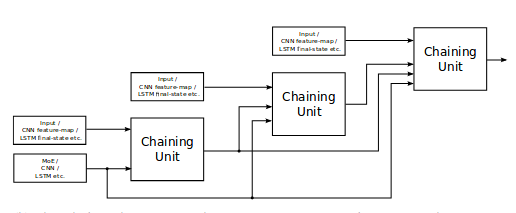
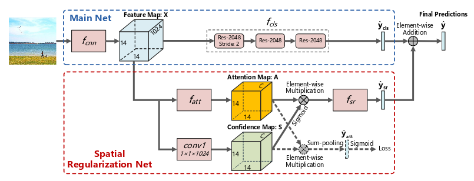
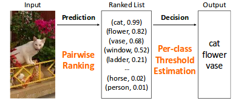

```{r, echo=FALSE, warning=FALSE, message=FALSE}
library(tidyverse)
library(knitr)
library(kableExtra)
```

# Convolutional Neural Networks for Multi-Label Image Classification \label{chp:mlcnn}

One potential concern with this approach is the risk of learning biased interdependencies from a limited training set which does not accurately represent a realistic distribution of pathologies – if every example of cardiomegaly is also one of cardiac failure, the model may learn to depend too much on the presence of other patterns such as edemas which do not always accompany enlarge-ent of the cardiac silhouette ([@Yao2017] on modeling label correlations).

## Baseline \label{sec:mlcnn_basic}

## From Single-Label to Multi-Label CNNs

It is very simple to adapt a DNN to suit a MLC problem. Recall that in a multiclass classification problem we would use a softmax layer activation on the final layer of a DNN. The softmax transforms the output so that the class scores are squeezed into the range of 0-1 and so that the class scores sum to 1. This is done so that the class scores better imitate class probabilities. However, when an observation can be associated with more than one label, we wouldn't expect the class probabilities to sum to 1. Therefore, a sigmoid activation is used on the output layer of a DNN for MLC. The sigmoid squeezes the class scores in the range of 0-1 without the constraint that the values should sum to 1. See Figure \@ref(fig:sigsof) for an illustration of the differences between sigmoid and softmax.

```{r sigsof, fig.cap = "Difference between the sigmoid and softmax transformation", echo=FALSE}
library(tidyverse)
x <- -5:5
sig_x <- 1/(1+exp(-x))
sof_x <- exp(x)/sum(exp(x))

data.frame(x, y = c(sig_x, sof_x), transform = c(rep("sigmoid", length(sig_x)),
                                                 rep('softmax', length(sof_x)))) %>% 
  ggplot(aes(x, y)) + geom_line(aes(color = transform)) + 
  ylab('a(x)') + 
  theme_minimal()
```

It turns out that a DNN with a sigmoid output layer is a very good baseline model for MLIC. It is only necessary to train one network to predict all labels and the network implicitly takes label correlations into account since the weights were trained to optimise all labels. For a MLIC problem, one can use a pretrained single-label classification network, say on ImageNet, swap out its softmax layer with a sigmoid layer and then fine-tune the network (with binary cross-entropy) on your specific data and achieve very good results. Although this method may be sufficient in some cases, there are ways to improve on this architecture. They are discussed below, sorted in order of publishing date. Remember, we are only considering end-to-end network approaches.

## Multi-Label Loss functions

One of the main considerations when switching from single-label to multi-label CNNs is the choice of loss function to minimise, *i.e.* how the network penalises the deviation between the predicted and true labels. Recall that when training a CNN, $f(x,\theta)\in \mathbb{R}^{K}$, we solve the optimisation problem

$$
\min_{\theta}\frac{1}{N}\sum_{i=1}^{N}l(f(x_{i},\theta), y_{i})+\mathcal{R}(\theta),
$$
where $l(f(x_{i},\theta), y_{i})$ is the loss for observation $i$ and $\mathcal{R}(\theta)$ is a regularisation term. The loss function needs to suit the multi-label output. We divide the loss functions used for training multi-label CNNs into two classes: cross-entropy based and ranking based.

### Cross-Entropy Based

The simplest and standard choice is to use the *binary cross-entropy loss*. This is simple the binary cross-entropy calculated for each label separately and then summed over all labels. Suppose the output from the network given the $i$-th input is the $K$-dimensional vector $\boldsymbol{p}_{i}=(p_{i1}, p_{i2},\dots,p_{iK})$, each element corresponding to the network's confidence that a certain label is associated with the input image. Assume that the final layer of the network is a sigmoid activation and therefore $p_{ij}\in(0,1)$. Let the true labels for that image be represented by the $K$-dimensional vector $\boldsymbol{y}_{i}=(y_{i1}, y_{i2},\dots,y_{iK})$ where $y_{ij}=1$ if label $j$ is associate with image $i$ and $y_{ij}=0$ if not. Then the cross-entropy for binary output $j$ can be given as

$$
\text{CE}(p_{ij},y_{ij})=-\left(y_{ij}\log(p_{ij})+(1-y_{ij})\log(1-p_{ij})\right),
$$
which can also be given by
$$
\text{CE}(p_{ij},y_{ij})=
\begin{cases}
-\log(p_{ij}) & \quad\text{if } y_{ij}=1\\
-\log(1-p_{ij}) & \quad\text{if } y_{ij}=0.\\
\end{cases}
$$
Thus the cross-entropy penalises $p_{ij}$ close to zero when $y_{ij}=1$ (label $j$ is present) and $p_{ij}$ near 1 when $y_{ij}=0$. The loss for a single observation can then be given by:

$$
l_{CE}(\boldsymbol{p_{i}},\boldsymbol{y_{i}})=\sum_{j=1}^{K}\text{CE}(p_{ij},y_{ij})
$$
This is what is referred to when reading "trained with binary cross-entropy", for example in [@Rajpurkar2017].

The authors of [@Wang2017] found that their network had trouble learning positive labels *i.e.* the network had a low recall. They argued that it was because of the small proportion of positive labels per image. To counter this imbalance, they proposed a balancing factor to give more weight to missclassified positive labels. Let $\beta_{i}$ be the proportion of positive labels for image $i$, *i.e* $\beta_{i}=\frac{\sum_{j=1}^{K}y_{ij}}{K}$. They then reweighted the cross-entropy loss as follows:

$$
\text{W-CE}(p_{ij},y_{ij})
=
\begin{cases}
-\frac{1}{\beta_{i}}\log(p_{ij}) & \quad\text{if } y_{ij}=1\\
-\frac{1}{1-\beta_{i}}\log(1-p_{ij}) & \quad\text{if } y_{ij}=0\\
\end{cases}
$$
This formulation gives a larger penalty to a missclassified positive label if the proportion of positive labels for the corresponding output is small. For example, if an input image is labeled with only 1 out 10 possible labels, the loss contributed if it was missclassified will be scaled by a factor of 10 (from $\frac{1}{0.1}$), whereas the loss contributed by the missclassified negative labels will only be scaled by a factor of 1.1111 (from $\frac{1}{1-0.1}$). The reverse would be true if for example 9 out the 10 possible labels are associated with an image. In [@Wang2017] they found that the $\text{W-CE}$ loss gave the best results in terms of the area under the ROC curve (AUC) for each label.

Of course there are other ways of defining the balancing factor. Another common convention to deal with class imbalance is to weight the contribution made by each label separately according to their proportions of positive instances, instead of a per observation weighting as was done previously.

Although these weighting schemes can give rare classes greater weight in the loss calculcation, it cannot differentiate between easy and hard examples, *i.e.* the weights are independent of how wrong or right the network is. We refer to the correctly predicted labels with high confidence as easy examples and those incorrectly predicted with high confidence as hard examples. 

Observe the negative log function of values between 0 and 1 in \autoref{fig:focal}. Notice that for values greater than 0.5 the negative log function still produces a relatively large non-zero value. This means that correctly classified examples ($p>0.5$) will still make a significant contribution to the overall loss incurred. We actually want a curve that is relatively flatter for values greater than roughly 0.6 and steeper for values less than say 0.4. This will ensure that the loss focusses more on the so-called hard examples. 

One such loss function is proposed in the field of object detection, called the *Focal loss* [@Lin2017]. The focal loss is defined as

$$
\text{FL}(p_{ij},y_{ij})=
\begin{cases}
-(1-p_{ij})^{\gamma}\log(p_{ij}) & \quad\text{if } y_{ij}=1\\
-p_{ij}^{\gamma}\log(1-p_{ij}) & \quad\text{if } y_{ij}=0,\\
\end{cases}
$$
where $\gamma$ is tunable focussing parameter $\gamma\ge 0$. This can be regarded as another form of the weighted cross-entropy, only this time, the weight is dependent on the confidence the network has in each label, $p_{ij}$. Consider the case where image $i$ is tagged with label $j$ ($y_{ij}=1$). If the network incorrecly has a low confidence that label $j$ is relevant ($p_{ij}$ close to zero), the scaling factor of the cross-entropy will be close to 1 and will have virtually no reduction in the cross-entropy. However, as the label confidence grows and the network becomes more certain that label $j$ is relevant to image $i$ ($p_{ij}\to 1$), the scaling factor reduces the cross-entropy by a greater amount. Therefore, when $p_{ij}>0.6$, the loss contribution will have a relatively much smaller contribution to the overall loss. A similar interpretation can be given for the case when $y_{ij}=0$. 

```{r, fig.cap="The loss contributions made by the focal loss.\\label{fig:focal}", echo=FALSE}

fl <- function(p, v=0) {
  -(1-p)^v * log(p)
}

p <- seq(0.0001, 0.9999, length.out = 100)

data.frame(p, a0 = fl(p), a1 = fl(p, 1), a2 = fl(p, 2), a5 = fl(p, 5)) %>%
  gather(weight, loss, -p) %>% 
  ggplot(aes(p, loss)) + geom_line(aes(color = weight)) +
  theme_minimal() +
  scale_y_continuous(limits = c(0, 5)) +
  scale_color_discrete(name = expression(gamma), labels = c("0", "1", "2", "5")) +
  ylab(expression((1-p)^gamma*log(p)))

```

\autoref{fig:focal} shows how the focal loss has a flatter penalty for correctly classified labels with high confidence. The effect of this down weighting is controlled by $\gamma$. If $\gamma=0$ the focal loss equivalent to the cross-entropy loss. The greater $\gamma$ the greater the down weighting. The creators of the focal loss found that $\gamma=2$ gave satifying results but that the focal loss is not that sensitive to this choice. The metric of interest was the average precision.

To the best of our knowledge, the focal loss has never before been used for multi-label classification, only for object detection. We report some of our findings in the next chapter along with experiments using a combination of the weighted cross-entropy and the focal loss.

### Ranking Based

While in multi-label image classification we care most about correctly classifying positive labels, it is equally important for the classifier to make sensible mistaktes, *i.e.* even if it fails to classify any positive labels it should still give higher scores to the positive labels compared to the negative labels. Thus it is desired for $p_{iu}>p_{iv}$, $\forall u \in L_{i}$, $v\notin Y_{i}$, where $Y_{i}$ is the labelset associated with the $i$-th image. To help ensure this we can choose to train the CNN using a rank based loss function. These may also act as better surrogates for some rank based multi-label evaluation metrics like AUC.

The first use of a ranking based loss in the context of multi-label image classification using CNNs can be found in [@Gong2013], which is also the first published work on multi-label image classification with CNNs. The *pairwise-ranking loss* can be given as

$$
l_{rank}(\boldsymbol{p_{i}},\boldsymbol{y_{i}})=\sum_{v\notin Y_{i}}\sum_{u\in Y_{i}}\max(0, 1-p_{iu}+p_{iv}))
$$
Thus a non-zero loss will be contributed by a positve label, $p_{iu}$, and negative label, $p_{iv}$, if $p_{iu}-p_{iv}<1$. This condition will always be true if the final layer of the newtork is a sigmoid activation. Then we would want $p_{iu}$ to be as close as possible to 1 and $p_{iv}$ as close as possible to zero. This is calculated for each positive and negative label pair of an image and for each image in a batch to determine the final pairwise rank loss. However, here it is not necessary for sigmoid activation at the output. It is also possible to swap the constant 1 with any other constant to change the margin. 

The authors of [@Gong2013] found that $l_{rank}$ does not optimise top-$k$ accuracy and therefore proposed the use of the *Weighted Approximate Ranking* (WARP) loss, defined as:

$$
l_{WARP}(\boldsymbol{p_{i}},\boldsymbol{y_{i}})=\sum_{v\notin Y_{i}}\sum_{u\in Y_{i}}w(r_{i}^{u})\max(0, 1-p_{iu}+p_{iv}))
$$
where $w(\cdot)$ is a weighting function and $r_{i}^{u}$ the estimated rank for positive label $u$. They used the following weighting function:

$$
w(r)=\sum_{j=1}^{r}\frac{1}{j}
$$

The idea is that the loss contribution for a label pair should have a greater weight if the positive label is not ranked near the top of the label list, *i.e.* when $r$ is large. $r_{i}^{u}$ is an estimation of the label $u$'s rank for image $i$. This estimation is based on the output of the network, $\boldsymbol{p_{i}}$. [@Gong2013] used a sampling approach to estimate the rank, based on the number of trials it took to sample a negative label given a positive label for which $p_{iu}-p_{iv}<1$. This adds extra computation to the loss calculation and gets very expensive as the number of labels become larger. In addition, the hinge function used inside the ranking loss is not smooth everywhere and is therefore difficult to optimise.

Recently, [@Li2017] proposed a smooth approximation of $l_{rank}$, which also does not require a rank estimation stage. This approximation uses the log-sum-exp pairwise function and therefore they called it the LSEP loss:

$$
l_{LSEP}(\boldsymbol{p_{i}},\boldsymbol{y_{i}})=\log\left(1+\sum_{v\notin Y_{i}}\sum_{u\in Y_{i}}\exp(p_{iv}-p_{iu})\right)
$$

```{r, fig.cap="The hinge function compared to the log-sum-exp function for different margins.\\label{fig:rankloss}", echo=FALSE}

m <- seq(-2, 1, length.out = 100)

hinge <- sapply(m, function(a) max(c(0, 1 + a)))
lsep <- exp(m)

data.frame(m, hinge, lsep) %>%
  gather(f, loss, -m) %>% 
  ggplot(aes(m, loss)) + geom_line(aes(color = f)) +
  theme_minimal() +
  xlab(expression(p[iv]-p[iu])) +
  scale_color_discrete(name = "", 
                       labels = c(expression(max() (0, 1 - p[iu] + p[iv])),
                                  expression(exp(p[iv]-p[iu])))) +
  theme(legend.text.align = 0)
```

See \autoref{fig:rankloss} how the contribution made by each pair of labels differ between the pairwise ranking loss and the LSEP loss. Note, that $\exp{(p_{iv}-p_{iu})}$ will give a much higher loss for large values of $p_{iv}-p_{iu}$ compared to $\max (1-p_{iu}+p_{iv})$. However, this difference is reduced by the log function in $l_{LSEP}$.

The authors of [@Li2017] argue that it is not necessary to add a weighting mechanism as in $l_{WARP}$ since weighting is done implicity by $l_{LSEP}$. $l_{LSEP}$ is also quite similar to the *BP-MLL* loss proposed in [@Nam2013] for text classification and genomics:

$$
l_{BP-MLL}(\boldsymbol{p_{i}},\boldsymbol{y_{i}})=\sum_{v\notin Y_{i}}\sum_{u\in Y_{i}}\exp(p_{iv}-p_{iu})
$$

According to [@Li2017] $l_{LSEP}$ is numerically more stable and focuses more on the violating cases ($p_{iv}>p_{iu}$), whereas $l_{BP-MLL}$ keeps pushing $p_{iu}-p_{iv}$ to $\infty$, because it lacks the $\log(1+\text{pairwise-loss})$ form of $l_{LSEP}$.

Computing the loss contributed by each pair of labels can become computationaly infeasible if $K$ is large. Therefore [@Li2017] also introduced a sampling trick to let the loss function scale linearly with increase in $K$. Instead of calculating the loss for each positive-negative label pair, they only sample a maximum of $t$ pairs from the Cartesian product, where they set $t=1000$.

In their results they found that $l_{LSEP}$ performed better than $l_{rank}$, $l_{WARP}$ and $l_{BP-MLL}$ in terms of the macro $F_{1}$-score and exact match measures, evaluated on 3 multi-label image benchmark datasets. It will be interesting to see how it compared to the cross-entopy based loss functions. We will investigate this in the next chapter.

## Modelling Label Correlations

As mentioned in \Cref{chp:mlc} exploiting label correlations is a key challenge in multi-label classificaiton. The standard way of adapting a CNN for multi-label classification does not explicitly model label correlation, however we can think of it as implicitly dealing with it. 

+ chaining
+ context gating
+ SE-Net
+ mention RNN: (https://nurture.ai/nips-challenge/p/c074cc00-3f61-476b-8f0c-83795f0229ed)

The winning solutions to the YouTube video classification challenge proposed interesting and ways to model label dependence for a MLC task. I identified two approaches worth exploring to see how well it works on MLIC.

The first approach is called **context gating** (CG) by [@Miech2017]. The idea of the CG module is to capture nonn-linear interedependencies between labels as well as among features. It does this by transforming an input representation $X$ into a new representation $Y$, by

$$
Y=\sigma(WX+b)\circ X,
$$
where $\circ$ is the elementwise multiplication operation. $WX+b$ is the linear transformation of $X$ and thus $W$ and $b$ are arrays of learnable parameter. The sigmoid activation, $\sigma(.)$, transforms the linear transform of $X$ to values between 0 and 1 and thus act as weights (or gates) which are then multplied with $X$.

The motivation behind this is to introduce non-linear interactions among activations of the input representation and to recalibrate the strengths of different activations of the input representation through a self-gating mechanism. The authors used CG first to transform an intermediate feature vector before passing it to the classification module. Secondly, they applied it after the classification layer to capture the prior structure of the output label space.

By sending a feature vector through the context gate, dependencies among features can be captured. For example, the context gating unit can learn to suppress features likely to be in the background and emphasise the foreground objects. For instance, if features corresponding to ‘Trees’, ‘Skier’ and ‘Snow’ have high co-occurring activations in a skiing video, context gating could learn to suppress the background features
such as ‘Trees’ and ‘Snow’, which are less important for the classification. By applying the CG unit after the initial classification layer it can learn to downweight unlikely combinations of labels. For example we saw previously that 'Male' and 'Skirt' does not appear often in the WIDER-attribute images. If this was predicted by the initial classificaiton layer, CG would then be able to tweak these predictions.

The authors saw a significant performance increase in their model after incorporating CG.

The other approach from the YouTube challenge is called **chaining** by @Wang2017. The idea is based on CC to model label correlations (although I think it resembles BR+ and stacked BRs more). A chaining unit accepts one feature vector and multiple model predictions as input and the produces a new model prediction. The model predictions are embedded into a lower dimensional space if $K$ is large. These units can be stacked on top of each other and then at each step the model can learn from its previous mistakes. See Figure \@ref(fig:chaining) for an illustration of the chaining approach.

```{r chaining, fig.cap="An illustration of the chaining layers.", echo=FALSE}

```

To accelarate the training process, auxiliary losses were given to the intermediate predictions after each chaining unit. The auxiliary losses only contributed 10-20% of the total loss when training. The number of chaining units to stack needs to be decided. The authors show that the addition of the chaining units increased the network's performance significantly.

Chaining has some similarities with recurrent nets, but where at each iteration all labels are predicted and no memory mechanism is involved and with a fixed number of iterations.

## Learning from Complex Images

+ using RNN attention

uses RL to train (https://nurture.ai/nips-challenge/p/2e855b9a-2e78-4788-98b2-6634301f35ab)

### Spatial Relations

The Spatial Regularisation Network (SRN) is the first network to propose to model spatial relations between labels. They achieve this by training a subnet to learn attention maps representing the image regions for each label, from which a series of convolutional layers can then learn the label spatial relations. 

As the backbone network, they first train a ResNet 101 on the relevant data. Then they use a set of lower level features from the backbone network to give as input to the SRN subnet. From these lower level visual features, the SRN subnet first learns a attention map for each label in a fully convolutional fashion, after which a series of convolutional layers take the attention maps as input and output the relevant labels for an image. This output is then added to the backbone net's predicted probabilities to obtain a final prediction. Figure \@ref(fig:srn) provides an illustration.

```{r srn, echo=FALSE, fig.cap="An illustration of the SRN framework."}

```

They tested the network on MSCOCO, NUS-WIDE and WIDER-Attribute datasets and achieved very good results, far better that any other method. They also evaluated without first selecting a fixed number of labels. Although the authors attribute the SRN's success to its ability to model spatial relation, there are other reasons why this network performs so well.

Firstly, the ResNet is a more advanced network than VGG which was used by CNN-RNN and WARP. Secondly, when training, the authors of SRN used a more sophisticated form of data augmentation. They used a random scale augmentation amongst others, which allows the network to "see" an image at different sizes, usually help to recognise objects of different scales. Lastly, the fact that the SRN is built on top of a lower level visual feature map which is of higher resolution, also makes the detection of smaller objects easier. Thus it might be valuable to compare the SRN with the CNN-RNN on equal footing, where in addition the CNN part of CNN-RNN is allowed to be fine-tunend.

The SRN is trained using binary cross-entropy loss. One inconvenience is that the network is trained in multiple steps. We still consider this an unified network, since the steps only consist of freezing and unfreezing weights during training.

A bonus is that the SRN's attention maps can be visualised, giving localisation information on each image.

A challenge in MLIC not receiving nearly enough attention is the challenge of recognising objects of vastly different scales. Although the CNN-RNN architecture can do this. Fortunately in object detection this issue has been attended to.

See also: https://arxiv.org/pdf/1712.00433.pdf

### Multi-Level Predictions

In brief, FPN augments a standard convolutional network with a top-down pathway and lateral connections so the network efficiently constructs a rich, multi-scale feature pyramid from a single resolution input image. Each level of the pyramid can be used for detecting objects at a different scale.

```{r FPN, fig.cap="An illustration of the FPN concept in @Lin2016.", echo=FALSE}
knitr::include_graphics('figures/fpn.png')
```

## Automatic Thresholding

+ multi-task learning
+ top-$k$
+ threshold

This contribution made in this work is two-fold: providing a novel loss function for MLC and introducing the idea of a learnable label decision module. 

Recall, that a standard CNN returns scores for each class and that we are ultimately interested in the binary output. Usually we would use a thresholding function or select the top-$k$ labels to determine which labels to include in the final predicted set. This approach does not take the input into account.

The learnable decision module proposed in this work takes the image into account when determining which labels to include in the final set. The decision module is a multi-layer perceptron (MLP) built on top of the penultimate layer of the classification network, which can either output the label count of the input image or the threshold to select the labels by. See Figure \@ref(fig:imprank) for an illustration. If we want the label decision module to output the label count we can treat it as a $n$-way classification problem, where $n$ is the maximum number of labels an image can have. The reason we choose to model it as a classification task is so that integers are returned. Since it is a multiclass classification problem, the module is trained using a categorical cross-entropy loss.

```{r imprank, echo=FALSE, fig.cap="An illustration of the label decision module concept."}

```

If we want the label decision module to return optimal thresholds for each label, we can treat it as a $K$ dimensional regression task. The loss function then becomes more complicated and can be given by:

$$
L_{thresh}=-\sum_{K=1}^{K}Y_{i,k}\log(\delta_{\theta}^{k})+(1-Y_{i,k})\log(1-\delta_{\theta}^{k}),
$$
where $\delta_{\theta}^{k}=\sigma(f_{k}(\boldsymbol{x}_{i})-\theta_{k})$, with $\sigma(.)$ the sigmoid function and $\theta_{k}$ the predicted threshold for label $k$. Thus if the $k$-th label of observation $i$ is positive, then we want $\delta_{\theta}^{k}>0$ and therefore $f_{k}(\boldsymbol{x}_{i})>\theta_{k}$, *i.e.* the score of class $k$ to be higher than the threshold. A similar explanation can give for the negative label case. 

The authors trained the classification network first and then trained the label decision module with the classification network weights frozen. The authors mention the full network can be trained in a multi-task learning manner (*i.e.* both networks simulataneously) but they observed better results doing it sequentially. They used a VGG pretrained on ImageNet as the classification CNN.

Their evaluations were done on all the major MLIC benchmark datasets (NUS-WIDE, MSCOCO, PASCAL VOC 2007) and reported the performance using the standard MLIC metrics along with the exact match. They compared their approach to using WARP and CNN-RNN, but not SRN. One of the other baselines they used as a comparison is a multi-label adaption of the categorical cross-entropy loss which does not make sense to me. They found that the thresholding decision module combined with LSEP loss got the best results of all (even better that cross-validated select thresholds or top-$k$'s). Although it does not seem to do better than SRN.

## Weakly-Supervised Object Detection

+ class activation maps
+ fully convolutional networks

## Conclusion