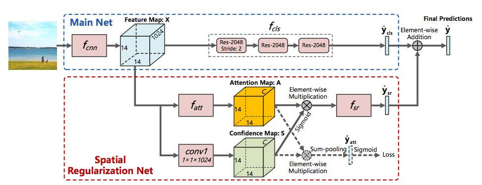
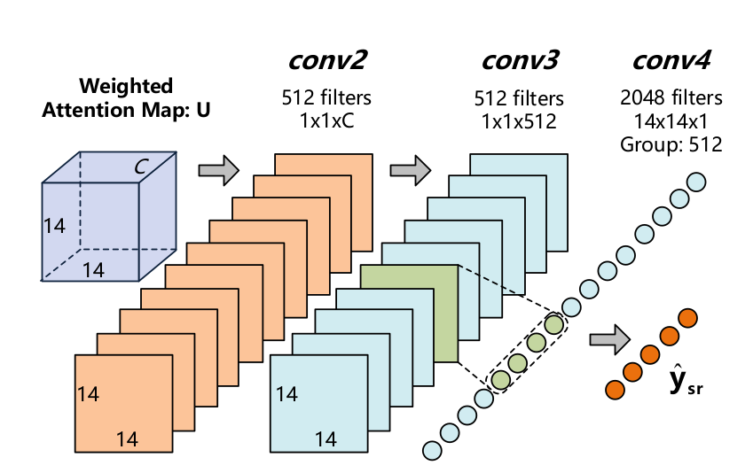

# Multi-Label Deep Neural Networks
\label{chp:ml_cnn}

## Introduction 

We have seen that Deep Convoltional Neural Networks have achieved great success on single-label image classificaiton problems. This is because of their strong capability in learning discriminative features when trained on large datasets, which are also transferable to other image classification problems. However, these feature representations might not be optimal for images with multiple labels. For example, one of the labels might only relate to a very small region of the image. This label would most likely be underepresented by the features learned on single label datasets, since for single label images, the label is typically related to a large part, and usually in the centre, of the image.

The most common method is to take popular existing networks, *e.g.* VGG and ResNet, and replace the activation function of their final classification layer to a sigmoid activation and train the network by minimising the sum of the binary cross-entropies of each label. This is mostly related to the BR approach, since direct relationships between labels are not taken into account. A pure BR approach would be to train a separate network for each label. If there are enough images per label, this approach should in theory be sufficient to classify the images. But in practice this is rarely true and the individual classifiers could be improved by having information on the other labels.

Minimising various other loss functions has also been investigated (see Deep convolutional ranking for multilabel image annotation). Found that weighted approximate ranking loss worked best for CNNs.

+ https://arxiv.org/pdf/1609.07982.pdf
+ replace last FC with maxout
+ replace last pooling with spatial pyramid pooling
+ other option use FCN with global max pool at end before sigmoid
+ dropout only on first layers after representation (fixed VGG)
+ note they also used dropout at testing and then combined for mean prediction
+ see [https://cs.nju.edu.cn/_upload/tpl/01/0b/267/template267/zhouzh.files/publication/tkde06a.pdf] for ML-loss function

## Proposal Based Approaches

If multiple labels are associated with a single image, it is fair to assume that the different labels are related to different visual regions of the image. Proposal based CNN methods attempt to cope with this problem. (Start with single to multi CNN paper). Proposal based methods are also very popular or object detection problems.

However, these methods ignore semantic relations between labels. Next we will look at ways to capture these semantic relations in image classification.

## RNN-CNN paper

+ sequential prediction problem.

+ also PGMs, Structured inference (SRN for reference)

However, these methods do not capture spatial relations between labels. This is a challenging problem because most of the times these spatial locations are not known beforehand, *i.e* the images are not annotated with these spatial locations. Spatial Regularisation Networks [@Zhua] attempt to capture both semantic and spatial relations between labels without any prior knowledge on the spatial locations of each label. This is discussed in the next section.

+ https://arxiv.org/pdf/1707.05495.pdf is an improvement of this that does not depend on the ordering of the LSTM.

## Spatial Regularization Networks

+ This paper provides a unified deep neural network for exploiting both semantic and spatial relationships between labels with only image-level supervisions
+ SRN generates attention maps for all labels and captures the underlying relations between them via learnable convolutions.
+ Also aggregates regularised classification with original classifcation from RN101.
+ tests on 3 benchmark datasets that show sota performance and great generalisation capability.
+ can be trained end-to-end

In short, the SRN learns separate attention maps for each label, which associates related image regions to each label. By performing learnable convolutions on the attention maps of all labels, the SRN captures the underlying semantic and spatial relations between labels and act as a spatial regulariser for multi-label classification.

The attention mechanism adaptively focuses on related regions of the image when the deep networks are trained with spatially related labels (segmentation?). Intuitively this seems likely to work for ML image classification problems.

The main net has the same network structure as ResNet-101 [cite]. The SRN takes visual features from the main net as inputs and learns to regularise spatial relations between labels. Such relations are exploited based on the learned attention maps of each label. Label confidences from both the main net and SRN are aggregated to generate final classification scores.

Not sure how in detail I should go here. 

Used $224 \times 224$ sized images. The $14\times 14$ feature map from layer named *res4b22_relu* of ResNet-101 is used as inputs to the SRN. The rest of the main net still continues to produce $K$ class scores, which is later combined with the output of the SRN. The SRN is composed of two sub-networks. The first sub-network learns label attention maps with image-level supervisions and the second sub-network captures spatial regularisations of labels based on the learned attention maps.

Multiple image regions are semantically related to different labels. The regions locations are generally not provided, but it is desirable that more attention is paid to the related regions. SRN attempts to predict such related regions using the attention mechanism. The attention maps are then used to learn spatial regularisations for the labels. The attention map for label $l$ related to an image should indicate the image regions related to $l$ by displaying higher attention values to that region. The attention estimator is modeled as 3 convolutional layers with 512 kernels of $1\times 1$, 512 kernels of $3\times 3$ and $K$ kernels of $1\times 1$, where $K=|\mathcal{L}|$. The ReLU activation function is applied after the first two convolutional layers, and the softmax after the third.

Since ground-truth annotations of attention maps are not available, the network is learned with only image-level label annotations. A weighted global average is computed for each label attention maps (similar to global average pooling in ResNet). This results in a 1024 sized vector on which a linear classifier is learned to obtain class scores. They are learned by minimising the cross-entropy loss between these predicted class scores and the ground-truth labels. (seems like the attention maps work from example given in paper).

Also compute a $1\times 1\times 1024$ convolutional layer on the feature inputs to obtain a $14\times 14\times K$ confidence map. $A$ and $S$ are multiplied element-wise and then spatially sum-pooled to obtain the label confidence scores (after Sigmoid activation).

Then combine weighted confidence scores with attention map, by element-wise multiplication and feed as input to another series of convolutional layers. These sizes should be chosen carefully in order not to have too many parameters. Authors suggest 3 convolutional layers with ReLU, followed by one fully-connected layer. See \autoref{fig:srn_fst} for size of convolutions. Empirically showed the weighted attention maps work.

The final label scores are the weighted sum of the outputs of the main net and SRN, weighted by learnable paramter $\alpha$. However, $\alpha$ can be set to 0.5 without observable performance drop.

The training is done in three parts. Training is done first by fine-tuning only the main net (but the full main net), which was pretrained on ImageNet. Then learning the attention map and confidence map simultaneously and then the convolution of the combination of the weighted attention map and confidence map. (This description will be much easier with notation).

Used data augmentation. Random crops of $256\times 256$ image from the four corners and center, then rescaled to $224\times 224$. See paper ref for detail.

Used SGD with batch size 96, momentum 0.9 and weight decay of 0.0005. Initial learning rate is set to 0.001 and decreases by factor 0.1 when validation loss reaches a plateau, until 0.00001. Testing is done by resizing image to $224\times 224$.

Evaluates on 3 benchmark datasets, with multiple measures and shows promising results. Compared to pure ResNet and CNN-RNN and is the best on almost all measures.

Here is another paper on exploiting spatial relations: https://arxiv.org/pdf/1612.01082.pdf. However, I think they are using Recurrent Nets.

Attention maps interpretable.

+ see https://arxiv.org/pdf/1705.02315.pdf for more attention maps, interesting pooling and other loss optmisations.

## Is object localization for free? – Weakly-supervised learning with convolutional neural networks

+ http://www.cv-foundation.org/openaccess/content_cvpr_2015/papers/Oquab_Is_Object_Localization_2015_CVPR_paper.pdf
+ section on label correlations for MLC

## Near Perfect Protein Multi-Label Classification with Deep Neural Networks

+ https://arxiv.org/pdf/1703.10663.pdf
+ spp layer after convolutions - not sure if it has to do with MLC

## BP-MLL

+ http://citeseerx.ist.psu.edu/viewdoc/download?doi=10.1.1.130.7318&rep=rep1&type=pdf
+ description on NN and some references

## ML NN for text

+ https://arxiv.org/pdf/1312.5419.pdf

## ML MT

+ http://www.cripac.ia.ac.cn/irds/People/lwang/M-MCG/Publications/2013/YH2013ICIP.pdf
+ but not much detail

## ML Attention:

+ https://arxiv.org/pdf/1412.7755.pdf
+ more ons weakly supervised attention https://arxiv.org/pdf/1707.05821.pdf

## Sparsemax ML loss

+ https://arxiv.org/pdf/1602.02068.pdf

+ Other object detection
+ winner of yt8m challenge: https://arxiv.org/pdf/1706.06905.pdf [@Lee2017a]. Used context gating!
+ see the chaining method of: https://arxiv.org/pdf/1706.05150.pdf and useful other tricks like bagging, boosting, stacking and knowledge distillation

## Label Embedding Approaches

+ Learning Deep Latent Spaces for Multi-Label Classification: https://arxiv.org/pdf/1707.00418.pdf
+ Direct Binary embedding: https://arxiv.org/pdf/1703.04960.pdf
+ cost sensitive: https://arxiv.org/pdf/1603.09048.pdf

+ see https://arxiv.org/pdf/1707.01408.pdf for label concept learning layer, other MOE options and ensembling and similarly https://arxiv.org/pdf/1707.03296.pdf with the addition of classifier chains
+ see https://arxiv.org/pdf/1706.07960.pdf for label processing layer, psuedo huber loss, 

+ see https://arxiv.org/pdf/1702.04684.pdf for nearest labelset approach

## Stratification

+ https://arxiv.org/pdf/1704.08756.pdf

## F-measure maximisation

+ https://arxiv.org/pdf/1604.07759.pdf
+ see https://arxiv.org/pdf/1701.05616.pdf for other loss optimisation 

+ see https://arxiv.org/pdf/1409.4698.pdf for MOE for MLC

## To read:

### Multi-Label Transfer Learning with Sparse Representation

+ https://pdfs.semanticscholar.org/92f5/bd6aa3544c36490e2dac798513055233b02c.pdf

### Multi-Instance Multi-Label Learning for Image Classification with Large Vocabularies

+ https://faculty.ist.psu.edu/vhonavar/Papers/bcv2011.pdf