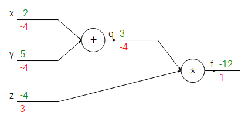
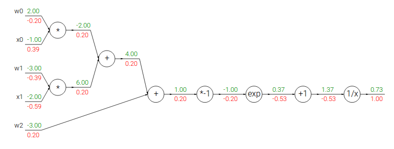
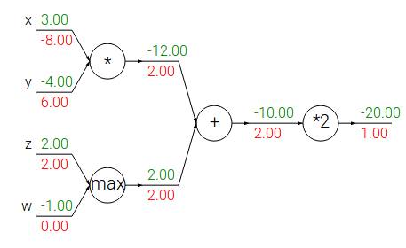

# Introduction
\label{chp:intro}

## Motivation

> the core of what I want to say here is that multi-label image classification is chosen because it has many useful applications. Deep neural networks is chosen because it is the most powerful single label image classification model. The combination is also new research area with potential of contributing to literature. Make sure this is what this section communicates.

*Image Classification* is the task of assigning one (or more) label(s) to an input image. It is one of the core problems in *Computer Vision*. This seemingly simple task has a large variety of practical applications. For example, detecting deforestation in the Amazon from satellite images [^Amazon] or detecting cancer from images of skin lesions taken by a mobile phones [@Esteva2017]. Image classification is a thoroughly researched subject and already regarded by many as a 'solved' problem. This progress is mainly attributed to the yearly large-scale image classification competition, called *ImageNet*[^imagenet], providing researchers with millions of labelled images to train their image classification models.

[^Amazon]: https://www.kaggle.com/c/planet-understanding-the-amazon-from-space
[^imagenet]: http://www.image-net.org/

The other driver of the recent success of image classification systems is the development of *Deep Learning* [@Lecun2015], a subfield of Machine Learning. Deep Learning or *Deep Neural Networks* (DNNs) is a class of models inspired by the structure and function of the brain called artificial neural networks. The type of DNN proven best suited for image classification problems are *Convolutional Neural Networks* (CNNs). CNNs is the uncontested state-of-the-art model for practically all image classification problems, mainly because of its ability of 'learning' highly discriminative feature representations of its input images. In the past, conventional approaches were built on carefully designed hand-crafted features such as SIFT [cite] and BoW [cite]. AlexNet [@Krizhevsky2012] was the first CNN to win ImageNet (in 2012) and thereafter, each of the following annual ImageNet competitions was won by a CNN.

The main focus of deep learning approaches for image classification, until recently, was on problems where each image is annotated with only a single label. *Multi-Label Classification* (MLC) [@Zhang2014] of images generalises this task to allow images to be annotated with more than one label. The majority of real-world images contain more than one object, making multi-label image classification a more general and practical problem, and naturally, also more challenging. Only recently more attention was given to multi-label image classification (for example, [@Wei2014]) and therefore the field is nowhere near the maturity level of its single-label counterpart. It is fair to assume that since DNNs are so powerful with single-label image classification, it may also be extended to successfully model images with multiple labels.

Extending CNNs and other DNNs to handle images with multiple labels is not a trivial task. Recently, a handful of proposals were made on how to tackle this task [cite them?]. However, these suggestions were mostly given in isolation of one another and no comprehensive review and comparison (theoretical or empirical) of these methods exist in the literature. Most of the proposals also come from a deep learning background and could gain from insights and methods already discovered in the field of MLC. 

In summary, the relevance of multi-label image classification, in terms of its wide range of useful practical applications, and the power of deep learning methods for image classification tasks, is the main motivation behind choosing this topic of research. This area of research is still relatively under explored and a comprehensive understanding and review of on the subject could lead to novel contributions to the literature. This is the secondary motivation behind the study. Exactly what this thesis aims to achieve will be discussed next.

## Objectives

The core of this study is to explore ways of applying DNNs to multi-label image classification problems. The direction of the research can be described by the following objectives. First, the intermediate objective of this study is to obtain a comprehensive understanding of the following research areas:

+ **The image classification problem** - This is the application domain for this study. A good understanding of the problem would lead to a solid foundation for further study in the domain. By disussing previous and basic approaches to the problem, the challenges and shortcomings in the domain can be identified.

+ **Deep neural networks and how they are applied to image classification** - This is the class of algorithms the study focusses on (more specifically, CNNs). Therefore, the understanding of DNNs is essential for further study on how they can be extended. The typical structures of DNNs for image classfication should be given attention to, in addition to how variations thereof influence the algorithms effectiveness in certain scenarios. Learning the limitations of the current networks would also be beneficial to the rest of the study.

+ **The multi-label classification framework** - This is the *supervised learning* paradigm in which this study will take place. Although only recently became popular, many contributions have been made to this field. Knowledge of the basic concepts, especially those novel relative to single label classification, the common challenges in the field and the state-of-the art algorithms would give valuable insights to the core of this thesis. The focus can mostly be agnostic to the application domain, however, previous work on multi-label image classifcation (other than DNNs), will also be insightfull.

> confused to how I must use could vs can and would vs will

The fulfillment of the above intermediate objective would be complementary to the main objective of learning how to effectively apply DNNs to a multi-label image classification probelm. This objective can be deconstructed into the following sub-objectives:

+ **Gather and review all the proposals on how to extend DNNs for multi-label image classification in the literature** - The literature on this subject is sparse, but there are enough proposals for a review on the subject to be relevant. The aim is to obtain a thorough understanding of each proposal, how it solves the multi-label classification problem and how effective it is in doing so. The conceptual differences between the approaches would be given considerable attention. If there are proposals for DNNs for MLC in other application domains, but the approach is transferable to image classification, these should also be considered.

+ **Suggest ways to improve existing approaches** - Learning from the strengths and weaknesses of each existing approach (from the review) would provide a good basis on to suggest improvements on existing approaches. These can either be extensions of existing approaches or novel approaches. The possibility of transferring ideas in pure MLC to deep learning to improve upon existing approaches would also be explored.

+ **Provide empirical evaluations and comparisons of the highlighted approaches** - The theory and discussions of the study can be complemented by empirical evaluations. Existing and suggested approaches can be evaluated on popular benchmark image datasets in order to compare them to each other and to compare them with the existing literature. This task will teach the implementations of such algorithms and highlight some of the challenges in doing so, not necessarily mentioned in the literature. 

When all these objectives are completed a master's level understanding on the topic of DNNs for multi-label image classification would have been obtained. Given a certain multi-label image classification problem, one would have the knowledge to reccommend some approaches above others, know its limitiation and have the ability to implement the approach.

> review these objectives as writing continues.

## Contributions

> rough - will complete after the contributions are actually done. This is roughly what I attempt to contribute.

Novel contributions made to the literature by this thesis:

+ First review of multi-label DNNs - there are a few papers on ML-CNN. They are usually compared to only a limited number of other approaches, on limited number of datasets and limited number of metrics. To the best of our knowledge, at the time of completing this thesis, no other work provides such an extensive review of the literature.

+ Some of the proposed algorithms empirical evaluations are lacking completeness. Usually they lack combinations of either or all of the following:

    + evaluated on multiple benchmark datasets
    + evaluated in terms of a representative set of multi-label evaluation metrics
    + estimated errors provided with standard errors
    + compared with a wide range of state-of-the-art algortihms

+ improvements on existing approaches?

## Code and Reproducibility

All of the code for this project, including the source docoments, is made available in the Thesis Github repository [^repo]. More instructions on how to implement the code is contained in the file named, `README.md`, in the repository.

> not sure about this section

[^repo]: https://github.com/jandremarais/Thesis

## Background and Important Concepts

It should be clear by now that the three main concepts in this thesis is that of image classification, deep neural networks and multi-label classification. Each of these areas will be introduced individually before putting it all together. DNNs will be discussed in Chapter \ref{chp:dnn} and MLC in Chapter \ref{chp:mlc}. Since we are interested in applying both of these classes of models in the image classification domain, a background and comprehension of the image classification problem is necessary.

First, a brief introduction to the general problem of image classification is given. It will be explained with the help of a trivial example. This discussion will also introduce the main components of DNNs which are important to understand before moving on to Chapter \ref{chp:dnn}.

### Image Classification

Classification is only one of many important tasks in Computer Vision (CV). Other examples of important tasks are localisation and segmentation (should I give example papers?). See \autoref{fig:cvtasks} for a display of the conceptual differences of these tasks. There are many similarities between these tasks, whereas classification can be viewed as the core of them. Image classification is the main focus of this study (out of the other CV tasks). 


Traditional image classification is the task of assigning one label from a fixed set of categories to an input image. A rather neglected topic in the literature, is that of assigning potentially more than one label to an input image, known as multi-label image classification. First, we will only look at the single label case.

+ mention applications?

One way of building an image classification model is to hard code into the model how to classify images. Clearly, with the possibly endless number of rules, this process is super inefficient, inflexible and inaccurate. A much more effective way of doing this is to let the model learn by itself how to classify images by providing it with many examples of images and its corresponding labels. This is sometimes referred to as a data-driven approach. This task of *training* a model to learn from labelled data (the set of annotated images in this case) is known as *Supervised Learning*.

+ give more formal definition of supervised learning here?

A very intuitive approach to image classification (and supervised learning in general) is called the nearest neighbour approach. Although this approach is rarely used for image classification in practice, a description thereof can help with the understanding of the image classification problem. The nearest neighbour classifier will take a test image, compare it to every single one of the training images, and predict its label to be the label of the closest, *i.e.* most similar,  training image. This leaves the question of how to measure the similarity between images. To answer this question, we need to look at how images are represented as data.

An image is a grid of many tiny, square cells of different colors. These cells are known as pixels and one pixel represents one color. A grayscale image, 32 pixels wide and 32 pixels long, can be represented by a $32\times 32$ matrix of integers, where each integer represents the 'brightness' (intensity) of each pixel. These integers are usually in $[0,255]$, such that the greater the integer the brighter the pixel, *i.e.* a pixel with intensity 0 is totally black and a pixel with intensity 255 is totally white. \autoref{fig:img_mat} illustrates this representation. Note, that a standard color image consists of 3 spectral bands, red, green and blue (RGB), *i.e.* the color of one pixel is determined by 3 integers in $[0,255]$, each representing the intensity of the color red, green and blue, respectively. Thus a $32\times32$ sized image is represented by an array of size $32\times32\times3$.

```{r,fig.cap="A low resolution grayscale profile of a man with pixel values overlayed on the image.\\label{fig:img_mat}", cache=TRUE, fig.width=3, fig.height=3}
load.image("figures/wim.jpeg") %>% 
  grayscale %>% 
  resize(16, 16) %>% 
  as.data.frame %>% 
  ggplot(aes(x, y)) + 
  geom_raster(aes(fill = value), show.legend = FALSE) +
  scale_y_continuous(trans=scales::reverse_trans(), expand = c(0, 0)) +
  scale_x_continuous(expand = c(0, 0)) + 
  scale_fill_gradient(low = "black", high = "white") +
  coord_fixed() +
  theme(text = element_blank(), line = element_blank()) +
  geom_text(aes(label = round(value * 256), color = value), show.legend = FALSE, size = 2) +
  scale_color_gradient(low = "white", high = "black")
```

The (dis)similarity between two images can now be measured pixel by pixel. It is possible to represent the grayscale image mentioned above in a vector of length 1024 ($32\times 32$). Suppose the matrix of pixel values of a grayscale image is flattened out to be represented by the vector $\boldsymbol{x}_{1}=\{x_{11},x_{12},\dots,x_{1p}\}$ and similary, another similar image by $\boldsymbol{x}_{2}$, where $p=1024$. Then the dissimilarity between Image 1 and Image 2 can be calculated by the $L_{1}$-distance:

$$
d_{1}(\boldsymbol{x}_{1},\boldsymbol{x}_{2})=\sum_{j=1}^{p}|x_{1j}-x_{2j}|.
$$

Now, suppose we want to predict the label of a test image $a$, then the nearest neighbour approach would assign the label of train image $b^{*}$ to test image $a$ if:

$$
b^{*} = \arg\min_{b} d_{1}(\boldsymbol{x}_{a},\boldsymbol{x}_{b}),
$$
for $b=1,2,\dots,N$, where $N$ is the number of training images. Of course there are other ways of measuring the dissimilarity between images. Another common distance metric is the $L_{2}$-distance:

$$
d_{2}(\boldsymbol{x}_{1},\boldsymbol{x}_{2})=\sqrt{\sum_{j=1}^{p}(x_{1j}-x_{2j})^{2}}.
$$
The chosen metric depends on the use case.

The nearest neighbour approach can be generalised to use more than 1 nearest neighbours when predicting the label of a test image. This approach is called the $k$-Nearest Neighbours ($k$-NN). The only difference is that you now search for the $k$ (instead of just 1) images with the smallest dissimilarity with the test image. Then the labels of these $k$ images are aggregated, either through averaging or majority voting, to determine the label to be assigned to the test image. Choosing the right value of $k$ is important and is usually done by *cross-validation* [@Hastie2009] (give page numbers?). 

The advantages of using $k$-NN is that it is simple and requires no time to train. Unfortunately, when it comes to test time, the algorithm needs to calculcate the distance between the test image and all the other images in the training set. This quickly becomes extremely computationally heavy as the size of the training set increases. Also in [@Hastie2009], they show that $k$-NN suffers severely from the so-called *curse of dimensionality* and that the algorithm is mostly only useful for the classification of lower dimensional objects. Images are typically very high-dimensional objects.

In addition, it turns out that the dissimilarity measures discussed above are proven to be very poor in discriminating between images in an image classification problem. Images that are nearby in terms of the $L_{1}$ and $L_{2}$ distances are much more of a function of the general color distribution of the images rather than their semantic identity. For example, if two images share roughly the same color background and their backgrounds take up a large part of the image, they will most probably have a low $d_{1}$ and $d_{2}$ between them, regardless of the foreground object. To illustrate this, look at the images in \autoref{fig:img_dist}. 

```{r, fig.cap="Two images of a Chihuahua, (a), (b), and an image of a blueberry muffin. \\label{fig:img_dist}", cache=TRUE}
chi_im <- load.image('figures/chihuahua.jpeg') %>% 
  crop.borders(nx = 50) %>% 
  resize(128, 128) %>% 
  as.data.frame()

chi2_im <- load.image('figures/chihuahua2.jpeg') %>% 
  resize(128, 128) %>% 
  as.data.frame()

muff_im <- load.image('figures/muffin.jpeg') %>% 
  resize(128, 128) %>% 
  as.data.frame()

chi_df <- load.image('figures/chihuahua.jpeg') %>% 
  crop.borders(nx = 50) %>% 
  resize(128, 128) %>% 
  as.data.frame(wide = "c")

chi2_df <- load.image('figures/chihuahua2.jpeg') %>% 
  resize(128, 128) %>% 
  as.data.frame(wide = "c")

muff_df <- load.image('figures/muffin.jpeg') %>% 
  resize(128, 128) %>% 
  as.data.frame(wide = "c")


bind_rows(
  chi_df %>% mutate(im = "(a)"),
  chi2_df %>% mutate(im = "(b)"), 
  muff_df %>% mutate(im = "(c)")
) %>% 
  mutate(rgb.val=rgb(c.1,c.2,c.3)) %>% 
  ggplot(aes(x, y)) + 
  geom_raster(aes(fill = rgb.val)) + 
  scale_fill_identity() + 
  scale_y_reverse(expand = c(0, 0)) +
  scale_x_continuous(expand = c(0, 0)) +
  coord_fixed() +
  facet_wrap(~ im, strip.position = "bottom") +
  theme(line = element_blank(), 
        axis.text = element_blank(),
        axis.title = element_blank(),
        strip.background = element_rect(fill="white"),
        panel.border = element_rect(colour = "black", fill = NA))
```

The images laballed (a) and (b) are clearly pictures of dogs (Chihuahuas) and image (c) is a picture of a blueberry muffin. Suppose images (b) and (c) are in the training set and we want to find the nearest neighbour to the test image (a). If we compute the $L_{2}$-distance measure between (a) and (b), and (a) and (c), we observe the following unsatisfactory results[^scale]:

$$
\begin{aligned}
d_{2}(I_{a}, I_{b}) &\approx `r round(sqrt(sum((chi_im$value - chi2_im$value)^2)), 2)`\\
d_{2}(I_{a}, I_{c}) &\approx `r round(sqrt(sum((chi_im$value - muff_im$value)^2)), 2)`
\end{aligned}
$$
By this measure, Image (a) is more similar to the muffin than it is to the other Chihuahua. The same conclusion would be made by using the $L_{1}$-distance. As mentioned previously, this is because a large part of images (a) and (c) is white background and also the color of the dog in Image (a) is similar to the muffin in Image (c). Therefore, more sophisticated approaches are needed to identify patterns and objects in images.

[^scale]: The values were scaled to be in the range, $[0,1]$, before the distance was calculated.

Before moving on, it is worth noting some of the things that make it hard for computers to classify images [^challenges]:

+ **Viewpoint variation** - A single instance of an object can be oriented in various ways with respect to the camera position.
+ **Scale variation** - Objects of the same class can appear in different sizes in the images.
+ **Deformation** - 
+ **Occlusion**
+ **Illumination conditions**
+ **Background clutter**
+ **Intra-class variation**

> incomplete since I'm not sure if I want to add this list. Thus far it is basically a copy of the one found in the reference. Think the challenges should be mentioned but this section is getting very long.

[^challenges]: http://cs231n.github.io/classification/ unsure how to cite websites.

### Score Function

The following basic approach to image classification naturally extends to neural networks and convolutional neural networks. There are three major components to this approach:

+ **score function** - This a function that maps raw data (*e.g.* an image) to a set of class scores.
+ **loss function** - This function quantifies the disagreement between the predicted class scores and the actual labels associated with the raw data.
+ **optimisation** - The task of training an image classification model can be reduced to an optimisation problem in which the minimisation of the loss function with respect to the parameters of the score function is the goal.

Some notation is needed to formally define this approach. Suppose we have $N$ training images $\boldsymbol{x}_{i}\in \mathbb{R}^{p}$ each associated with a label $y_{i}\in \{1,2,\dots, K\}$, where $i=1,2,\dots,N$ and $K$ is the number of possible categories an image can belong to and $p$ the number of pixels of each image. The score function is then defined as the function, $f$, that maps the raw image pixels to class scores:

$$
f:\mathbb{R}^{p}\to\mathbb{R}^{K}.
$$

A very simple score function can be a linear mapping between the inputs and the class scores (outputs), *i.e.*

$$
f(\boldsymbol{x}_{i},W,b)=W\boldsymbol{x}_{i}+\boldsymbol{b}.
$$
Applying this expression to an image classification problem, Image $i$ is flattened out to be represented by a $p$-dimensional vector. The paramters of $f$ are the weight matrix, $W:K\times p$, and the bias vector $\boldsymbol{b}$. These terms are comparable to the coefficient and constant terms in a statistical linear model and thus should not be confused with bias in the statistical sense. Notice that this score function determines the score for each class as a weighted sum of the pixel values of the input image. Therefore, suppose a linear classifier is trained to classify ships, we would expect that the weight matrix assigns heavier weights to blue pixels on the sides of an image, since they loosely represent water.

We assume the pairs $(\boldsymbol{x}_{i},y_{i})$ to be fixed, but we do have control over the $W$ and $\boldsymbol{b}$ terms. Our goal will be to set these in such a way so that the computed class scores for each image in the training set matches its associated ground truth label as close as possible. What we have described thus far is very similar to the approach taken by convolutional neural networks, with the exception of the shape of the score function, $f$, which in a CNN's case is much more complicated with sometimes millions of parameters to tune.

Another interpretation of this linear classifier is that each row of the weight matrix is a template for the corresponding class. The linear classifier matches the input image with each of the class templates in $W$ by calculating a dot product between the pairs. A high class score would imply a higher similarity between the input image and the class template. Since the negative of a dot product can be seen as distance measure, this interpretation is closely related to the nearest neighbour approach. However, in this case the distance between the input image and each of the $K$ class templates are calculated instead of its distance to each of the $N$ images in the training set.

> I can add illustrations of the interpretations and also add the images as high dimensional points interpretation - each image is a point in a high-dimensional space and the linear classifier is a (separating) hyperplane in this space with its orientation determined by $W$ and position by $b$.

Later on it becomes too cumbersome to keep track of two sets of parameters, $W$ and $\boldsymbol{b}$. A common trick in the literature is to write the linear classifier as:

$$
f(\boldsymbol{x}_{i},W)=W\boldsymbol{x}_{i},
$$
where $\boldsymbol{b}$ is now contained in the last column of $W$ and the last element of $\boldsymbol{x}_{i}$ is now the constant, $1$. This is the so-called *bias trick*.

Note that thus far we have used raw pixel values in the range of $[0,255]$ as input. However, in practice, it is more common to subject the input images to some preprocessing before using it as input to the score function. The benefits of this will be made clear in the optimisation section. Common preprocessing techniques are the centering and scaling of the pixels so that their values lie in the range of $[-1,1]$. To center the input image, is to calculate a *mean image* from the training images and subtract each of its pixel values to from the corresponding pixel values of each image in the training set. This is identical to zero mean centering for standard statistical learning tasks - each pixel is seen as in input feature. Scaling is done by dividing each pixel by a function of its variance accross the whole training set.

### Loss Function

To evaluate the agreement between the outputs of the score function and the ground truth labels, we need a loss function. A loss function, also known as the cost or the objective function, is high when the score function does a poor job of mapping the input images to the class scores, and low when it does so accurately. There are multiple ways of defining such a loss function.

#### Multiclass Support Vector Machine Loss

A commonly used loss is the Multiclass Support Vector Machine (SVM) loss. In statistical learning this is more commonly known as the (multiclass) Hinge Loss [@Crammer2002]. The SVM loss is designed in such a way that it rewards examples when the correct class for the image has a score higher than the incorrect classes by some fixed margin, $\Delta$. More precisely, the multiclass SVM loss for the $i$-th example with ground-truth label $y_{i}$ can be given by:

$$
L_{i}=\sum_{j\neq y_{i}}\max (0,s_{j}-s_{y_{i}}+\Delta),
$$
where $s_{k}=f(x_{i},W)_{k}$ is the score for the $k$-th class computed for image $i$, $k=1,\dots,K$. Here, $L_{i}$ is the summation of $K-1$ components, each representing an incorrect class. A component will make no contribution to the loss if the calculated class score for the corresponding incorrect class is less than the correct class score by a margin of $\Delta$, *i.e.* $s_{y_{i}}-s_{j}>\Delta$. It will make a positive contribution otherwise. As an example, suppose we have three predicted class scores for an image, $s = [4, 5, -3]$, and that the second class is the true label. Also, let $\Delta = 2$. The loss computed for this image will then consist of 2 components:

$$
\begin{aligned}
L_{i}&=\max(0, 4-5+2)+\max(0,-3-5+2)\\
&=1+0
\end{aligned}
$$
We see that although the predicted class score for class 1 was smaller that the predicted class score for the true label, class 2, it was still within a margin of $\Delta=2$ and therefore had a positive contribution to the loss. The predicted class score for class 3 was far lower than predicted class score for the true label and therefore did not make any contibution to the loss.

Note, that the loss is typically evaluated on a set of images and not just one, as we have describe thus far. The average loss of a set with $N$ images can be written as $L=\frac{1}{N}\sum_{i=1}^{N}L_{i}$. Another variation of the SVM loss is to replace the $\max(0,\cdot)$ term with the term, $\max(0,\cdot)^{2}$. This results in the squared hinge loss or the $L_{2}$-SVM loss. This penalises violated margins more heavily and may work better in some cases [@Tang2013].

There is still one problem with the SVM loss described thus far. Suppose we have found a weight matrix, $W$, that correctly classifies all input images by the correct margins, *i.e.* $L_{i}=0$, $\forall i$. Then setting the weight matrix to $\lambda W$, for $\lambda>1$ will have the same solution. This means the solution to the optimisation problem is not unique. It would make the optimisation task easier if we could remove this ambiguity. This can be done by adding a penalty term to the loss function, also know as regularisation. The most common regularisation penalty, $R(W)$, is the $L_{2}$-norm:

$$
R(W)=\sum_{k}\sum_{l}W_{k,l}^{2},
$$
which is simply the sum of the squared elements of the weight matrix. The full SVM loss can now be defined as:

$$
L=\frac{1}{N}\sum_{i}L_{i}+\lambda R(W).
$$
The two components of the loss can be called the *data loss* and the *regularisation loss*. $\lambda$ determines how much regularisation should be done. If $\lambda$ is large, more regularisation will take place. The value of $\lambda$ is typically determined through cross-validation.

The regularisation penalty ensures a unique solution to the optimisation problem by restricting the weight parameters in size. Greater weight parameters will result in bigger loss, if everything else remain constant. Another appealing property is that penalising large weights tends to improve generalisation, because it means that no input dimension can have a very large inlfuence on the scores all by itself. The benefits of regularisation are discussed in detail in [@Hastie2009]. Also note that, typically, only the weight parameters are regularised, since the bias terms do not control the strength of influence of an input dimension. Howerver, in practice this often has a negligible effect. 

We have not yet mentioned how to determine the value of $\Delta$. It turns out that $\Delta$ and $\lambda$ control the same trade-off and therefore we can safely set $\Delta=1$ and only tune the $\lambda$ parameter. The weights in $W$ have a direct influence on the class scores and therefore also on the differences between them. If all the elements in $W$ are shrinked, all the differences in class scores will shrink and if all the elements are scaled up, the opposite will happen. Therefore, the margin $\Delta$ becomes meaningless in the sense that the weights can shrink or stretch to match $\Delta$. Thus the only real trade-off is how large we allow the weights to be and this we specify through $\lambda$.

#### Softmax Classifier

The linear classifier combined with the SVM loss is called the SVM classifier. Next, we will look at the *Softmax* classifier. This also makes use of the linear classifier but it is combined with a different loss function. In statistical learning, the softmax classifier is better known as the multiclass logistic regression model [@Hastie2009]. The biggest difference between the SVM classifier and the softmax classifier is that the latter gives a slightly more intuitive ouput in the form of normalised class probabilities, instead of the uncalibrated output of the SVM classifier. The loss function used for the softmax classifier is the *cross-entropy loss*:

$$
\begin{aligned}
L_{i}&=-\log\frac{e^{f_{y_{i}}}}{\sum_{j}e^{f_{j}}}\\
&=-f_{y_{i}}+\log\sum_{j}e^{f_{j}}.
\end{aligned}
$$
As before, the full loss is the mean of $L_{i}$ over the whole dataset with an optional regularisation penalty.

To motivate the use of this loss function, first consider the softmax function:

$$
h_{j}(\boldsymbol{z})=\frac{e^{z_{j}}}{\sum_{k}e^{z_{k}}}.
$$
$h_{j}(\boldsymbol{z})$ squeezes the elements of the real-valued vector, $\boldsymbol{z}$, to fit in the range of $[0,1]$ and that their sum always add to 1. Therefore, if the output of a linear classifier is transformed by the softmax function (*a.k.a.* the log-odds or logit transformations [@Hastie2009]), the class score more closely resembles the properties of conditional class probabilities. 

In information theory, the cross-entropy between a 'true' distribution $p$ and an estimated distribution $q$ is defined as:

$$
H(p,q)=-\sum_{x}p(x)\log q(x).
$$
Consider the case where the 'true' distribution, $p$, is a vector of zeros except at the $y_{i}$-th position, where the value is 1, and the estimated distribution, $q$, is the estimated class probabilities, $q=\frac{e^{f_{y_{i}}}}{\sum_{j}e^{f_{j}}}$. Clearly, $H(p,q)$ then simplifies to $L_{i}$. Thus the optimisation problem of the softmax classifier is minimising the cross-entropy between the estimated class probabilities and the true distribution.

In the probabilistic interpretation of this classifier, we are minimising the negative log likelihood of the correct class, which can be interpreted as performing *maximum likelihood estimation* (MLE). From this view, the term $R(W)$ can be interpreted as coming from a Gaussian prior over the weight matrix, $W$, where instead of MLE we are performing *maximum a posteriori*. To be clear, the softmax classifier interprets the scores computed by $f$ to be the unnormalised log probabilities. Therefore, it undergoes the exponentiating and division (to become the normalized probabilities) before being used as input the cross-entropy loss.


Note that although we used the term 'probabilities' to describe the output the softmax classifier, these are not probabilities in the statistical sense. They do sum to 1 and are in the range of $[0,1]$, but they are still technically confidence scores rather than probabilities, *i.e.* their order is interpretable but not their absolute values. The reason for this is that they depend heavily on the regularisation strength determined by $\lambda$. The higher $\lambda$ is, the more uniform the probabilities become.

> possilby add the section on the comparison between the softmax and svm classifiers. See http://cs231n.github.io/linear-classify/

### Optimisation

From the previous sections we learned that the key components for the image classification task is the score function and the loss function. We looked at the linear mapping of raw pixel values to class scores and various loss functions, such as the hinge loss and cross-entropy loss, to evaluate the mapping against the ground truth labels. Putting all of this together, the SVM classifier can be reduced to the problem of minimising the loss:

$$
L=\frac{1}{N}\sum_{i}\sum_{j\neq y_{i}}\left[\max(0,f(\boldsymbol{x}_{i};W)_{j}-f(\boldsymbol{x}_{i};W)_{y_{i}}+1)\right]+\alpha R(W),
$$
where $f(\boldsymbol{x}_{i};W)=W\boldsymbol{x}_{i}$. This process of minimising the loss is also known as optimisation, which is the third key component. Optimisation is the process of finding the set of parameters $W$ that minimise the loss function.

Once we get to convolutional neural networks, the only major difference is the use of a more complicated score function. The loss and optimisation components remain mostly unchanged.

> Visualise a loss function in 2-dimensions to give idea of how it looks. [http://cs231n.github.io/optimization-1/]

> SVM classifier has a convex loss function. Whole research field in convex optimisation. When we get to more complex neural netorks, the loss becomes non-convex.

> The loss functions we use are technnically non-differentiable, since there are 'kinks' in the loss function (gradients not define everywhere). However, the subgradient still exists and is commonly used instead. [https://en.wikipedia.org/wiki/Subderivative]

For this discussion on how to minimise the loss function with respect to $W$, we will use the SVM loss. The methods discussed may seem odd, since it is a convex optimisation problem. We only use this example for simplicity, since when we get to complex neural networks, the optimisation will not be a convex problem.

The core idea of this approach to minimise the loss with respect to $W$ is that of iterative refinement - start with a random $W$ and then iteratively refining it to get a lower loss. Finding the best set of weights, $W$ is hard, but the problem of refining a specific set of weights to only be slightly better, is much easier.

A helpful analogy is that of the blindfolded hiker, who is on a hilly terrain, trying to reach the bottom. The height of the terrain represents the loss achieved. A possible strategy for the hiker to reach the bottom would be to test a step into a random direction and the only take the step if it leads downhill. In optimisation terms, we can start with a random initialisation of $W$, generate random perturbations $\delta W$ to it and if the loss ath the perturbed $W + \delta W$ is lower, we will perform an update. This approach is better than a random search of $W$ but still inefficient and computationally expensive.

It turns out that it is actually not necessary to randomly search for a good direction to move towards. The best direction can be determined mathematically. This best direction along which the weights should change corresponds to the direction of steepest descend and is related to the gradient of the loss function. In the hiking analogy, this approach roughly corresponds to feeling the slope of the hill below our feet and stepping down the direction that feels the steepest.

In one-dimensional functions, the slope is the instantaneous rate of change of the function at any specified point. The gradient is a generalisation of slope for multi-dimensional functions and is simply a vector of slopes, better known as derivatives, for each dimension in the search space. Mathematically, the expression for the derivative of a 1-dimensional function with respect to its input is:

$$
\frac{df(x)}{dx}=\lim_{h\to 0}\frac{f(x+h)-f(x)}{h}.
$$

When the function of interest take a vector of numbers instead of a single number, we call the derivatives partial derivatives. The gradient is simply the vector of partial derivatives in each dimension.

There are two approaches to computing the gradient: the **numerical gradient** and the  **analytic gradient**. Their pro's and con's are discussed in the following section.

#### Computing the Gradient Numerically

Iterate over all dimensions one by one, make a small change, $h$, along that dimension and calculate the partial derivative of the loss function along that dimension by seeing how much the function changed. Ideally, we want $h$ to be as small as possible, since the mathematical formulation requires $h\to 0$. In practice it often works better to compute the numeric gradient using the centered difference formula: $\frac{f(x+h)-f(x-h)}{2h}$.

Note that the update of $W$ should be made in the negative direction of the gradient, since we wish to decrease the loss function.

The gradient tells us the direction in which the function has the steepest rate of increase, but it does not tell us how far along this direction we should step, *i.e.* what is the value of the step size? This value is also known as the *learning rate* and we will soon learn that it is one of the most important hyperparameters of a neural network. Choosing a small step size in the direction of steepest descent will ensure consistent but slow progress. A large step in this direction may lead to a quicker descent but also has the risk of overshooting the optimal point.

The obvious downfall of this approach (in addition to that is only an approximation) is that we need to calculate the gradient in each direction/dimension. Neural networks have millions of parameters and therefore optimising them in this manner is clearly not feasible.

#### Computing the Gradient Analytically

The second way to compute the gradient is analytically using Calculus. A direct formula for the gradient can be derived and it also very fast to compute. This approach is more error prone to implement which is why in practice it is very common to perform a *gradient check*, which is the comparision of the analytic gradient to the numeric gradient to chech the correctness of the implementation.

By using the SVM loss for a single data point as an example:

$$
L_{i}=\sum_{j\neq y_{i}}\left[\max(0,\boldsymbol{w}_{j}^{T}\boldsymbol{x}_{i}-\boldsymbol{w}_{y_{i}}^{T}\boldsymbol{x}_{i}+\Delta)\right].
$$

Now, we want to differentiate the function with respect to the weights. Taking the gradient *w.r.t.* $\boldsymbol{w}_{y_{i}}$, gives:

$$
\nabla_{\boldsymbol{w}_{y_{i}}}L_{i}=-\left(\sum_{j\neq y_{i}}\mathbb{I}(\boldsymbol{w}_{j}^{T}\boldsymbol{x}_{i}-\boldsymbol{w}_{y_{i}}^{T}\boldsymbol{x}_{i}+\Delta>0)\right)\boldsymbol{x}_{i},
$$
where $\mathbb{I}$ is the indicator function. This is simply the data vector scaled by the negative of the number of classes scores that did not meet the desired margin. The gradient with respect to the other rows of $W$ where $j\neq y_{i}$ is:

$$
\nabla_{\boldsymbol{w}_{j}}L_{i}=\mathbb{I}(\boldsymbol{w}_{j}^{T}\boldsymbol{x}_{i}-\boldsymbol{w}_{y_{i}}^{T}\boldsymbol{x}_{i}+\Delta>0)\boldsymbol{x}_{i}.
$$

Determining these equations are the tricky part. Once this is done, it is easy to implement the expressions and use them to perform gradient updates.

#### Gradient Descent

The procedure of repeatedly evaluating the gradient and then performing a parameter update is called *gradient descent*. This is by far the most common and established way of optimising neural network loss functions. Although there are some 'bells and whistles' to add to this algorithm, the core ideas remains the same when optimising neural networks.

One of the advantages of gradient descent is that a weight update can be made by only evaluating the gradient over a subset of the data, called *mini-batch gradient descent*. This is extremely helpful for large-scale applications, which are almost the norm for Deep Learning, since it is not necessary to compute the full loss function over the entire dataset. This leads to faster convergence and allows for the processing of large datasets that are too big to fit into a computer's memory. A typical batch consists of 64/128/256 data points, but it depends on the computational power at hand. The gradient computed using a mini-batch is only an approximation of the gradient of the full loss. This seems to be sufficient in practice since the data points/images are correlated. 

The specification of the mini-batch size is not very important and is usually determined based on memory constraints. Usually they are in powers of two, because in practice many vectorised operation implementations work faster when ther inputs are sized in powers of 2. The extreme case of mini-batch gradient descent is when the batch size is selected to be 1. This is called *Stochastic Gradient Descent* (SGD). Recently, this is much less common, since it is more efficient to calculate the gradient in larger batches compared to only using one example. However, it is still widely acceptable to use the term SGD even though you are referring mini-batch gradient descent. This is actually the norm.


#### Backpropagation

Way of computing gradients of expressions through recursive application of the chain rule. Critical to understanding the optimisation of neural networks.

The core problem for this section is: We are given some function $f(\boldsymbol{x})$, where $\boldsymbol{x}$ is a vector of inputs, and we are interested in computing the gradient of $f$ at $\boldsymbol{x}$, *i.e.* $\nabla f(\boldsymbol{x})$. In our case, $f$ corresponds to the loss function (*e.g.* SVM loss) and the inputs $\boldsymbol{x}$ will consists of the training data and the neural network weights.

Consider this simple example to introduce some of the conventions. Suppose we have the following function $f(x,y)=xy$. The partial derivative for either input is then:

$$
\begin{aligned}
\frac{\partial f}{\partial x}&=y,\\
\frac{\partial f}{\partial y}&=x
\end{aligned}
$$
These indicate the rate of change of $f$ with respect to $x$ and $y$ respectively surrounding an infinitelly samll region near a particular point. For example, if $x=2$ and $y=-5$, then $f(x,y)=-10$. The derivative on $x$ is $-5$, which tells us that if we were to increase the value of $x$ by a tiny amount, the effect on the whole expression would be to decrease by 5 times that amount.

As used before, the vector of partial derivatives is called the gradiemt, $\nabla f$. So for the previous simple example we have $\nabla f=\left[\frac{\partial f}{\partial x},\frac{\partial f}{\partial y}\right]=[y,x]$. What follows are another two simple examples that will prove to be useful in later discussions.

For $f(x,y)=x+y$, $\nabla f=[1,1]$, and if $f(x,y)=\max(x,y)$, then $\nabla f =\left[\mathbb{I}(x\geq y), \mathbb{I}(y\geq x)\right]$. Technically, $nabla f$ for the latter function is called a subgradient, since the derivative for $\max(x,y)$ is not defined everywhere (?).

#### Compound Expressions with the Chain Rule

Now for the calculating of a more complicated expression, we will use the chain rule. Consider the expression $f(x,y,z)=(x+y)z$. Note that this expression can be decomposed into two expressions: $q=x+y$ and $f=qz$. From the previous simpler examples, we saw how to calculalte the gradient for these simple expression of addition and multiplication separately. But what we are really interested in is how to calculate the gradient of $f$ *w.r.t.* its inputs, $x,y,z$. This can be done using the *chain rule*. According to the chain rule, $\frac{\partial f}{\partial x}=\frac{\partial f}{\partial q}\frac{\partial q}{\partial x}$, and similarly for $\frac{\partial f}{\partial y}$ and $\frac{\partial f}{\partial z}$. This can be viewed as the simplest form of backpropogation.



Suppose we want to compute the gradient at inputs $x=-2$, $y=5$ and $z=-4$. First, we make a *foreward pass* to compute the outputs from the given inputs, *i.e.* $q=3$ and then $f=-12$. These values are shown in green in the circuit diagram. The following step is to make a *backward pass* (backpropogation), which is to start at the end and recursively apply the chain rule to copmute the gradients, shown in red in the circuit diagram, all the way to the inputs of the circuit. In the example, $\frac{\partial f}{\partial f}=1$, $\frac{\partial f}{\partial z}=3$, $\frac{\partial f}{\partial q}=-4$, $\frac{\partial f}{\partial x}=-4$ and $\frac{\partial f}{\partial y}=-4$. The gradients can be thought of as flowing backwards through the circuit.

Each circle in the diagram can be referred to as a gate. Notice that every gate (the addition gate $(+)$ and the multiplication gate $(*)$) gets some inputs and can right away compute its output value and the local gradient of its inputs with respect to its output value. This is done completely indpendently without being aware of any of the details of the full circuit that they are embedded in. However, during backpropogation the gate will eventually learn about the gradient of its ouput value on the final output of the entire circuit. According to the chain rul, the gate should take that gradient and multiply it into every gradient it normally computes for all of its inputs. Let us look at the example again to make this clear.

The $(+)$ gate received inputs $[2,-5]$ and computed output 3. It also computed its local gradient with respect to both of its inputs, which is 1, since it is an addition operation. The rest of the circuit copmuted the final value to be -12. During the backward pass, the $(+)$ gate learns that the gradient for its output was -4. It then takes that gradient and multiplies it to all of the local gradients for its inputs, which results in -4 and -4. This implies that if $x,y$ were to decrease (responding to their negative gradients) then the $(+)$ gate's output would decrease, which in turn makes the $(*)$ gate's output increase. Thus backpropogation can be thought of as gates communicating to each other through the gradient signal whether they want their outputs to increase or decrease, so as to make the final output higher.

#### Modularity

We introduced addition gates and multiplication gates, but any kind of differentiable function can act as a gate. We can also group multiple gates into a single gate or decompose a function into multiple gates whenever it is convenient. Consider the following expression to illustrate this:

$$
f(\boldsymbol{w},\boldsymbol{x})=\frac{1}{1+e^{-(w_{0}x_{0}+w_{1}x_{1}+w_{2})}}.
$$

This function is actualy a common piece in a neural network, but for now we can view it as mapping from inputs $\boldsymbol{x},\boldsymbol{w}$ to a single number. The function is made up of multiple gates, and aside from the ones already discussed (addition, multiplication and max), they are:

$$
\begin{aligned}
f(x)&=\frac{1}{x} &\implies \frac{df}{dx}&=-\frac{1}{x^{2}}\\
f_{c}(x)&=c+x &\implies \frac{df}{dx}&=1\\
f(x)&=e^{x} &\implies \frac{df}{dx}&=e^{x}\\
f_{a}(x)&=ax &\implies \frac{df}{dx}&=a
\end{aligned}
$$
where $c,a$ are constants. The full circuit for this expression is then:



The long chain of functions (gates) on the dot product of $\boldsymbol{x}$ and $\boldsymbol{w}$ is the decomposition of the *sigmoid function*:

$$
\sigma(x)=\frac{1}{1+e^{-x}}.
$$
The derivative of the sigmoid function simplifies to a very convenient expression:

$$
\frac{d\sigma(x)}{dx}=\frac{e^{-x}}{(1+e^{-x})^{2}}=\left(\frac{1+e^{-x}-1}{1+e^{-x}}\right)\left(\frac{1}{1+e^{-x}}\right)=(1-\sigma(x))\sigma(x).
$$
Therefore in any real practical application it would be very useful to group the operations of the tail chain into a single gate.

#### Patterns in Backward Flow

It is interesting to note that in many cases the backward-flowing gradient can be interpreted on an intuitive level. Take the three most commonly used gates in neural networks, (add, mul, max), as an example. All of them have very simple interpretations in terms of how they act during backpropogation. Consider the following example circuit:



From the diagram above, the following patterns should be clear:

+ The add gate always takes the gradient on its output and distributes it equally to all of its inputs, regardless of what their values were during the forward pass. This is because the local gradient for the add operation is always 1 for all its inputs.

+ The max gate routes the gradient to exactly one of its inputs, the input that had the highest value during the forward pass. This because the local gradient for a max gate is 1 for the highest value and 0 for all other values.

+ The multiply gate switches the gradients of its inputs and then multiply it by its output gradient.

Notice that if one of the inputs to the multiply gate is very small and the other is very big, then the multiply gate will do something slightly unintuitve: it will assign a relatively huge gradient to the small input and a tiny gradient to the large input. This is good to know, since in linear classifiers where the weights are multiplied by the inputs, it means that if the inputs are multiplied by a 1000, then the gradient on the weights will be 1000 times larger and you would have to lower the learning rate by that factor to compensate. This show how important preprocessing is for the optimisation of a classifier.

The above sections were concerned with single variables, but all concepts extend in a straight-forward manner to matrix and vector operations. However, one must pay closer attention to dimensions and transpose operations.

+ http://cs231n.github.io/

+ introduce multi-label image classification (briefly)

+ maybe mention that pure classification of objects in an image seem limited and that we might want to localise the objects in terms of bounding boxes or segmentation. This is somewhat true. However, ML-CNNs can provide a rough localisation with attention maps. Also, annotation of bounding boxes and segmentation maps are expensive to obtain.

+ add challenges to image classification

## Outline

From this point on the reader should have a basic understanding of the topic of this thesis. The reasons why this topic was chosen has been described in the Motivations section and the goals of completing this thesis under the Objectives section. How this thesis will contribute to the literature has also been given. The problem of image classification has been introduced with the help of basic examples, along with a brief conceptual description of the multi-label image classification problem. Therefore, the reader should also be comfortable with the problem we want the DNNs to solve and the common challenges to such a problem. Although, DNNs have not yet been introduced, it should have been sufficient to know that it is class of algorithms. However, brief glimpses of the main components of DNNs have been given under the image classification problem description.

The rest of the thesis will follow the following outline. Chapter \ref{chp:dnn} introduces deep neural networks for image classifcation. Convolutional neural networks are specifically good at image classification and therefore most of the chapter will deal with them. The main focus is on the different structures and layers of the networks and how these influence performance (review this sentence - probably need to elaborate). 

Chapter \ref{chp:mlc} starts with the fundamentals of multi-label classification. It includes a formal definition and emphasis on the important concepts, such as multi-label evaluation metrics and the modelling of label dependencies (maybe add class imbalance here). The chapter also includes a review of the state-of-the-art algorithms for MLC. A discussion is given on the challenges and ongoing research of the field. One of the objectives of this chapter is to find approaches that could help extend DNNs for multi-label image classification. 

Chapter \ref{chp:dnn_mlc} reviews deep learning approaches for multi-label image classification. It looks at practically all of the proposals in the latest literature, how they attempt to model multiple labels and what are their shortcomings. The extensions are mostly adaptions of loss functions to be optimised or structural changes of the networks. An extensive comparision of the approaches is an important part of the chapter. Should I make proposals in this chapter?

Chapter \ref{chp:results} evaluates the highlighted approaches in previous chapter on popular benchmark image datasets. Note that more on the benchmark datasets are given in Appendix \ref{app:data}. The goal is to give a comprehensive empirical comparison of the best representative approaches in terms of many multi-label evaluation metrics (with standard errors). It includes discussions on the challenges of implementing these approaches and how the results correlate with the literature. The experiments done in this chapter are made as reproducible as possible with additional information on the code and software given in Appendix \ref{app:code}.

The thesis is concluded in Chapter \ref{chp:conc} with a summary of the work done in this project, general discussion of the literature and results and what directions can be followed for future research. It includes a section on the limitations of this study.

## My comments on the chapter

+ unsure about the capitalisation of subject names - capitalise first letters all the time or only once?
+ unsure about the use of abbreviations - sometimes it feels more clear when writing out the full word(s)
+ want to highlight important concepts when first mentioned with italics - is this acceptable?
+ an alternative is to place image classification as a separate chapter, but then not sure what the rest of chapter 1 would be about. Maybe short introductions to image classification, deep learning and MLC.
+ is it okay to use other's images - how to cite?
+ unsure on when to cite papers
+ find out how to cite specific page numbers and chapters in books
+ is it okay to cite [@Hastie2009] so many times?
+ some of the chapter is probably not academic enough
