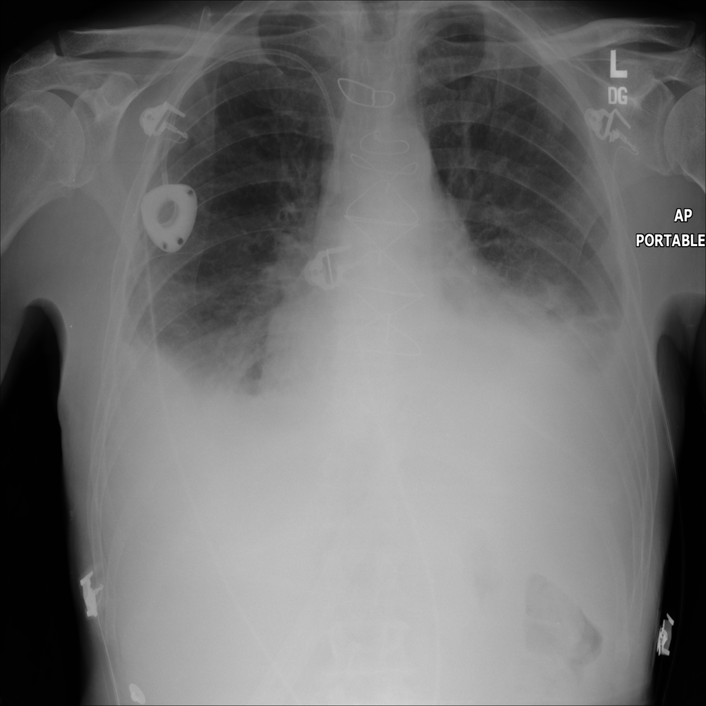

# Acknowledgements

+ acknowledge the NIH Clinical Center

# Introduction

## The Task and the Data

+ define the task
+ introudction of the data
+ focus on ML research and not CNNs

The focus of this thesis is on the use of convolutional neural networks to detect multiple thorax pathologies from chest X-rays. This task can be posed as an multi-label image classification problem since each image (X-ray) may be associated with more than one label (pathology). See \autoref{fig:task} for an example chest x-ray. The goal is to find the most accurate model but also to form some understanding of why certain methods work and others fail.

## Motivation

+ The chest X-ray is one of the most commonly accessible radiological examinations for screening and diagnosis of many lung diseases.
+ Deep learning yields similar rises in performance in the medical  image  analysis  domain  for  object (often human anatomical or pathological structures in radiology imaging) detection and segmentation tasks

+ Tremendous progress in a range of computer vision problems via deep learning and large-scale annotated image datasets. (compared to previous methods based on hand-crafted features)
+ needs lots of data

+ importance of CAD
+ importance of MLIC (including with DL)

    - dl research is extremely fast paced
    - need to stop and think carefully about directions
    - summary and comparison is good

+ also provide summary of previous work for both

## Objectives

+ find the most accurate model
+ apply existing techniques
+ explore new techniques
+ understand why they work or not
+ provide more robust evaluations and benchmarks
+ need some understanding -> localisation

## Background and Important Concepts

+ supervised learning: classification
+ neural networks / mlp
+ optimisation
+ image classification and localisation

> maybe these can be explained in terms of the application

## Outline

+ describe how the rest of the thesis is going to look like

# Multi-Label Classification

+ introduce the learning framework

## Introduction

## Formal Definition

## Evaluating Multi-Label Classifiers

### Metrics

### Validation

## Key Challenges

### Label Correlation

## Overview of Existing Approaches

### Problem Transformation

+ BR
+ LP
+ CC

### Algorithm Adaption

+ ML-KNN
+ ML-DT
+ Neural Networks

### Ensemble Methods

+ Rakel
+ ECC

## Summary

# Convolutional Neural Networks

+ overview of CNNs

# Multi-Label Convolutional Neural Networks

## Introduction

## Standard Approach

## Multi-Label Loss Functions

## Modeling Label Correlations

## Dealing with Complex Images

Local pathological image regions can show hugely varying sizes or extents but often very small comparing to
the full image scale. Fig. 1 shows eight illustrative examples and the actual pathological findings are often significantly smaller (thus harder to detect) [@Wang2017]

### Exploiting Spatial Relations

### Multi-Level Predictions

## Learnable Thresholding Functions

### Top $k$

### Threshold

## Summary

# Predicting Pathologies from X-Rays

## Methodology

+ name the experiments and how they are going to be done
+ probably would first need to test with smaller networks (RN18) and then do final one with findings

+ explain data split

    Similar to all the previous work on the Chest X-Ray dataset [@Wang2017, @Yao2017, @Rajpurkar2017] we split the data into train, validation and test sets by roughly 70%-10%-20%. If a patient has more than one X-Ray, all of those observations will belong to one data split. This is important since the X-rays of one patient can be almost identical to one another and therefore we would not want some to be in the training set and the other in the test set, as this will technically not be an 'unseen' data point, and would results in an unfair generalisation error estimate.

## Results

## Discussion

## Limitations

+ limited resources: no cv, not fast
+ labels not perfect
+ mention that one article I saw

# Conclusion

# Appendix A

+ provide the link to our original download site

## Exploratory Data Analysis

# Appendix B

## Hardware

## Software