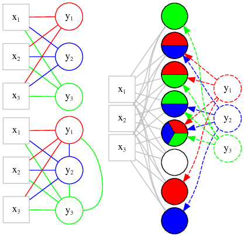

```{r, echo=FALSE, warning=FALSE, message=FALSE}
library(tidyverse)
library(knitr)
library(kableExtra)
```

# Multi-Label Classification Methods and Neural Networks

Multi-label classification can be viewed as a generalisation of the conventional single-label classification task (binary or multiclass). In a MLC problem, each observation in the dataset may be associated with more than one label and the task is to predict a label set, whose size is unknown  *a priori*, for each unseen observation. There are plenty of real-world applications that fit into this framework: an image annotation problem where each image contains more than one semantic object [@Zhu2017], a text classification task where each document has multiple topics [@Liu2017] or an acoustic classification task where the recordings contain the sounds of multiple bird species [@Zhang2016], to name a few. The realisation of the field's applicability to real-world problems is probably what drives the increasing research interest (see \autoref{pubsperyear}).

```{r pubsperyear, include=FALSE, eval = FALSE}
library(tidyverse)
library(ggthemes)
pubsperyear_data <- read_csv("data/Scopus-2251-Analyze-Year.csv")
p <- pubsperyear_data %>% gather(database, No, -YEAR) %>% 
  #mutate(ind2017 = YEAR >= 2017) %>% 
  filter(YEAR < 2017) %>% 
  ggplot(aes(YEAR, No)) +
  geom_line() +
  theme_minimal() +
  labs(x = "Year", y = "# Documents") +
  facet_wrap(~database, labeller = function(variable, value) {
    dnames <- list(Scopus = "(a) Scopus", SemSchol = "(b) Semantic Scholar")
    return(dnames[value])}) 

ggsave("pubsperyear.png", plot = p, device = "png", path = "figures", width = 7, height = 4)
```

![Line graphs illustrating the rise in multi-label learning publications per year for two databases. The database searches were done on 24-03-2017. The searches were not identical since they were limited to the search features of the databases. (a) The search on Scopus (cite) was for all documents (conference papers, articles, conference, articles in press, reviews, book chapters and books) in any subject area with either the words *multi-label* or *multilabel* and either the words *learning* or *classification* found in either their titles, abstracts or keywords. (b) The search on Semantic Scholar was based on machine learning principles and thus automatically decides which research documents are relevant to a specific search query. The query used was *multilabel multi-label learning classification*. The search only returns research in the computer science and neuroscience fields of study. More technical details can be found on the respective engine's websites (probably put details in appendix). \label{pubsperyear}](figures/pubsperyear.png)

The generality of MLC naturally introduces more complexity to the classification task. We have already seen some of the challenges in \Cref{chp:dataeval} such as: evaluating multi-label models, dealing with label correlation, label imbalance, etc. In the first half of this chapter we investigate some of the representative approaches to solving the MLC problem. Thie goal of this discussion is to put our chosen approach into perspective with other existing approaches. Our approach is based on neural networks for MLC and therefore, in the second half of this chapter, we zoom in on neural networks and how they are adapted to predict multiple outputs.

MLC methods are in abundance and developing at a rapid pace. Approaches to MLC are generally categorised into *Problem Transformation* (PT) and *Algorithm Adaptation* (AA) methods [@Zhang2014]. A further grouping is often given, namely *Ensemble Methods* (See \autoref{fig:mll_tax}). These are respectively discussed in \Cref{sec:pt}, \Cref{sec:aa} and \Cref{sec:em}. In \Cref{sec:thresh} we look at more complicated approaches to thresholding the real output of a classifier. In \Cref{sec:NN} we introduce artificial neural networks and discuss there structure, how they are trained and how they are adapted for the MLC problem.

+ The question is whether or not harnessing label dependencies will improve predictive accuracy. Unfortunately this question cannot be answered in a blanket way since it is totally dependent on the problem, influenced by factors such as the properties of the data and the loss function to be minimised [Dembszynski2010]. If we inappropriately model label dependence it can add unecessary complexity and additional noise to the problem.

```{r, fig.cap="Diagram of the categorisation of MLC methods.\\label{fig:mll_tax}"}
library(DiagrammeR)

mermaid("
graph TB
  root{Multi-Label Methods}
  PT[Problem Transformation]
  AA[Algorithm Adaptation]
  root-->PT
  root-->AA

  BR(Binary Relvance)
  CC(Classifier Chains)
  LP(Label Powerset)
  PT-->BR
  PT-->CC
  PT-->LP
  
  ECC(Ensemble Classifier Chains)
  RKL(Random k-Labelsets)
  CC-->ECC
  LP-->RKL
  subgraph Ensemble Methods  
  ECC
  RKL
  end
  
  MLDT(Multi-Label Decision Tree)
  MLKNN(Multi-Label k-Nearest Neighbours)
  MLNN(Multi-Label Neural Networks)
  AA-->MLDT
  AA-->MLKNN
  AA-->MLNN

  style MLNN fill: pink, stroke: red
  
")
```

## Problem Transformation \label{sec:pt}

PT methods consist of first transforming the multi-label problem into one or more single-label problem(s) and then fitting any standard supervised learning algorithm(s) to the single-label data. For that reason, PT methods are called algorithm independent, since once the data is transformed, any single-label classifier can be used [@Tsoumakas2007a].

The two main problem transformation algorithms are the *binray relevance* (BR) and *label powerset* (LP) transformations. They form the basis of most problem transformation methods. The SotA problem transformations algorithms are most of the times extensions of either the standard BR or LP algorithms [@Alazaidah2016].



### Binary Relevance

```{r, fig.cap="Diagram explaining the Binary Relevance approach to MLC.\\label{fig:br}", eval=FALSE}
library(DiagrammeR)

grViz("
digraph BR {
      
      graph [overlap = false, fontsize = 10, layout = dot,
      rankdir = LR, splines = true, concentrate=true]
      
      node [shape = square, color = gray]
      x1; x2; x3
      
      x1 [label = 'x@_{1}']
      x2 [label = 'x@_{2}']
      x3 [label = 'x@_{3}']
      
      node [shape = circle]
      y1; y2; y3
      
      y1 [color = red, label = 'y@_{1}']
      y2 [color = blue, label = 'y@_{2}']
      y3 [color = green, label = 'y@_{3}']
      
      {x1 x2 x3}->y1 [color = red, arrowhead=false]
      {x1 x2 x3}->y2 [color = blue, arrowhead=false]
      {x1 x2 x3}->y3 [color = green, arrowhead=false]
      }
      ", height = 200) %>%
  export_svg %>% charToRaw %>% rsvg_svg("figures/br_graph.svg")

```

The BR algorithm transforms the mutli-label task into $K$ binary classification problems by modelling each of the labels separately. Thus $K$ single label datasets are constructed from the multi-label dataset, 

$$
(\boldsymbol{x}_{i},y_{ik})_{i=1}^{N},
$$
for $k=1,2,\dots, K$ and a classifier of the form $h_{k}:\mathbb{R}^{p}\to\{0,1\}$ is trained on each dataset separately. To predict the labels for an observation $\boldsymbol{x}$, the input is fed to each of the $K$ classifiers and their outputs are combined to determine the multi-label output, *i.e.* $\left(\hat{h}_{1}(\boldsymbol{x}), \hat{h}_{2}(\boldsymbol{x}), \dots, \hat{h}_{K}(\boldsymbol{x})\right)^{\intercal}$. See \autoref{fig:pt} (a) for an illustration of the BR transformation applied to a scenario with $p=3$ and $K=3$. Notice how there are no connections between the labels.

The BR transformation makes the very strong assumption of total label independence, *i.e.* the presence or absence of a label is not influenced by the presence or absence of other labels. Obviously this assumption limits the performance of a classifier when the labels are strongly correlated. There are some benefits to this assumption however. Firstly, the simplicity of the approach protects against overfitting label dependencies. The complexity of BR scales linearly with increasing $K$, which compares favourably against some of the other PT approaches. Nevertheless, it remains inconvenient to separately fit $K$ different models for large $K$. 

It is possible for BR to predict any combination of labels for an input, in contrast to some of the other methods such as LP which we will discuss shortly. This can be seen as an advantage since it is not restricted to label combinations that are only in the training set. But this may also lead to label combination predictions that would never occur in real life. [@Read2011] mentions that the label cardinality of the predicted labels produced by BR may differ greatly from the cardinality of the actual labels. But this flexibility of the BR predictions make it ideal for dynamic learning evironments, where the labels to be predicted may change over time, for instance.

In scenarios of high label cardinality, large $K$ and large label correlatinos, [@Luaces] found that BR performed surprisingly well empirically against other methods that take label correlations into account, probably because of its simplicity. This was especially true when looking at macro-averaged metrics, since these metrics evaluate the model on a per label basis. [@Dembcz2012] proved that the BR approach is the risk minimiser of the Hamming Loss but performs poorly in terms of the subset accuracy, which evaluates the quality of the predicted label combinations as a whole. 

BR is considered the baseline method for MLC. Most of the modern work suggest how label correlations can be taken into account and show how it outperforms BR on certain datasets and specific metrics. But again, there is no one solution that outperforms BR consistently. 

Direct extensions of BR that can learn from label correlations but preserves some of the simplicity of BR have been suggested [see @Cherman2011, @Tsoumakas2009, @Godbole2004, @Pachet2009]. The basic idea is a two-stage approach. In the first stage a standard BR algorithm is applied to obtain predictions for each label and then in the second stage those predictions are used as input to for the following round of training. The finer detail is beyond the scope of this thesis. These extensions do not guarrantee an improvement. Some label pairs might have no correlation and adding predictions for those labels as inputs to the second round of training will add noise to the model and waste computation time. [@Tsoumakas2009] suggests a solution called correlation-based pruning. They estimate the pairwise correlations between labels, $\phi$, and only include initial predictions of labels as inputs that are highly correlated with the specific label to be predicted.

One PT algorithm that can also be seen as a variation of BR that take label dependencies into account is the *Classifier Chains* (CC) algorithm [@Read2011]. This is a common algorithm for MLC, also with some interesting extensions, and therefore we discuss it in the next section.

### Classifier Chains

```{r, fig.cap="Diagram explaining classifier chains.\\label{fig:cc}", fig.width=0.5, eval=FALSE}
library(DiagrammeR)

grViz("
digraph cc {
      
      graph [overlap = false, fontsize = 10, layout = dot,
      rankdir = LR, splines = true, concentrate=true]
      
      node [shape = square, color = gray]
      x1; x2; x3
      
      x1 [label = 'x@_{1}']
      x2 [label = 'x@_{2}']
      x3 [label = 'x@_{3}']
      
      node [shape = circle]
      y1; y2; y3
      
      y1 [color = red, label = 'y@_{1}']
      y2 [color = blue, label = 'y@_{2}']
      y3 [color = green, label = 'y@_{3}']
      
      {x1 x2 x3}->y1 [color = red, arrowhead=false]
      {x1 x2 x3}->y2 [color = blue, arrowhead=false]
      y1->y2 [color = blue, arrowhead=false, constraint=false]
      {x1 x2 x3}->y3 [color = green, arrowhead=false]
      y2->y3 [color = green, arrowhead=false, constraint=false]
      y1->y3 [color = green, arrowhead=false, constraint=false, headport = 'e']
      
      }
      ", height = 200) %>%
  export_svg %>% charToRaw %>% rsvg_svg("figures/cc_graph.svg")

```

The CC algorithm also consists of transforming the mutli-label data set into $K$ single-label data sets but the transformations are done sequentially in the sense that the label previously treated as a target will be added as a feature for predicting the next label. The produced datasets can be given as follows:

$$
(\boldsymbol{x}_{i}^{*},y_{ik})_{i=1}^{N},
$$
where $\boldsymbol{x}_{i}^{*}=(x_{i1},x_{i2},\dots,x_{ip},y_{i1},y_{i2},\dots, y_{i(k-1)})$. To each of these single-label data sets a classifier, $h_{k}:\mathbb{R}^{p+k-1}\to\{0,1\}$, is trained and then their predictions are combined in the same fashion as BR. See \autoref{fig:pt} (b) for an illustration of this transformation. Notice how the previously predicted labels are used as inputs to predict a given label in a chain like fashion, illustrated by the colored connections between the output nodes. CC thus assumes a conditional label dependence between some labels.

To make a prediction with CC, we cannot use $y_{ik}$ as inputs to the classifier, since this information is typically not available in a test setting. Therefore we use $\hat{y}_{ik}$, obtained by $h_{k}$. It is also possible to use the real output $f_{k}$ instead of $h_{k}$ as input to the classifiers later in the chain [@Dembczyski2010].

Notice that if a label used early in the chain is poorly predicted it may have a negative influence on the predictions of the labels in the remainder of the chain. In addition, the labels at the end of the chain is provided information on all the labels in the chain before it, whereas the labels at the start of the chain do not have that privillege. Ideally we would want the labels that are easy to predict and not dependent on other labels to be at the start of the chain and the labels that depend on other labels to be placed after those labels in the chain. However there is not obvious way to find the optimal label order. The original proposal suggested a random order and claimed that in many cases this has little influence. However in an experiment [Dutoit2017] found evidence of the contrary.

It also not feasible to experiment with all the possible label orders for large datasets. Therefore it is useful if we can estimate the best label order from the data. Some suggestions from the literature is to order the labels based on the initial accuracy of each label using BR, placing the easily predicted labels first [Keika2016, ordered ccs] and ordering the labels based on feature importance and correlation scores [Dutoit2017]. We are not going into the detail here.

On way to reduce the effect of label order is to randomly try different label orders and combine the predictions obtained from the CC for each permutation. This method is called *Ensemble of Classifier Chains* (ECC) [@Read2011]. ECC also trains each CC on a different subset of the training dataset to increase the uniqueness of each classifier, helping with variance reduction when aggregating the output of each CC in the ensemble. Ensembling is popular technique used to increase the accuracy of statistical learning algorithms, therefore it is hard to determine whether ECC handles the label correlations better than CC or that the performance improvement is actually due to the ensembling procedure. More on CC based methods can be found in [Dutoit2017].

### Label Powerset

```{r, fig.cap="Diagram explaining the Label Powerset approach.\\label{fig:lp}", eval=FALSE}
grViz("
digraph LP {
      
      graph [overlap = false, fontsize = 10, layout = dot,
      rankdir = LR, splines = true, concentrate=true, nodesep=0.05]
      
      subgraph input {
        node [shape = square, color = gray]

        x1 [label = 'x@_{1}']
        x2 [label = 'x@_{2}']
        x3 [label = 'x@_{3}']

        label = 'input'
      }
      
      subgraph output {
        nodesep = 0.05
        rank = max
        node [shape = circle, style = dashed]
        
        y1 [color = red, label = 'y@_{1}']
        y2 [color = blue, label = 'y@_{2}']
        y3 [color = green, label = 'y@_{3}']
      }
      
      subgraph lp {
        node[label = '', style = filled, shape = circle]
        z1 [fillcolor='red']; z2 [fillcolor='blue']; z3 [fillcolor='green'];
        node[style = wedged]
        z4 [fillcolor='red:blue']; z5 [fillcolor='red:green']; z6 [fillcolor='green:blue']; 
        z7 [fillcolor='red:blue:green']; z8
      }
      
      {x1 x2 x3} -> {z1 z2 z3 z4 z5 z6 z7 z8} [arrowhead=none, color = grey]
      y1 -> {z1 z4 z5 z7} [style = 'dashed', color = red]
      y2 -> {z2 z4 z6 z7} [style = 'dashed', color = blue]
      y3 -> {z3 z5 z6 z7} [style = 'dashed', color = green]

      edge [style='invis']
      y1 -> {z2 z3 z6 z8}
      y2 -> {z1 z3 z5 z8}
      y3 -> {z1 z2 z4 z8}
      }
      ", height = 400) %>%
  export_svg %>% charToRaw %>% rsvg_svg("figures/lp_graph.svg")
```

On the other side of the spectrum of problem transformation approaches, is the label powerset (LP) algorithm. LP treats each combination of labels as a distinct class and then a standard multiclass classifier can be applied to learn theses classes [@Tsoumakas2007]. The transformation is illustrated in \autoref{fig:pt} (c). See how the original labels are mapped to a space where there is a single point for each possible label combination. Thus no observation can belong to more than one class in the transformed space and therefore a multiclass problem. There are $2^{K}$ possible label combinations but using the LP algorithm for MLC restricts one to only learn label combinations that exist in the training data, which may be a lot less than $2^{K}$. Nevertheless, the number of classes after the powerset transformation can be very large for large $K$ which makes multiclass classifiers inefficient. It also quite common that some label combinations appear relatively infrequently in the training set and thus introduces an imbalance class distribution, again difficult for classifiers to handle [@Xu2016]. 

The advantage of using the LP algorithm is that it models the full conditional dependencies of the labels. [@Dembcz2012] shows that LP optimises the subset accuracy but usually fails for losses like the Hamming Loss.

Again there are multiple proposals on how to extend LP to keep its advantages and reduce its limitations. [@Read2008] suggested to prune the number of classes after the powerset transformation, *i.e.* eliminate some of the infrequent label combinations. This reduces the complexity of the multiclass problem but not without other drawbacks. Firstly it is difficult to determine the threshold for which of the label combinations to be eliminated and by eliminating these combinations introduces bias in the predictions.

*RAKEL* (Random $k$ Labelsets) and *HOMER* (Hierachy of multi-label classifiers) [@Tsoumakas2008] are both examples of ensembling approaches which attempt to improve the base LP algorithm by combining the output of simpler classifiers. They achieve this by first clustering the labels and then fitting classifiers to these clusters. The advantages of these methods typically lie in the reduction of the output space dimension of the fitted classifiers and the variance reduction effects of ensembling. However ensembling typically requires more computing time. Luckily some of the models can be trained in parallel.

The previous sections roughly cover the representative PT approaches to MLC. Next we will look at algorithm adaptation approaches and see where neural networks for MLC fit in.

## Algorithm Adaptation \label{sec:aa}

AA methods tackle the MLC task by adapting, extending and/or customising an existing supervised learning algorithm [@Madjarov2012]. The main weakness of AA methods is that they are mosty tailored to suit a specific model, whereas problem transformation methods are more general and allows for the use of many well-known and effective single-label models [@Systems2014]. We place neural networks for MLC in this category. Here we look at a simple example of another algorithm in this category.

### Multi-Label $k$-Nearest Neighbour (ML-kNN)

There are multiple proposals to adapt the kNN algorithm to suit MLC - the most common of these methods is the *Multi-Label $k$-Nearest Neighbour* (ML-kNN) algorithm [@Zhang2007]. Suppose we are interested in predicting the labels for observation $\boldsymbol{x}$. Just like the conventional kNN algorithm the ML-kNN algorithm first determines the $k$ closest traininf points to $\boldsymbol{x}$ in the input space, which we denote as $\mathcal{N}(\boldsymbol{x})$. In a binary or multiclass problem, the output of kNN is a simple aggregation (majority vote of average) of the label counts accros the observations in $\mathcal{N}(\boldsymbol{x})$. The output of ML-kNN is also based on the label counts, but aggregated in a different way to accomodate for multiple labels.

Suppose $C_{k}$ denotes the number of points in $\mathcal{N}(\boldsymbol{x})$ associated with label $\lambda_{k}$ and let $P(y_{ik}=b|C_{j})$ be the probability that $y_{ik}=b$ for $b\in\{0,1\}$ given that there are exactly $C_{k}$ points in $\mathcal{N}(\boldsymbol{x}_{i})$ with label $\lambda_{k}$. Then the output of ML-KNN can be given by:

$$
\begin{aligned}
\hat{y}_{ik} &= \arg\max_{b\in\{0,1\}} P(y_{ik}=b|C_{k})\\
&=\arg\max_{b\in\{0,1\}}P(y_{ik}=b)P(C_{k}|y_{ik}=b)\quad \text{(Bayes' Rule)}
\end{aligned}
$$

Therefore all we need to predict the relevance of label $\lambda_{k}$ for observation $\boldsymbol{x}_{i}$ is the prior probability $P(y_{ik}=b)$ and the posterior probability $P(C_{k}|y_{ik}=b)$. Both of these quantities can be estimated from the data using label frequencies in the training set. For example $P(y_{ik}=1)$ can be estimated by calculating the proportion of observations in the training set associated with $\lambda_{k}$. More detail can be found in [@Zhang2007].

Some of the advantages of using ML-kNN is that it complexity scales linearly with increase in $K$ and that it is easy to implement. Otherwise it suffers from the same limitations of ordinary kNN such as the large memory requirements for prediction and the sensitivity to the *curse of dimensionality* [@Hastie2009, p. 20 ??].

The above sections served as an overview of the MLC methods taxonomy. An often overlooked aspect of MLC is the thresholding of the continuous outputs to obtain binary outputs. Most of the time a threshold of 0.5 is used, which is rarely optimal. In the next section we look at more advanced ways to go from continuous outputs to multiple label predictions which can considerably improve the performance of a classifier.

## Thresholding Strategies \label{sec:thresh}

We learned that a multi-label classifier, $h$, consists of a label prediction module, $f$, and a thresholding function, $t$. $t:\mathbb{R}^{K}\to\{0,1\}^{K}$ maps the real-output of the label prediction module (usually in $[0,1]$) for all labels to binary values. In multiclass classification, the convention is to assign a 1 to the label with highest score given by $f$ and zero the rest of the labels. In binary classification this translates to mapping the continuous output to 1 if it exceeds 0.5. Since MLC can be decomposed into multiple binary classification tasks, a threshold of 0.5 is usually used for each label to obtain binary values from the continuous output.

Depending on the desired metric to be optimised, this thresholding strategy may not be optimal. For instance, if recall is important to the application, it will probably be better to chose a smaller threshold to make sure less of the positive labels are missed. The results may improve even further if different thresholds are used for each label. Suppose for some reason the classifier learned to be biased towards a certain label, then a threshold for this label can be chosen to be larger than the other labels' thresholds to try and correct the bias. However finding these optimal thresholds are tricky which is probably why most users resort to the simple 0.5 threshold. 

The simplest method to finding a possibly better threshold than the default 0.5 is by a simple search over a pre-selected set of threshold values (for example $\{0.1, 0.2, \dots, 0.8,0.9\}$). The binary predictions obtained using each of these threshold values can be evaluated using any desired multi-label metric and then we can choose the threshold that results in the best performance. The evaluation is typically done on a validation set or incorporating it into the cross-validation procedure to prevent biased error estimates. [@Read2011] found that choosing a threshold so that the label cardinality of the test set is the same as that of the training set, also produces comparable performace at a lower cost. This would only work if a full testing set is available and that its true label distribution is similar to that of the training set.

Instead of finding an optimal threshold value, the thresholding can be done by mapping the top $m$ labels with the highest predicted score to 1 and the rest to zero [@Yang2001]. Again $m$ can be found using a search strategy or alternatively setting it to the integer closest to the label cardinality in the training set. However, assuming that each observation has the same number of labels is very unrealistic in most cases. An alternative could be to find the top $m_{k}$ for $k=1,2,\dots, K$ observations with the highest score for label $\lambda_{k}$ and map them to 1 and the rest to zero. $m_{k}$ can be found using any search strategy or possibly to match the label proportions of the training set.

For a more flexible approach when using threshold values, we can search for a threshold value for each label separately. In [@Yang2001] the thresholds are sequentially tuned independently of one another using a validation set or cross-validation. For micro-averaged and example based metrics the tuning process requires more than one pass over all labels until convergence. This label dependent threshold strategy requires more computation and increases the risk of overfitting the thresholds to a subset of the data.

Furthermore, the threshold may even depend on the input or the predicted scores from the other labels [@Quevedo2012]. This can conveniently be posed as a learning problem, where the threshold value or the number of labels for a given observation can be treated as the response variable and then using a statistical learning algorithm to predict these values. [@Zhang2006 and @Nam2013] used a regularised linear model to predict the thresholds for each label given $\boldsymbol{x}$. Other design choices can be to inlcude the predicted label scores as inputs or to pose it as a multiclass classification problem, modelling the number of labels [@Ioannou2010]. 

In \Cref{chp:mlcnn} we will see that this learnable threshold strategy can easily be incorporated into a neural network, producing the class scores and optimal thresholds simultaneously, as in [@Li2017]. We compare this with other more conventional thresholding strategies empirically in \Cref{chp:results}. In the next section we introduce neural networks and how they are adapted for MLC.

## Artifical Neural Networks \label{sec:NN}

### Multilayer Perceptron

### Optimisation \label{sec:optim}

# Convolutional Neural Networks \label{chp:cnn}

# Convolutional Neural Networks for Multi-Label Image Classification \label{chp:mlcnn}

One potential concern with this approach is the risk of learning biased interdependencies from a limited training set which does not accurately represent a realistic distribution of pathologies – if every example of cardiomegaly is also one of cardiac failure, the model may learn to depend too much on the presence of other patterns such as edemas which do not always accompany enlarge-ent of the cardiac silhouette ([Yao2017] on modeling label correlations).

## Baseline \label{sec:mlcnn_basic}

# Results \label{chp:results}

\chapterprecishere{"For us, the most important part of rigor is better empiricism, not more mathematical theories."\par\raggedleft--- \textup{Ali Rahimi and Ben Recht}, NIPS 2017}

