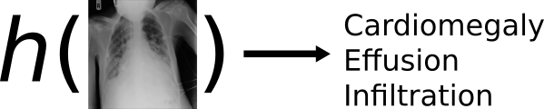

```{r, echo=FALSE, warning=FALSE, message=FALSE}
library(tidyverse)
library(knitr)
library(kableExtra)
```

# Introduction

## The Task \label{sec:task}

The focus of this thesis is to produce a system that can identify multiple thoracic pathologies[^thor] from a chest X-ray image of a patient. 

[^thor]: Pathologies that are located in the thorax region - between the neck and abdomen.

We formulate this task as a multi-label image classification (MLIC) problem [@Wang2017], since the inputs are X-ray images and each image can be associated with more than one pathology, or label. We denote an X-ray image by the vector

$$
\boldsymbol{x}_{i}=
\begin{bmatrix}
x_{i1} \\
x_{i2} \\
\vdots \\
x_{ip}
\end{bmatrix},
$$
for $i=1,2,\dots,N$, where $N$ is the number of X-rays represented in the dataset, and where $p$ denotes the number of pixels in each X-ray image. We also refer to $\boldsymbol{x}$ as an observation. Suppose the set of all possible pathologies or labels is contained in the set $\mathcal{L}=\{\lambda_{1},\lambda_{2},\dots,\lambda_{K}\}$. Then each observation $boldsymbol{x}_{i}$ is associated with a subset of the full labelset, *viz.* $Y_{i}\subseteq\mathcal{L}$.
Hence the X-ray image dataset consists of $N$ input-output pairs (also known as examples), which is denoted by 
$(\boldsymbol{x}_{i},Y_{i})_{i=1}^{N}.$ The space in which the inputs reside, is the *input space*, while all possible outputs are contained in the *label space*. To accomplish our task, we require a system which maps the input space to the label space [@Zhang2014]. That is, we are in search of a function  $h:\mathbb{R}^{p}\to2^{\mathcal{L}}.$, also referred to as the classifier or model. (See \autoref{fig:task} for an illustration of the use of $h(\cdot)$ in our application).



How do we model such an $h(\cdot)$ to produce accurate mappings? Following the *supervised learning* framework for classification [see @Hastie2009, Ch. 2] , $h(\cdot)$ is learned by example, *i.e.* from the data. To learn $h(\cdot)$ from the data, in a parametric approach we first need to assume its functional form (or shape). Suppose the mapping performed by $h(\cdot)$ is defined by a set of parameters $\theta$ such that the configuration of $\theta$ determines the way in which $h(\cdot)$ processes $\boldsymbol{x}$ to produce $Y$, however limited to the form we initially assumed for $h(\cdot)$. Further suppose that a specific parameter configuration $\hat{\theta}$ produces an output $\hat{Y}_{i}$ associated with $\boldsymbol{x}_{i}$, *i.e.* $h_{\hat{\theta}}(\boldsymbol{x}_{i})\to\hat{Y}_{i}.$ Then, using some *loss function*, $L(Y_{i},\hat{Y}_{i})$, we can measure the extent to which the prediction made by $h_{\hat{\theta}}(\cdot)$ deviates from the ground truth. The loss function should of course produce large values if the prediction is far from the truth, and values close to zero if the prediction matches the true label(s). Therefore our task can now roughly[^simple] be reduced to the optimisation problem of finding the parameters $\hat{\theta}$ such that the loss between the predictions and the ground truth is a minimum. That is, we find

$$
\hat{\theta}=\arg\min_{\theta}\sum_{i=1}^{N}L\left(Y_{i}, h_{\theta}(\boldsymbol{x}_{i})\right).
$$

> please number the above display by (1.1)

The minimum in (1.1) may be found using any appropriate optimisation procedure.

[^simple]: This is a slight simplification of the real task, used to convey a basic understanding. The actual optimisation problem includes a penalty term for regularisation, which we discuss later.

The solution to our task may now be summarised as consisting of the following four main components:

+ the **data**, $(\boldsymbol{x}_{i},Y_{i})_{i=1}^{N}$,
+ the **classifier**, $h_{\theta}(\cdot)$,
+ the **loss function**, $L$, and
+ the **optimisation procedure**.

In this study, the dataset of interest is the recently released ChestX-ray14 data [@Wang2017], which contains 112,120 frontal-view chest X-ray images, each labeled with up to 14 different thoracic diseases. This dataset is the largest publicly available chest X-ray dataset.
The size of the data facilitate the use of a *convolutional neural network* (CNN) as multi-label classifier. CNNs may briefly be described as artificial neural networks (ANNs) that specialise in detecting patterns from images. To a large extent, a review and exploration of the different CNN architectures applicable to MLIC, and evaluation of their performance on our specific task, constitute the emphasis of this study. 
In terms of the loss function, in addition to the ambuigity of appropriate evaluation of multi-label classifiers,  finding a (surrogate) loss function that can efficiently be minimised, remains a challenging task.  Many proposals regarding surrogate loss functions may be found in the literature. A thorough discussion and experimental analysis of various loss functions that may be used in the MLIC domain, forms an important part of the thesis. 
Finally in this section, regarding optimisation procedures, note that the most commonly used optimisation procedure in neural networks is *stochastic gradient descent* (SGD). We provide a brief overview of this method and discuss some of the bells and whistles that can be added to improve it. A detailed overview and experimentation with the best optimisation procedures in the context of our thoracic disease identification task lies beyond the scope of this thesis. Instead, We aim to make use of the simplest, most robust and consistent method available in the literature.

From the above it is clear that the task at hand may serve as a link to three topics that are currently very relevant in the literature, *viz.* *CNNs*, *image classification* and *multi-label classification*. Briefly, the motivation for this study is therefore two-fold. Although thoracic disease identification is an important and interesting problem in itself, the way in which this practical problem relates to the topics of CNNs, image classification and multi-label prediction, largely contributes to the rationale for attempting to address it. We expand upon the motivation for the study in the following section.
 

## Motivation

The chest X-ray is one of the most commonly accessible radiological examinations for screening and diagnosis of many thoracic pathologies [@Wang2017]. For diseases like pneumonia, it is currently the best available method for diagnosis [@WHO2001]. However, the diagnosis of thoracic diseases from X-rays require the availability of expert radiologists. An effective *computer aided diagnosis* (CAD) system may serve to increase access to expert knowledge, thereby breaking down a major barrier facing patients, *viz.* the financial cost of an examination. A CAD system can assist radiologist to diagnose patient conditions faster and more accurately, potentially leading to an increase in the availability of expert knowledge and decreasing examination costs. Perhaps in the near future, such systems will become fully autonomous - providing everyone with free, 100% trustworthy diagnoses. This is why we found a focus on this application in the MLIC domain to be worthwhile.

Multi-label image classification is not restricted to the application to the diagnosis of lung diseases from chest X-rays. In fact, it can be appplied to many important real-world problems. An important example is the task of teaching a computer to "see" in the field of *parse complex real-world imagery*, which will assist in the automation of many tasks. Another interesting and important MLIC problem is the analysis of satellite imagery. Recently for example, a Kaggle competition[^amazon] was hosted where the task was to design a system that can identify multiple land cover and land use classes from satellite images of the Amazon rain forest. The effective development of such a system would assist authorities to track the changes in the forest on a large scale and to ultimately aid in the fight against deforestation.

> Perhaps add a sentence stating that there are many other important applications, and provide a reference listing some of these.

[^amazon]: https://www.kaggle.com/c/planet-understanding-the-amazon-from-space

Although the original CNN proposal dates back to some time ago - based on work by @Hubel1962, @Fukushima1980 and @LeCun1999 - the first publication of a successful large-scale implementation was fairly recently [*cf.* @Krizhevsky2012]. Ever since, the field of state-of-the-art (SotA) approaches in *computer vision* (CV) tasks has typically been dominated by CNNs. The success of CNNs is mainly attributed to their remarkable ability to learn useful representations from raw inputs [@LeCun2015], such as images in their pixel value form. Up to now, the main focus of CNN research was on problems concerning the simpler scenario of multi*class* image classification, where each image is only associated with a single label. The annual large scale image classification competition known as *ImageNet* [@Russakovsky2015] is an example of such a problem. For the ImageNet competition, \autoref{fig:IN_err} presents a plot of the misclassification error rate of each year's winning model. Note the large drop in the error rate from 2011 to 2012, the year in which a CNN was for the first time used in the ImageNet competition. From 2012 onwards, the winning model was always a CNN. Hence the decrease in misclassification error rates from 2012 to 2017 showcases the success of CNNs in the multiclass image classification domain.

```{r, echo=FALSE, fig.cap="The misclassification error rate of each year's winning ImageNet model.\\label{fig:IN_err}", cache=TRUE}
library(tidyverse)
data.frame(Year = 2010:2017, Error = c(0.28191, 0.25770, 0.16422, 0.1174, 0.0666, 0.03567, 0.02991, 0.02251)) %>% 
  ggplot(aes(Year, Error)) + geom_line() + geom_point() + theme_minimal() +
  ggtitle("ImageNet misclassification error rates") + 
  geom_hline(yintercept = 0.051, linetype = "dashed") + 
  scale_x_continuous(breaks = 2010:2017, minor_breaks = NULL) +
  scale_y_continuous(breaks = seq(0, 0.3, 0.05)) +
  annotate("text", x = 2012.1, y = 0.16422, label = "First CNN", hjust = 0) +
  annotate("text", x = 2010, y = 0.06, label = "Human performance", hjust = 0)
```

Despite their success in multiclass image classification problems, far less attention has been paid to the application of CNNs in the context of multi-label image classification. This is the case notwithstanding the fact that MLIC is arguably a more relevant task: most real-world images can be associated with more than one class. Although a fairly trivial adaption can be made to a single-label[^sl] CNN to apply it to a multi-label case (see \Cref{sec:mlcnn_basic}),

> I think the above reference to Section 5.1 should be omitted.

it does not explicitly deal with some of the unique challenges of predicting images with multiple labels. These challenges include the incorporation of label correlation and detecting objects with different scales. Only a handful of publications address some of these issues - see for example @Gong2013, @Wei2014, @Wang2016, @Zhu2017, and @Chen2017. The use of CNNs for MLIC is to a large extent still a developing research direction. Many of the publications are written in isolation of each other, which may warrant further study.

[^sl]: Referring to binary or multiclass classification tasks.

[^talk]: From a talk given at NIPS 2017 - https://www.youtube.com/watch?v=Qi1Yry33TQE.

[^git]: https://github.com/jandremarais/Thesis

## Objectives

Inherent to the motivation of the study, some of the main objectives of the research have already featured. We are interested in gaining a thorough understanding of the chest X-ray application, in acquiring the practical skills to be able to compare various CNN variants on the ChestX-ray14 dataset, and in achieving competive results with the SotA approach on these data, as reported in [@Rajpurkar2017].

In order to achieve the above main objectives, it will be required to:

+ Perform an exploratory analysis on the chest X-ray data. 
+ Review the literature on multi-label classification, image classification and multi-label image classification.
+ Develop a thorough understanding of CNNs and of the practical issues regarding their application to image classification problems.
+ Review the latest research on CNNs with application to multi-label image classification, and thereby to develop an understanding of the relative performances of CNN variations in specific scenarios.
+ Learn how existing approaches may be tweaked or adapted to optimally fit the ChestX-ray14 data.
+ Propose novel adaptations to existing approaches.
+ Design reproducible experiments for any researcher or person with an interest in the field to replicate the results and to further build on the approaches.
+ Empirically compare the performance of novel and existing approaches on the ChestX-ray14 dataset. 
 
With regard to the empirical objectives, it is interesting to note that recently the field of *deep learning*, the class of statistical learning models to which multi-layer ANNs (including CNNs) belong, has been criticised for the growing gap between the theoretical understanding of models and their practical successes, where most of the recent focus was on the latter[^talk]. The speakers urge the deep learning community to be more rigorous in their experiments. For them, the most important part of rigor is better empiricism, as opposed to more mathematical theories. Better empiricism in classification may for example include practices such as using cross-validation to estimate the generalisation ability of a model, and to also report estimated standard errors. Empirical studies should aim to achieve more than just trying to beat the benchmark - ideally they should also include simple experiments that aid in understanding why certain approaches outperform others. Therefore there seems to be much scope for empirical work on CNNs to be both more *rigorous* and *reproducible*. Although especially the latter aspect is often overlooked, its importance in ensuring transparent, accountable reporting and research that can easily be extended by others, cannot be overstated. Hence in this study, note that all of the data, code and documentation needed to reproduce the reported experiments are publicly available[^git]. 

Having discussed some background of the research problem at hand, as well as the rationale and objectives of the study, we are now in a position to proceed with the details of CNNS and the way in which they can be applied to the problem of diagnosing thoracic diseases from chest X-rays. The structure of the remainder of the thesis is summarised in the section below.

## Outline

We start in \Cref{chp:dataeval} with an exploratory analysis of the  ChestX-ray14 data. The analysis serves a dual purpose. It conveys important characteristics of our specific dataset which may guide the modelling process later on. Moreover, it facilitates a discussion of the following important aspects: the unique properties of image data with multiple labels, the unique challenges associated with CNNs when applied in an MLIC domain, various definitions of multi-label performance measures, and the way in which we go about sampling multi-label data. The main categories of multi-label classification methods are described in \Cref{chp:}, followed by a discussion of neural networks. 

\Cref{chp:cnn} is devoted to CNNs, ...
In \Cref{chp:mlcnn} we discuss the ways in which CNNS may be adapted to better fit an MLIC scenario. 
Our empirical work on the X-ray image classification data is described in \Cref{chp:results}. It involves a comparative study of most of the main approaches in the literature, in addition to some novel methods.

We close with a summary and possible avenues for further research in \Cref{chp:concl}.


